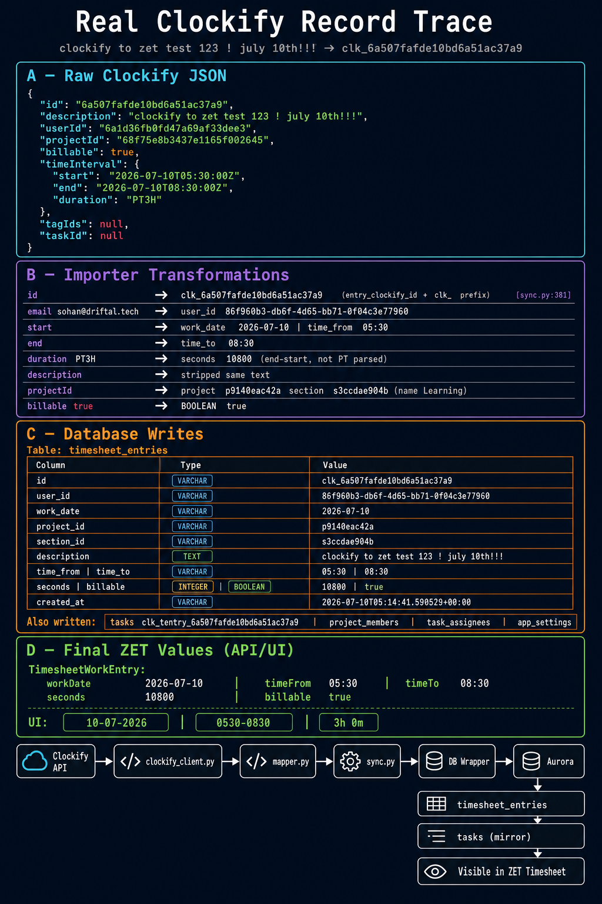

# Real Clockify Record Trace

**Target description (search):** `Clockify to zet test 123 ! july 10th!!!`  
**Actual stored description (Clockify + ZET):** `clockify to zet test 123 ! july 10th!!!` *(case differs; matched in DB via exact description after import)*

**Clockify time entry ID:** `6a507fafde10bd6a51ac37a9`  
**ZET timesheet entry ID:** `clk_6a507fafde10bd6a51ac37a9`  
**Last successful sync:** `2026-07-10T05:14:41.590529+00:00` (`app_settings.clockify.last_sync`)

Sources: live Clockify API (`GET /users`, `GET /user/{id}/time-entries`, `GET /projects/{id}`) and Aurora `zet` database read on 2026-07-10. No data was modified.



---

## STEP 1 — Locate the record

### How it was found

1. Database query: `SELECT … FROM timesheet_entries WHERE description ILIKE '%Clockify to zet test%'`
2. Returned `clk_6a507fafde10bd6a51ac37a9` with description `clockify to zet test 123 ! july 10th!!!`
3. Clockify API: fetched `GET /workspaces/68f75dbb4ef41a4c2704592e/user/6a1d36fb0fd47a69af33dee3/time-entries` for `2026-07-09`–`2026-07-11`; matched `id == 6a507fafde10bd6a51ac37a9`

### Complete raw Clockify time-entry JSON

```json
{
  "id": "6a507fafde10bd6a51ac37a9",
  "description": "clockify to zet test 123 ! july 10th!!!",
  "tagIds": null,
  "userId": "6a1d36fb0fd47a69af33dee3",
  "billable": true,
  "taskId": null,
  "projectId": "68f75e8b3437e1165f002645",
  "workspaceId": "68f75dbb4ef41a4c2704592e",
  "timeInterval": {
    "start": "2026-07-10T05:30:00Z",
    "end": "2026-07-10T08:30:00Z",
    "duration": "PT3H"
  },
  "customFieldValues": [],
  "type": "REGULAR",
  "kioskId": null,
  "hourlyRate": {
    "amount": 0,
    "currency": "USD"
  },
  "costRate": {
    "amount": 0,
    "currency": "USD"
  },
  "isLocked": false
}
```

### Clockify user object (outer loop context)

```json
{
  "id": "6a1d36fb0fd47a69af33dee3",
  "email": "sohan@driftal.tech",
  "name": "sohan",
  "status": "ACTIVE"
}
```

*(Full API user payload also includes `memberships`, `settings`, `profilePicture`, `customFields` — importer reads only `id`, `email`, `name`.)*

### Clockify project JSON (resolved via `projectId`)

```json
{
  "id": "68f75e8b3437e1165f002645",
  "name": "Learning",
  "clientName": "Driftal",
  "clientId": "68f75e134ef41a4c27046802",
  "workspaceId": "68f75dbb4ef41a4c2704592e",
  "billable": true,
  "archived": false,
  "color": "#FF5722",
  "note": "",
  "public": true
}
```

*(Importer catalog fetch uses only `id`, `name`, `clientName` from list endpoint; full project object shown for verification.)*

---

## STEP 2 — Importer transformations (field by field)

| # | Clockify path | Clockify value | Transformation | Final value | Reason | Code |
|---|---------------|----------------|----------------|-------------|--------|------|
| 1 | `id` | `"6a507fafde10bd6a51ac37a9"` | `entry_clockify_id()` → sanitize | `"6a507fafde10bd6a51ac37a9"` | Strip unsafe chars (none here) | `mapper.py:22-27` |
| 2 | `id` | above | prefix `clk_` | `"clk_6a507fafde10bd6a51ac37a9"` | Deterministic ZET PK | `sync.py:381` |
| 3 | member `email` | `"sohan@driftal.tech"` | `.strip().lower()` + `users_by_email` lookup | user_id `"86f960b3-db6f-4d65-bb71-0f04c3e77960"` | Match existing ZET user by email | `sync.py:291-293, 342-347` |
| 4 | `userId` | `"6a1d36fb0fd47a69af33dee3"` | **Ignored on entry** | — | User from member loop, not entry JSON | `sync.py:348` outer `ck_uid` |
| 5 | `timeInterval.start` | `"2026-07-10T05:30:00Z"` | `parse_clockify_dt` → `.date().isoformat()` | `"2026-07-10"` | Work date from UTC start | `sync.py:382`, `mapper.py:15-16` |
| 6 | `timeInterval.start` | `"2026-07-10T05:30:00Z"` | `hm_from_iso` | `"05:30"` | UTC hour:minute | `sync.py:390`, `mapper.py:18-20` |
| 7 | `timeInterval.end` | `"2026-07-10T08:30:00Z"` | `hm_from_iso` | `"08:30"` | UTC hour:minute | `sync.py:391`, `mapper.py:18-20` |
| 8 | `timeInterval.duration` | `"PT3H"` | `entry_seconds`: not int/digit → `(end−start).total_seconds()` | `10800` | ISO duration `PT3H` **not** parsed; interval delta used | `mapper.py:29-39` |
| 9 | `description` | `"clockify to zet test 123 ! july 10th!!!"` | `.strip()` | same string | Trim whitespace only | `sync.py:389` |
| 10 | `billable` | `true` | `bool(entry.get("billable", True))` | `true` | Direct map | `sync.py:393` |
| 11 | `projectId` | `"68f75e8b3437e1165f002645"` | `_resolve_clockify_project_section` via catalog name `"Learning"` | project `"p9140eac42a"`, section `"s3ccdae904b"` | Name match to existing ZET project | `sync.py:359-378`, `219-238` |
| 12 | — | sync instant | `_now_iso()` | `"2026-07-10T05:14:41.590529+00:00"` | Import timestamp | `sync.py:39-40, 394` |
| 13 | `tagIds` | `null` | **Ignored** | — | Not implemented | — |
| 14 | `taskId` | `null` | **Ignored** | — | Not implemented | — |
| 15 | `workspaceId` | `"68f75dbb4ef41a4c2704592e"` | **Ignored** | — | From env `CLOCKIFY_WORKSPACE_ID` | — |
| 16 | `customFieldValues` | `[]` | **Ignored** | — | Not implemented | — |
| 17 | `type` | `"REGULAR"` | **Ignored** | — | Not implemented | — |
| 18 | `hourlyRate` / `costRate` | `{amount:0,currency:USD}` | **Ignored** | — | Not implemented | — |
| 19 | `isLocked` | `false` | **Ignored** | — | Not implemented | — |
| 20 | `kioskId` | `null` | **Ignored** | — | Not implemented | — |

### Mirror task (`clk_tentry_*`) transformations

| Clockify source | Transformation | ZET value | Code |
|-----------------|----------------|-----------|------|
| `id` | `clk_tentry_{safe}` | `clk_tentry_6a507fafde10bd6a51ac37a9` | `sync.py:177-180` |
| `description` | `[:200]` title; strip description | title & description = `clockify to zet test 123 ! july 10th!!!` | `sync.py:183-189` |
| `work_date` | from start date | `due_date` = `"2026-07-10"` | `sync.py:195` |
| `seconds` | `10800` → `time_tracked`; status if `>0` → `"completed"` | DB: `time_tracked=10800`, **`status="backlog"`** *(insert-only; row not updated on re-sync)* | `sync.py:197-200` |
| assignee | ZET user | `assigned_to` = `86f960b3-db6f-4d65-bb71-0f04c3e77960` | `sync.py:192` |
| owner | `_default_owner_id()` | `assigned_by` / `created_by` = `3cc296b2-2a72-42fc-a6c9-16569951262c` | `sync.py:193-194` |

---

## STEP 3 — Database trace (every table touched)

### `timesheet_entries` (primary row)

| Column | SQL type | Stored value | Clockify source | Example format |
|--------|----------|--------------|-----------------|----------------|
| `id` | VARCHAR PK | `clk_6a507fafde10bd6a51ac37a9` | `id` + `clk_` prefix | `clk_{sanitizedClockifyId}` |
| `user_id` | VARCHAR FK | `86f960b3-db6f-4d65-bb71-0f04c3e77960` | member `email` → ZET user | UUID string |
| `work_date` | VARCHAR | `2026-07-10` | `timeInterval.start` | `YYYY-MM-DD` |
| `project_id` | VARCHAR FK | `p9140eac42a` | `projectId` → name `Learning` | `p` + 10 hex |
| `section_id` | VARCHAR FK | `s3ccdae904b` | first section of project | `s` + 10 hex |
| `description` | TEXT | `clockify to zet test 123 ! july 10th!!!` | `description` | plain text |
| `time_from` | VARCHAR | `05:30` | `timeInterval.start` UTC | `HH:MM` |
| `time_to` | VARCHAR | `08:30` | `timeInterval.end` UTC | `HH:MM` |
| `seconds` | INTEGER | `10800` | `PT3H` via end−start | seconds (3×3600) |
| `billable` | BOOLEAN | `true` | `billable` | PostgreSQL boolean |
| `created_at` | VARCHAR | `2026-07-10T05:14:41.590529+00:00` | sync `_now_iso()` | ISO-8601 UTC |

### `tasks` (mirror row `clk_tentry_*`)

| Column | SQL type | Stored value | Source |
|--------|----------|--------------|--------|
| `id` | VARCHAR PK | `clk_tentry_6a507fafde10bd6a51ac37a9` | Clockify entry `id` |
| `title` | VARCHAR | `clockify to zet test 123 ! july 10th!!!` | `description`[:200] |
| `description` | VARCHAR | `clockify to zet test 123 ! july 10th!!!` | `description` |
| `project_id` | VARCHAR FK | `p9140eac42a` | resolved project |
| `section_id` | VARCHAR FK | `s3ccdae904b` | resolved section |
| `assigned_to` | VARCHAR FK | `86f960b3-db6f-4d65-bb71-0f04c3e77960` | ZET user |
| `assigned_by` | VARCHAR FK | `3cc296b2-2a72-42fc-a6c9-16569951262c` | default owner |
| `created_by` | VARCHAR FK | `3cc296b2-2a72-42fc-a6c9-16569951262c` | default owner |
| `due_date` | VARCHAR | `2026-07-10` | `work_date` |
| `priority` | VARCHAR | `Medium` | constant |
| `status` | VARCHAR | `backlog` | see note above |
| `is_started` | BOOLEAN | `false` | constant |
| `approved_by_manager` | BOOLEAN | `false` | constant |
| `time_tracked` | INTEGER | `10800` | `seconds` |
| `tags_json` | TEXT | `[]` | constant |
| `custom_fields_json` | TEXT | `{}` | constant |
| `created_at` | VARCHAR | `2026-07-10T05:14:41.590529+00:00` | sync time |
| `min_log_minutes` | INTEGER | `1` | default |

### `users` (matched, not created)

| Column | Stored value | Notes |
|--------|--------------|-------|
| `id` | `86f960b3-db6f-4d65-bb71-0f04c3e77960` | Pre-existing ZET user |
| `email` | `sohan@driftal.tech` | Matched Clockify `sohan@driftal.tech` |
| `name` | `Sohan` | Unchanged on import |
| `role` | `manager` | Unchanged on import |

### `projects` (matched by name)

| Column | Stored value | Clockify source |
|--------|--------------|-----------------|
| `id` | `p9140eac42a` | ZET-generated (not Clockify id) |
| `name` | `Learning` | project `name` |
| `description` | `Imported from Clockify` | constant (from earlier import) |
| `client_id` | `c547a89b1a3` | `clientName` `Driftal` |
| `created_by` | `3cc296b2-2a72-42fc-a6c9-16569951262c` | default owner |
| `created_at` | `2026-07-09T09:08:35.483348+00:00` | prior import |

### `sections`

| Column | Stored value |
|--------|--------------|
| `id` | `s3ccdae904b` |
| `name` | `General` |
| `project_id` | `p9140eac42a` |

### `clients`

| Column | Stored value | Clockify source |
|--------|--------------|-----------------|
| `id` | `c547a89b1a3` | ZET `new_id("c")` |
| `name` | `Driftal` | `clientName` |
| `created_at` | `2026-07-09T09:23:31.881921+00:00` | prior import |

### `project_members` (side effect)

| `project_id` | `user_id` |
|--------------|-----------|
| `p9140eac42a` | `86f960b3-db6f-4d65-bb71-0f04c3e77960` |

### `task_assignees` (mirror task)

| `task_id` | `user_id` | `position` |
|-----------|-----------|------------|
| `clk_tentry_6a507fafde10bd6a51ac37a9` | `86f960b3-db6f-4d65-bb71-0f04c3e77960` | `0` |

### `app_settings` (sync metadata)

| `key` | `value` |
|-------|---------|
| `clockify.last_sync` | `2026-07-10T05:14:41.590529+00:00` |
| `clockify.last_status` | `{"status":"success","imported":1,"updated":0,"unchanged":1782,"skipped":0,"failed":0,"usersCreated":0,"projectsCreated":0,"tasksImported":1,"days":365,"skipSummary":{}}` |

---

## STEP 4 — Complete path

```
Clockify UI (time entry logged)
        ↓
Clockify API
  GET /workspaces/…/users
  GET /workspaces/…/user/6a1d36fb…/time-entries
        ↓
clockify_client.py
  fetch_workspace_users() → users fallback (members 404)
  fetch_time_entries_for_period() → 30-day chunks, dedupe by id
        ↓
mapper.py
  entry_clockify_id, parse_clockify_dt, hm_from_iso, entry_seconds
        ↓
sync.py
  run_reconciliation_sync()
  _resolve_clockify_project_section()
  TimesheetEntry(...) build
  te_crud.upsert_entry()
  _ensure_task_from_time_entry()
  projects_crud.add_member()
        ↓
db_wrapper (DatabaseWrapper → Aurora PostgreSQL)
        ↓
ZET tables
  timesheet_entries, tasks, task_assignees, project_members, app_settings
  (+ existing users, projects, sections, clients referenced by FK)
        ↓
ZET API  GET /timesheet/entries?start=&end=
        ↓
Frontend TimesheetPage
  TimesheetWorkEntry JSON (camelCase)
```

---

## STEP 5–7 — Verification examples

### Clockify JSON → Importer object → DB → UI

**Clockify (API):**

```json
{
  "id": "6a507fafde10bd6a51ac37a9",
  "description": "clockify to zet test 123 ! july 10th!!!",
  "projectId": "68f75e8b3437e1165f002645",
  "billable": true,
  "timeInterval": {
    "start": "2026-07-10T05:30:00Z",
    "end": "2026-07-10T08:30:00Z",
    "duration": "PT3H"
  }
}
```

**Importer `TimesheetEntry` (Python, before upsert):**

```python
TimesheetEntry(
    id="clk_6a507fafde10bd6a51ac37a9",
    user_id="86f960b3-db6f-4d65-bb71-0f04c3e77960",
    work_date="2026-07-10",
    project_id="p9140eac42a",
    section_id="s3ccdae904b",
    description="clockify to zet test 123 ! july 10th!!!",
    time_from="05:30",
    time_to="08:30",
    seconds=10800,
    billable=True,
    created_at="2026-07-10T05:14:41.590529+00:00",
)
```

**Aurora row (`timesheet_entries`):** same values as table in Step 3.

**ZET API / UI (`TimesheetWorkEntry`):**

```json
{
  "id": "clk_6a507fafde10bd6a51ac37a9",
  "userId": "86f960b3-db6f-4d65-bb71-0f04c3e77960",
  "workDate": "2026-07-10",
  "projectId": "p9140eac42a",
  "sectionId": "s3ccdae904b",
  "description": "clockify to zet test 123 ! july 10th!!!",
  "timeFrom": "05:30",
  "timeTo": "08:30",
  "seconds": 10800,
  "billable": true,
  "createdAt": "2026-07-10T05:14:41.590529+00:00"
}
```

**UI display (Timesheet page):**

| Field | Display |
|-------|---------|
| Date | `10-07-2026` |
| Time | `0530` – `0830` (compact inputs) |
| Duration | `3h 0m` |
| Billable | green $ icon (true) |
| Project | `Learning` (resolved from `projectId`) |

---

## Upsert outcome for this record

From `clockify.last_status` on last sync: **`imported: 1`** — this entry was **inserted** (not updated/unchanged) during that run. Subsequent runs would upsert by the same `clk_6a507fafde10bd6a51ac37a9` PK.

---

## Identifier map (this record)

| Concept | Clockify | ZET |
|---------|----------|-----|
| Time entry | `6a507fafde10bd6a51ac37a9` | `clk_6a507fafde10bd6a51ac37a9` |
| Mirror task | same entry id | `clk_tentry_6a507fafde10bd6a51ac37a9` |
| User | `6a1d36fb0fd47a69af33dee3` | `86f960b3-db6f-4d65-bb71-0f04c3e77960` (via email) |
| Project | `68f75e8b3437e1165f002645` | `p9140eac42a` (via name `Learning`) |
| Client | `68f75e134ef41a4c27046802` / name `Driftal` | `c547a89b1a3` |
| Section | — | `s3ccdae904b` (`General`) |

---

*Trace generated from production Clockify workspace `68f75dbb4ef41a4c2704592e` and Aurora database `zet`. No code or data was modified.*
