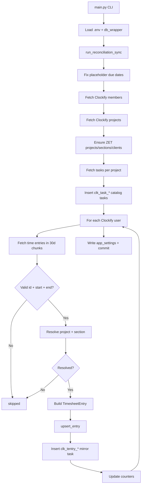
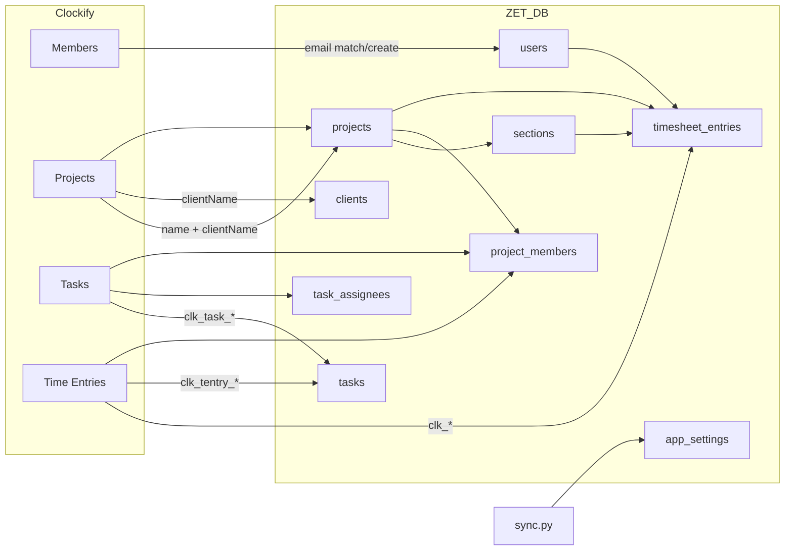
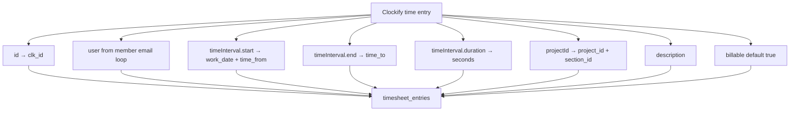
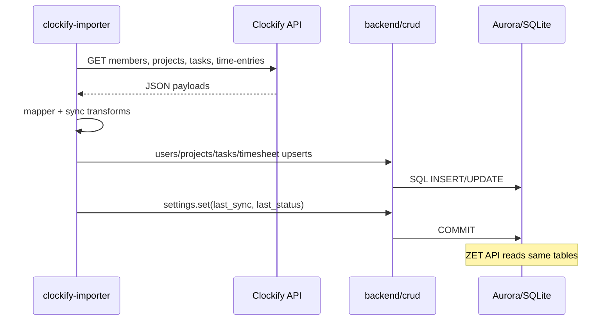

# Clockify → ZET Data Mapping Reference

**Definitive mapping document for the standalone Clockify Importer.**

Source of truth: current implementation in `clockify-importer/` (`clockify_client.py`, `mapper.py`, `sync.py`, `db.py`, `main.py`, `importer_config.py`) plus ZET backend CRUD/models invoked by the importer.

**Direction:** Clockify API → Importer → ZET database (Aurora PostgreSQL or SQLite via `db_wrapper`). ZET UI reads the same database through the ZET API.


**Field-level one-to-one mapping (every variable + full format examples):** [field-mapping.md](./field-mapping.md) · 

**Real record trace (live example):** [docs/real_clockify_trace.md](./docs/real_clockify_trace.md)

---

## SECTION 1 — OVERVIEW

### Why the Clockify Importer exists

ZET is a task and timesheet management product. Many organizations already track time in [Clockify](https://clockify.me). The importer pulls Clockify workspace data—users, projects, tasks, and time entries—and writes it into ZET’s shared database so hours appear on the **Timesheet** page, in **Time Report**, and in **analytics** without manual re-entry.

### Why it is separated from ZET

The importer is a **standalone Python CLI** (`clockify-importer/main.py`). It:

- Runs outside the ZET FastAPI container.
- Loads Clockify credentials from `clockify-importer/.env` (`CLOCKIFY_API_KEY`, `CLOCKIFY_WORKSPACE_ID`).
- Connects to the **same database** as ZET by importing `backend/db_wrapper` and `backend/crud/*`.
- Commits directly via CRUD functions; it does **not** call ZET HTTP routes.

### Problems this architecture solves

| Problem | How separation helps |
|--------|----------------------|
| Long-running sync blocking API requests | Import runs as a batch job / cron, not inside request workers |
| Clockify API rate limits and pagination | Dedicated process can chunk 30-day windows and paginate safely |
| Credential isolation | Clockify API key lives in importer env, not in every API instance |
| Reuse of ZET persistence rules | Importer calls the same `crud/` layer as the API—one schema, one truth |
| Operational scheduling | Ops can run `python main.py --days 30` on a schedule without redeploying ZET |

### Advantages over embedding Clockify inside ZET

1. **No API downtime** during large historical imports (default 365 days).
2. **Simpler failure domain**—a failed import does not take down the web app.
3. **Direct CRUD access** avoids duplicating mapping logic in `routes/` + `logic/`.
4. **Independent scaling**—import frequency and lookback window are operator-controlled (`--days`).
5. **Shared database**—ZET UI immediately sees imported rows; no secondary sync channel.

### What the importer does *not* do

- Does not write to `task_time_logs` (per-day task timers).
- Does not create or update `timesheet_submissions`.
- Does not sync Clockify tags, custom fields, hourly rates, or `taskId` on time entries.
- Does not use `CLOCKIFY_BASE_URL` from config in HTTP calls (`clockify_client.py` hardcodes `https://api.clockify.me/api/v1`).

---

## SECTION 2 — END TO END FLOW

```
Clockify API
     ↓
Importer CLI (main.py)
     ↓
Transformation (mapper.py + sync.py)
     ↓
Validation (inline guards in sync.py)
     ↓
Database Mapping (CRUD → SQLAlchemy models)
     ↓
Aurora / SQLite (db_wrapper)
     ↓
ZET API + Frontend (read same tables)
```

### Step-by-step

| Step | Component | What happens |
|------|-----------|--------------|
| 1. **Clockify** | Clockify cloud | Workspace members, projects, tasks, and time entries exposed via REST API v1 |
| 2. **Importer** | `main.py` | Parses `--days` (default 365), loads `.env`, opens DB via `db.get_db()`, enters request scope, calls `sync.run_reconciliation_sync()` |
| 3. **Transformation** | `sync.py`, `mapper.py` | Maps Clockify JSON to ZET model instances; resolves users by email, projects by name, generates prefixed IDs |
| 4. **Validation** | `sync.py` | Skips entries missing `id`, `timeInterval.start`, or `timeInterval.end`; requires resolvable project+section; sanitizes Clockify IDs |
| 5. **Database mapping** | `crud/*` | `INSERT` / `UPSERT` into `users`, `clients`, `projects`, `sections`, `project_members`, `tasks`, `task_assignees`, `timesheet_entries`, `app_settings` |
| 6. **Aurora** | `db_wrapper` | PostgreSQL (production) or SQLite (local/test) via IAM or file connection from `backend/.env` |
| 7. **ZET** | FastAPI + React | `GET /timesheet/entries` etc. serve `timesheet_entries`; Tasks/Projects pages show imported catalog and mirror tasks |

### Sync phases inside `run_reconciliation_sync`

1. **Pre-fix:** `_fix_clockify_placeholder_due_dates()` — SQL cleanup for legacy bad due dates on `clk_task_*` rows.
2. **User map:** Load all ZET users by email; fetch Clockify members; build `ck_user_email` and `ck_name_by_email`.
3. **Project catalog:** Fetch all Clockify projects; for each, `_ensure_zet_project()` + `_add_managers_to_project()`; fetch tasks per project → `_ensure_zet_task()`.
4. **Time entries:** For each Clockify user ID, `fetch_time_entries_for_period()` (30-day chunks); upsert `timesheet_entries`; optionally `_ensure_task_from_time_entry()`.
5. **Post-fix:** Run due-date cleanup again.
6. **Metadata:** Write `app_settings` keys `clockify.last_sync` and `clockify.last_status` (JSON result).
7. **Commit:** Single `db.commit()` on success (or on failure after saving error status).

---

## SECTION 3 — CLOCKIFY APIs

Base URL used in code: `https://api.clockify.me/api/v1`  
Auth header: `X-Api-Key: <CLOCKIFY_API_KEY>`

> **Note:** `importer_config.CLOCKIFY_BASE_URL` exists in `.env.example` but is **not** passed to `httpx` calls.

---

### 3.1 Workspace members (with users fallback)

| Property | Value |
|----------|-------|
| **Purpose** | List workspace users to map Clockify user IDs → email → ZET user |
| **HTTP method** | `GET` |
| **Paths tried** | `/workspaces/{workspaceId}/members` then `/workspaces/{workspaceId}/users` if members returns 404 |
| **Response model** | `list[dict]` — array of member/user objects |
| **Objects returned** | One dict per workspace member |

**Fields read by importer:**

| Field | Usage |
|-------|-------|
| `id` or `userId` | Clockify user ID key in `ck_user_email` |
| `email` or `user.email` | Match/create ZET user |
| `name` | Display name when creating ZET user |

**Example JSON (minimal — only fields used):**

```json
[
  {
    "id": "5fc6a0b5b8b4a123456789ab",
    "email": "jane@example.com",
    "name": "Jane Doe"
  },
  {
    "userId": "5fc6a0b5b8b4a123456789cd",
    "user": { "email": "bob@example.com" },
    "name": "Bob Smith"
  }
]
```

---

### 3.2 Projects (paginated)

| Property | Value |
|----------|-------|
| **Purpose** | Build project catalog; map Clockify `projectId` on time entries to ZET project+section |
| **HTTP method** | `GET` |
| **Path** | `/workspaces/{workspaceId}/projects` |
| **Query params** | `page` (1-based), `page-size` = 200 |
| **Response model** | `list[dict]` per page; importer aggregates into `dict[clockifyProjectId → {name, clientName}]` |
| **Pagination** | Stop when batch empty or `len(batch) < 200` |

**Example JSON:**

```json
[
  {
    "id": "64a1b2c3d4e5f6789012345",
    "name": "Website Redesign",
    "clientName": "Acme Corp"
  }
]
```

---

### 3.3 Project tasks (paginated)

| Property | Value |
|----------|-------|
| **Purpose** | Import Clockify tasks as ZET catalog tasks (`clk_task_*`) |
| **HTTP method** | `GET` |
| **Path** | `/workspaces/{workspaceId}/projects/{clockifyProjectId}/tasks` |
| **Query params** | `page`, `page-size` = 200 |
| **Response model** | `list[dict]` |
| **Pagination** | Same as projects; 404 → empty list for that project |

**Example JSON:**

```json
[
  {
    "id": "task-uuid-abc123",
    "name": "Implement login page",
    "assigneeId": "5fc6a0b5b8b4a123456789ab",
    "dueDate": "2026-08-15T00:00:00.000Z",
    "status": "ACTIVE"
  }
]
```

---

### 3.4 User time entries (paginated, date range)

| Property | Value |
|----------|-------|
| **Purpose** | Primary data: billable hours → `timesheet_entries` |
| **HTTP method** | `GET` |
| **Path** | `/workspaces/{workspaceId}/user/{clockifyUserId}/time-entries` |
| **Query params** | `start`, `end` (ISO-like `YYYY-MM-DDTHH:MM:SSZ`), `page`, `page-size` = 1000 |
| **Response model** | `list[dict]` |
| **Pagination** | `Last-Page: true` response header OR `len(batch) < 1000` |
| **Chunking** | `fetch_time_entries_for_period()` splits range into ~30-day windows (Clockify drops rows on long ranges) |

**Example JSON:**

```json
[
  {
    "id": "entry-uuid-xyz789",
    "description": "Code review and pairing",
    "projectId": "64a1b2c3d4e5f6789012345",
    "billable": true,
    "timeInterval": {
      "start": "2026-07-10T09:15:23Z",
      "end": "2026-07-10T11:00:00Z",
      "duration": 6300
    }
  }
]
```

---

## SECTION 4 — COMPLETE FIELD MAPPING

Convention: **Ignored** = present in typical Clockify payloads but never read by importer code.

---

### 4.1 Workspace member / user fields

| Clockify API | Clockify Field | Example | Clockify Type | Transformation | ZET Table | ZET Column | ZET SQL Type | Nullable | Notes |
|--------------|----------------|---------|---------------|----------------|-----------|------------|--------------|----------|-------|
| members/users | `id` | `5fc6a0b5…` | string | `str(uid)` as map key | — | — | — | — | Not stored; used only during sync |
| members/users | `userId` | `5fc6a0b5…` | string | Fallback if `id` missing | — | — | — | — | Same as `id` |
| members/users | `email` | `jane@example.com` | string | `.strip().lower()` | `users` | `email` | VARCHAR UNIQUE | NO | Match key for existing users |
| members/users | `user.email` | `bob@example.com` | string | Nested fallback for email | `users` | `email` | VARCHAR | NO | Used when top-level `email` absent |
| members/users | `name` | `Jane Doe` | string | `strip()` or email local-part | `users` | `name` | VARCHAR | NO | Only when **creating** new user |
| members/users | *(all other fields)* | — | — | **Ignored** | — | — | — | — | e.g. `status`, `hourlyRate`, `profilePicture` |

**New user creation** (when email not in ZET):

| Source | Transformation | ZET Table | ZET Column | ZET SQL Type | Notes |
|--------|----------------|-----------|------------|--------------|-------|
| — | `str(uuid.uuid4())` | `users` | `id` | VARCHAR PK | Full UUID string |
| `name` / email | see above | `users` | `name` | VARCHAR | |
| `email` | lowercased | `users` | `email` | VARCHAR | |
| — | `hash_password(secrets.token_urlsafe(24))` | `users` | `password_hash` | VARCHAR | Random password; user must reset |
| — | literal `"employee"` | `users` | `role` | VARCHAR | |
| — | defaults from `create_user` | `users` | `avatar`, `job_title`, `experience_months`, `joined_at` | various | `joined_at` = UTC ISO now |

---

### 4.2 Project fields

| Clockify API | Clockify Field | Example | Clockify Type | Transformation | ZET Table | ZET Column | ZET SQL Type | Nullable | Notes |
|--------------|----------------|---------|---------------|----------------|-----------|------------|--------------|----------|-------|
| projects | `id` | `64a1b2c3…` | string | Cache key in `ck_id_to_zet` | — | — | — | — | Not stored as column |
| projects | `name` | `Website Redesign` | string | `str(...).strip()`; match key `name.lower()` | `projects` | `name` | VARCHAR | NO | **Name** match links to existing ZET project |
| projects | `clientName` | `Acme Corp` | string | `str(...).strip()` → `_ensure_client_id` | `clients` / `projects` | `name` / `client_id` | VARCHAR | YES (`client_id`) | Empty → `client_id` NULL |
| projects | *(all other fields)* | — | — | **Ignored** | — | — | — | — | e.g. `clientId`, `archived`, `color`, `billable` |

**When creating a new ZET project** (no case-insensitive name match):

| Source | Transformation | ZET Table | ZET Column | Value |
|--------|----------------|-----------|------------|-------|
| — | `new_id("p")` | `projects` | `id` | `p` + 10 hex chars |
| `name` | stripped | `projects` | `name` | Clockify project name |
| — | constant | `projects` | `description` | `"Imported from Clockify"` |
| `clientName` | via client cache | `projects` | `client_id` | `c…` id or NULL |
| — | `_default_owner_id()` | `projects` | `created_by` | First admin/manager user id |
| — | `_now_iso()` | `projects` | `created_at` | UTC ISO datetime string |
| — | `new_id("s")` | `sections` | `id` | `s` + 10 hex |
| — | constant | `sections` | `name` | `"General"` |
| — | new project id | `sections` | `project_id` | FK to project |

**When matching existing ZET project by name:** only `projects.client_id` may be updated (if Clockify has `clientName`).

---

### 4.3 Task fields (catalog import)

| Clockify API | Clockify Field | Example | Clockify Type | Transformation | ZET Table | ZET Column | ZET SQL Type | Nullable | Notes |
|--------------|----------------|---------|---------------|----------------|-----------|------------|--------------|----------|-------|
| tasks | `id` | `task-uuid-abc` | string | `safe_clockify_id` → `clk_task_{safe}` | `tasks` | `id` | VARCHAR PK | NO | Skip insert if id exists |
| tasks | `name` | `Implement login` | string | `strip()[:200]` or `"Clockify task"` | `tasks` | `title` | VARCHAR | NO | |
| tasks | — | — | — | constant | `tasks` | `description` | VARCHAR | NO | `"Imported from Clockify"` |
| tasks | — | — | — | from parent project | `tasks` | `project_id`, `section_id` | VARCHAR FK | NO | |
| tasks | `assigneeId` | Clockify user id | string | → email → ZET user id; else owner | `tasks` | `assigned_to` | VARCHAR FK | NO | |
| tasks | — | — | — | `_default_owner_id()` | `tasks` | `assigned_by`, `created_by` | VARCHAR FK | NO | |
| tasks | `dueDate` / `due_date` | `2026-08-15T00:00:00.000Z` | string | `str(raw)[:10]` or `""` | `tasks` | `due_date` | VARCHAR | NO | Empty string = no due date |
| tasks | — | — | — | constant `"Medium"` | `tasks` | `priority` | VARCHAR | NO | |
| tasks | `status` | `DONE` / `ACTIVE` | string | `ck_task_status()` | `tasks` | `status` | VARCHAR | NO | See Section 8 |
| tasks | — | — | — | `False` | `tasks` | `is_started` | BOOLEAN | NO | |
| tasks | — | — | — | `False` | `tasks` | `approved_by_manager` | BOOLEAN | NO | |
| tasks | — | — | — | `0` | `tasks` | `time_tracked` | INTEGER | NO | Catalog tasks: no time |
| tasks | — | — | — | `[]` → `tags_json` | `tasks` | `tags_json` | TEXT | NO | `"[]"` |
| tasks | — | — | — | `_now_iso()` | `tasks` | `created_at` | VARCHAR | NO | |
| tasks | `assigneeId` | — | string | resolved user id | `task_assignees` | `user_id` | VARCHAR | NO | `position` = 0 |
| tasks | `id` | — | string | `clk_task_{safe}` | `task_assignees` | `task_id` | VARCHAR | NO | |
| tasks | — | — | — | `add_member` | `project_members` | `project_id`, `user_id` | VARCHAR | NO | Assignee added to project |
| tasks | *(all other fields)* | — | — | **Ignored** | — | — | — | — | e.g. `estimate`, `billable` |

---

### 4.4 Time entry fields

| Clockify API | Clockify Field | Example | Clockify Type | Transformation | ZET Table | ZET Column | ZET SQL Type | Nullable | Notes |
|--------------|----------------|---------|---------------|----------------|-----------|------------|--------------|----------|-------|
| time-entries | `id` / `_id` | `entry-uuid-xyz` | string | `entry_clockify_id` → `clk_{safe}` | `timesheet_entries` | `id` | VARCHAR PK | NO | Upsert key |
| time-entries | — | — | — | from member loop | `timesheet_entries` | `user_id` | VARCHAR FK | NO | ZET user matched by email |
| time-entries | `timeInterval.start` | `2026-07-10T09:15:23Z` | string ISO8601 | `parse_clockify_dt` → `.date().isoformat()` | `timesheet_entries` | `work_date` | VARCHAR | NO | `YYYY-MM-DD` |
| time-entries | `projectId` | Clockify project id | string | `_resolve_clockify_project_section` | `timesheet_entries` | `project_id`, `section_id` | VARCHAR FK | NO | Fallbacks if unresolved |
| time-entries | `description` | `Code review` | string | `.strip()` | `timesheet_entries` | `description` | TEXT | NO | Default `""` |
| time-entries | `timeInterval.start` | `2026-07-10T09:15:23Z` | string | `hm_from_iso` → `HH:MM` | `timesheet_entries` | `time_from` | VARCHAR | NO | UTC wall clock |
| time-entries | `timeInterval.end` | `2026-07-10T11:00:00Z` | string | `hm_from_iso` → `HH:MM` | `timesheet_entries` | `time_to` | VARCHAR | NO | |
| time-entries | `timeInterval.duration` | `6300` | int/string | `entry_seconds()` | `timesheet_entries` | `seconds` | INTEGER | NO | Seconds; see Section 10 |
| time-entries | `billable` | `true` | boolean | `bool(..., True)` | `timesheet_entries` | `billable` | BOOLEAN | NO | Default **true** if absent |
| time-entries | — | — | — | `_now_iso()` on insert/update row | `timesheet_entries` | `created_at` | VARCHAR | NO | Updated on row change |
| time-entries | `projectId` | — | string | `add_member` | `project_members` | `project_id`, `user_id` | VARCHAR | NO | Time-entry user joined to project |
| time-entries | *(mirror task)* | — | — | `_ensure_task_from_time_entry` | `tasks` | *see 4.5* | | | Separate 1:1 task row |
| time-entries | `taskId` | — | string | **Ignored** | — | — | — | — | Not linked to Clockify task |
| time-entries | `tagIds` | — | array | **Ignored** | — | — | — | — | |
| time-entries | `userId` | — | string | **Ignored** | — | — | — | — | User from outer loop |
| time-entries | `hourlyRate`, `costRate` | — | number | **Ignored** | — | — | — | — | |
| time-entries | `createdAt`, `updatedAt` | — | string | **Ignored** | — | — | — | — | |
| time-entries | `customFieldValues` | — | array | **Ignored** | — | — | — | — | |
| time-entries | `isLocked`, `type`, `kioskId` | — | various | **Ignored** | — | — | — | — | |

---

### 4.5 Time-entry mirror task fields (`clk_tentry_*`)

Created at most once per time entry (insert-only, no update).

| Clockify source | Transformation | ZET Table | ZET Column | Notes |
|-----------------|----------------|-----------|------------|-------|
| `id` / `_id` | `clk_tentry_{safe}` | `tasks` | `id` | Skip if exists |
| `description` | first 200 chars or `Time log {work_date}` | `tasks` | `title` | |
| `description` | stripped or `"Imported from Clockify time entry"` | `tasks` | `description` | |
| resolved project | from entry mapping | `tasks` | `project_id`, `section_id` | |
| ZET user | from email match | `tasks` | `assigned_to` | |
| owner | `_default_owner_id()` | `tasks` | `assigned_by`, `created_by` | |
| `timeInterval.start` date | `work_date` | `tasks` | `due_date` | **Not** a true due date |
| — | `"Medium"` | `tasks` | `priority` | |
| `seconds` | `completed` if `> 0` else `backlog` | `tasks` | `status` | |
| `seconds` | direct | `tasks` | `time_tracked` | Not `task_time_logs` |
| — | `False`, `[]`, `_now_iso()` | `tasks` | other columns | Same defaults as catalog tasks |
| — | `[zet_uid]` | `task_assignees` | `user_id`, `task_id` | |

---

### 4.6 Client fields

| Clockify source | Transformation | ZET Table | ZET Column | Notes |
|-----------------|----------------|-----------|------------|-------|
| `clientName` on project | trim; `get_by_name_ci` or `new_id("c")` | `clients` | `id`, `name`, `created_at` | Case-insensitive dedup |

---

### 4.7 App settings (sync metadata)

| Key | Value | Written when |
|-----|-------|--------------|
| `clockify.last_sync` | UTC ISO string | Every run (success or failure) |
| `clockify.last_status` | JSON result object | Every run |

Result JSON keys: `status`, `imported`, `updated`, `unchanged`, `skipped`, `failed`, `usersCreated`, `projectsCreated`, `tasksImported`, `days`, `skipSummary`, optional `error`.

---

## SECTION 5 — TABLE MAPPING

### 5.1 `timesheet_entries`

| Aspect | Detail |
|--------|--------|
| **Purpose** | Manual day rows; primary sink for Clockify time entries |
| **Columns populated** | `id`, `user_id`, `work_date`, `project_id`, `section_id`, `description`, `time_from`, `time_to`, `seconds`, `billable`, `created_at` |
| **Value sources** | Clockify time entry + resolved project/section + ZET user from email |
| **Transformation** | See Section 4.4 |
| **Validation** | Requires sanitized entry id, `timeInterval.start`, `timeInterval.end`, resolvable project+section |
| **Unique constraints** | PK on `id` only (`clk_{clockifyEntryId}`) |
| **Upsert** | `te_crud.upsert_entry` by `id`; compare 9 fields; see Section 11 |

---

### 5.2 `users`

| Aspect | Detail |
|--------|--------|
| **Purpose** | Identity for timesheet ownership |
| **Columns populated** | On create: `id`, `name`, `email`, `password_hash`, `role`, defaults |
| **Value sources** | Clockify member email/name when no ZET match |
| **Matching** | `users_crud.get_by_email` case-insensitive |
| **Upsert** | **Insert only** for missing emails; existing users never updated |
| **Unique constraints** | `email` UNIQUE |

---

### 5.3 `projects`

| Aspect | Detail |
|--------|--------|
| **Purpose** | Group timesheet rows and tasks |
| **Columns populated** | `id`, `name`, `description`, `client_id`, `created_by`, `created_at` |
| **Value sources** | Clockify project `name`, `clientName` |
| **Matching** | Case-insensitive **project name** against existing ZET projects (`_build_zet_project_lookup`) |
| **Upsert** | Create if name missing; if matched, optionally `update_client` only |
| **Unique constraints** | PK `id` only (names not unique in schema) |

---

### 5.4 `sections`

| Aspect | Detail |
|--------|--------|
| **Purpose** | Required FK for tasks and timesheet entries |
| **Columns populated** | On new project: `id`, `name`=`"General"`, `project_id` |
| **Value sources** | Auto-created with new project; existing projects use **first section** from `list_for_project` order |
| **Upsert** | Insert only with new project |

---

### 5.5 `clients`

| Aspect | Detail |
|--------|--------|
| **Purpose** | Client name from Clockify `clientName` |
| **Columns populated** | `id`, `name`, `created_at` |
| **Matching** | `clients_crud.get_by_name_ci` |
| **Upsert** | Insert if name not found (per-run cache) |

---

### 5.6 `tasks` (two flavors)

| Flavor | ID prefix | Purpose | Upsert |
|--------|-----------|---------|--------|
| Catalog | `clk_task_` | Clockify task backlog | Insert-only; skip if `get_by_id` hits |
| Time-entry mirror | `clk_tentry_` | 1:1 shadow task per time entry | Insert-only |

Neither flavor writes `task_time_logs`.

---

### 5.7 `task_assignees`

| Aspect | Detail |
|--------|--------|
| **Purpose** | Multi-assignee support |
| **Columns** | `task_id`, `user_id`, `position` (0) |
| **Upsert** | `set_assignees` replaces assignees on create (only called on insert) |

---

### 5.8 `project_members`

| Aspect | Detail |
|--------|--------|
| **Purpose** | Project visibility for users |
| **Population** | All admins/managers added to each imported project; assignee added for catalog tasks; time-entry user added per entry |
| **Upsert** | `add_member` — no-op if pair exists |

---

### 5.9 `app_settings`

| Aspect | Detail |
|--------|--------|
| **Purpose** | Last sync timestamp and result JSON for operators / future UI |
| **Keys** | `clockify.last_sync`, `clockify.last_status` |

---

### 5.10 Tables **not** written by importer

`task_time_logs`, `timesheet_submissions`, `task_timer_runs`, `audit_logs`, `notifications`, `kanban_columns`, `skills`, `task_feedback`, `task_checklists`, `task_attachments`, etc.

---

## SECTION 6 — DATA TYPE MAPPING

| Clockify / input | Intermediate (Python) | ZET / Postgres column type | Notes |
|------------------|----------------------|----------------------------|-------|
| string (UUID-like id) | `str` after `re.sub(r'[^a-zA-Z0-9_-]', '', ...)` | VARCHAR PK | Prefixes: `clk_`, `clk_task_`, `clk_tentry_`, `p`, `s`, `c` |
| string (email) | `str.strip().lower()` | VARCHAR | UNIQUE on `users.email` |
| string (name/title) | `str.strip()` | VARCHAR | Title truncated to 200 chars |
| ISO8601 datetime `…Z` | `datetime` (timezone-aware UTC) | — | Via `parse_clockify_dt` |
| ISO8601 datetime | `date.isoformat()` | VARCHAR `work_date` | `YYYY-MM-DD` string, not DATE type |
| ISO8601 datetime | `f"{hour:02d}:{minute:02d}"` | VARCHAR `time_from` / `time_to` | HH:MM 24h from UTC instant |
| int / float duration | `int` seconds `max(0, …)` | INTEGER `seconds` | From `duration` or interval delta |
| boolean `billable` | `bool` (default True) | BOOLEAN | |
| string status `DONE`/`ACTIVE` | ZET status string | VARCHAR | Enum mapping Section 8 |
| — | `datetime.now(timezone.utc).isoformat()` | VARCHAR `created_at` | All ZET timestamps stored as ISO strings |
| — | `uuid.uuid4()` string | VARCHAR `users.id` | New Clockify-only users |
| — | `f"{prefix}{uuid.uuid4().hex[:10]}"` | VARCHAR | `new_id("p"|"s"|"c")` |
| JSON array `tagIds` | **not imported** | TEXT `tags_json` = `"[]"` | |
| JSON custom fields | **not imported** | TEXT `custom_fields_json` = `"{}"` | default in `create_task` |

**Storage note:** ZET uses **VARCHAR for dates and datetimes**, not native PostgreSQL `DATE`/`TIMESTAMP`, in Aurora bootstrap schema.

---

## SECTION 7 — DATE AND TIME

### Clockify format

- Typical: `2026-07-10T09:15:23Z` or `2026-07-10T09:15:23.000Z`
- Timezone: **`Z` = UTC**
- Task due dates may include time portion; importer keeps **first 10 characters** only (`YYYY-MM-DD`)

### Parsing (importer)

```python
datetime.fromisoformat(iso.replace("Z", "+00:00"))
```

Defined in `mapper.parse_clockify_dt`.

### Python types

| Use | Type |
|-----|------|
| Sync window | `datetime` UTC aware (`start_dt`, `end_dt`) |
| API query bounds | `strftime("%Y-%m-%dT00:00:00Z")` / `…T23:59:59Z` |
| `work_date` | `date.isoformat()` → `str` |
| `time_from` / `time_to` | `str` `HH:MM` from UTC hour/minute |
| `created_at` | `str` full ISO from `datetime.now(timezone.utc).isoformat()` |

### Database types

| Column | Stored as | Example |
|--------|-----------|---------|
| `work_date` | VARCHAR | `2026-07-10` |
| `time_from`, `time_to` | VARCHAR | `09:15`, `11:00` |
| `created_at` | VARCHAR | `2026-07-10T06:00:00.123456+00:00` |
| `due_date` (tasks) | VARCHAR | `2026-08-15` or `""` |

### Frontend types (`TimesheetWorkEntry`)

| Field | Type | Display |
|-------|------|---------|
| `workDate` | `string` `YYYY-MM-DD` | `DD-MM-YYYY` via `formatDisplayDate` |
| `timeFrom`, `timeTo` | `string` `HH:MM` | Compact `HHMM` in inputs via `apiTimeToCompactDisplay` |
| `seconds` | `number` | `Xh Ym` via `formatDuration` |
| `createdAt` | `string` ISO | As returned by API |

### Formatting rules

1. **Importer** does not apply user local timezone—all `time_from`/`time_to` are **UTC wall-clock** components from Clockify instants.
2. **ZET API** stores and returns `HH:MM` unchanged (`timesheet_logic.to_out`).
3. **Frontend** accepts `HH:MM` or compact 4-digit input; normalizes to `HH:MM` for API.
4. **Duration** on timesheet row uses Clockify `duration` when numeric; else `(end - start).total_seconds()`.
5. **30-day chunks** for fetch: `cursor` advances `chunk_end + 1 second` to avoid gaps/overlaps; dedupe by entry `id` in memory.

### Due-date cleanup SQL

Removes erroneous `due_date` on catalog tasks where `due_date == substr(created_at,1,10)` and `description = 'Imported from Clockify'` and `id LIKE 'clk_task_%'`.

---

## SECTION 8 — ENUMS

### Task status (Clockify → ZET)

| Clockify `status` | ZET `tasks.status` | Notes |
|-------------------|---------------------|-------|
| `DONE` (case-insensitive) | `completed` | via `ck_task_status` |
| `ACTIVE` | `in_progress` | |
| *(anything else / empty)* | `backlog` | Default |

Time-entry mirror tasks: `completed` if `seconds > 0`, else `backlog` (Clockify status not used).

### Task priority

| Clockify | ZET |
|----------|-----|
| *(not read)* | Always `"Medium"` |

### User role (new users only)

| Clockify | ZET |
|----------|-----|
| *(not read)* | Always `"employee"` |

### Billable

| Clockify `billable` | ZET `timesheet_entries.billable` |
|---------------------|----------------------------------|
| `true` | `true` |
| `false` | `false` |
| absent | `true` (default) |

### Sync result `status`

| Value | Meaning |
|-------|---------|
| `success` | Completed without top-level exception |
| `failed` | Exception in outer try; partial counts may be non-zero |

---

## SECTION 9 — IDENTIFIER MAPPING

### ID prefix scheme

| Entity | Clockify ID example | ZET ID formula | Example ZET ID |
|--------|---------------------|----------------|----------------|
| Time entry | `entry-uuid-xyz789` | `clk_{sanitized}` | `clk_entry-uuid-xyz789` |
| Catalog task | `task-uuid-abc` | `clk_task_{sanitized}` | `clk_task_task-uuid-abc` |
| Mirror task | same as time entry | `clk_tentry_{sanitized}` | `clk_tentry_entry-uuid-xyz789` |
| Project (new) | *(not stored)* | `new_id("p")` | `p1a2b3c4d5e` |
| Section (new) | — | `new_id("s")` | `s6f7g8h9i0j` |
| Client (new) | — | `new_id("c")` | `c9k8l7m6n5o` |
| User (new) | — | `uuid.uuid4()` | `550e8400-e29b-41d4-a716-446655440000` |

**Sanitization:** `re.sub(r'[^a-zA-Z0-9_-]', '', str(raw))` — if empty after sanitization, record is skipped.

### Clockify User ID → ZET User

1. Build `ck_user_email[clockifyUserId] = email.lower()`.
2. Lookup `users_by_email[email]` from preloaded ZET users.
3. If missing → `_ensure_clockify_user(email, display_name)` → new UUID user.
4. **Email is the sole merge key.** Clockify user ID is never stored in ZET.

### Clockify Project ID → ZET Project + Section

1. In-memory `ck_id_to_zet[clockifyProjectId] → (project_id, section_id)`.
2. On cache miss: load `name` + `clientName` from `fetch_projects` dict.
3. `_ensure_zet_project`: match existing ZET project by **lowercase name**; else create project + `"General"` section.
4. For time entries: if `projectId` null/unresolved → user's first `project_members` project → else first project in entire DB.

**Clockify project ID is not stored** in `projects` table—only in runtime cache for the sync run.

### Clockify Task ID → ZET Task

- Catalog: `clk_task_{sanitizedTaskId}`.
- **No link** from time entry `taskId` to ZET tasks.

### Clockify Time Entry ID → Timesheet Entry ID

- Deterministic: `clk_{sanitizedEntryId}`.
- Upsert uses this as primary key.

### Matching summary

| Entity | Primary match | Fallback |
|--------|---------------|----------|
| User | Email (case-insensitive) | Create new user |
| Project | Name (case-insensitive) | Create new project |
| Client | Name (case-insensitive) | Create new client |
| Section | First section of matched project | `"General"` on create |
| Time entry | Sanitized Clockify entry id | — |
| Catalog task | `clk_task_{id}` exists check | — |

---

## SECTION 10 — TRANSFORMATIONS

### 10.1 `safe_clockify_id` / `entry_clockify_id`

| | |
|---|---|
| **Input** | Raw `id` or `_id` from JSON |
| **Logic** | Strip all characters except `[a-zA-Z0-9_-]` |
| **Output** | Safe string or `None` (skip record) |
| **Example** | `"abc/123?x"` → `"abc123x"` |

### 10.2 `parse_clockify_dt`

| | |
|---|---|
| **Input** | `"2026-07-10T09:15:23Z"` |
| **Logic** | Replace `Z` with `+00:00`, `datetime.fromisoformat` |
| **Output** | Timezone-aware `datetime` UTC |
| **Example** | → `datetime(2026, 7, 10, 9, 15, 23, tzinfo=UTC)` |

### 10.3 `hm_from_iso`

| | |
|---|---|
| **Input** | ISO start/end string |
| **Logic** | `parse_clockify_dt` → format `HH:MM` from **UTC** hour/minute |
| **Output** | `"09:15"` |
| **Example** | `"2026-07-10T09:15:23Z"` → `"09:15"` |

### 10.4 `work_date` from start

| | |
|---|---|
| **Input** | `timeInterval.start` |
| **Logic** | `parse_clockify_dt(start).date().isoformat()` |
| **Output** | `"2026-07-10"` |

### 10.5 `entry_seconds`

| | |
|---|---|
| **Input** | Full entry dict, `start_iso`, `end_iso` |
| **Logic** | 1) Use `timeInterval.duration` if int/float; 2) if digit string; 3) else `(end-start).total_seconds()`; `max(0, int(...))` |
| **Output** | Integer seconds |
| **Example** | `duration: 6300` → `6300`; missing duration with 1.5h interval → `5400` |

### 10.6 `parse_clockify_due`

| | |
|---|---|
| **Input** | Task `dueDate` or `due_date` |
| **Logic** | If falsy → `""`; else first 10 chars |
| **Output** | `"2026-08-15"` or `""` |
| **Example** | `"2026-08-15T00:00:00.000Z"` → `"2026-08-15"` |

### 10.7 `ck_task_status`

| | |
|---|---|
| **Input** | Clockify task status string |
| **Logic** | Uppercase map: `DONE`→`completed`, `ACTIVE`→`in_progress`, else `backlog` |
| **Output** | ZET status string |

### 10.8 Project name lookup

| | |
|---|---|
| **Input** | Clockify project name |
| **Logic** | `name.strip().lower()` as dict key |
| **Output** | Existing `(project_id, section_id)` or new IDs |

### 10.9 Billable default

| | |
|---|---|
| **Input** | `entry.get("billable", True)` |
| **Logic** | `bool(...)` |
| **Output** | Missing field → **billable=true** |

### 10.10 Time entry title (mirror task)

| | |
|---|---|
| **Input** | `description`, `work_date` |
| **Logic** | `description[:200]` if non-empty else `f"Time log {work_date}"` |
| **Output** | Task `title` |

### 10.11 30-day fetch chunking

| | |
|---|---|
| **Input** | `start_dt`, `end_dt` UTC |
| **Logic** | Windows of 30 days; query `00:00:00Z`–`23:59:59Z`; dedupe ids across chunks |
| **Output** | Merged entry list |

### 10.12 Default owner

| | |
|---|---|
| **Input** | All ZET users |
| **Logic** | First `admin` or `manager`; else first user |
| **Output** | `created_by` / `assigned_by` for imports |

---

## SECTION 11 — UPSERT LOGIC

### Timesheet entries (`te_crud.upsert_entry`)

| Case | Detection | Action | Counter |
|------|-----------|--------|---------|
| **New** | `get_by_id(id)` is None | `INSERT` | `imported++` |
| **Unchanged** | Row exists; all 9 fields equal | No SQL | `unchanged++` |
| **Updated** | Row exists; any field differs | `UPDATE` (including `created_at` → sync `now`) | `updated++` |

**Compared fields:** `user_id`, `work_date`, `project_id`, `section_id`, `description`, `time_from`, `time_to`, `seconds`, `billable`.  
**Not compared:** `created_at` (but update overwrites it).

**Duplicate detection:** Same Clockify entry id → same `clk_{id}` PK. Re-sync updates content if Clockify changed.

### Tasks (catalog and mirror)

| Case | Detection | Action |
|------|-----------|--------|
| Exists | `tasks_crud.get_by_id(zet_id)` | Skip (no update) |
| New | No row | `INSERT` + assignees | `tasksImported++` |

### Users

| Case | Detection | Action |
|------|-----------|--------|
| Exists | `get_by_email` | Reuse id |
| New | No email match | `create_user` | `usersCreated++` |

### Projects / clients

| Case | Detection | Action |
|------|-----------|--------|
| Project exists | Name lowercase in `zet_projects_by_name` | Reuse; maybe `update_client` |
| Project new | Name not found | `create_project` + section | counts toward `projectsCreated` |
| Client exists | `get_by_name_ci` | Reuse id |
| Client new | — | `create` with `new_id("c")` |

### Skipped entries (`skipped++`)

| Reason key | Condition |
|------------|-----------|
| `Missing timestamps` | No sanitized id, or missing `timeInterval.start` or `end` |
| `Project not found` | All three project resolution strategies returned None |
| `Other` | Uncaught exception per entry (`failed++` also incremented) |

### Failed entries (`failed++`)

Per-entry exception during processing (logged; up to 5 error strings in result).

### `projectsCreated` calculation

```text
len(zet_projects_by_name) - zet_project_count
```

After catalog loop, where `zet_project_count` was snapshot before imports.

---

## SECTION 12 — EXAMPLES

### 12.1 Time entry — full chain

**Clockify JSON**

```json
{
  "id": "64f1a2b3c4d5e6f7a8b9c0d1",
  "description": "Sprint planning",
  "projectId": "64a1b2c3d4e5f6789012345",
  "billable": true,
  "timeInterval": {
    "start": "2026-07-10T14:30:00Z",
    "end": "2026-07-10T16:00:00Z",
    "duration": 5400
  }
}
```

**Importer object (`TimesheetEntry`)**

```python
TimesheetEntry(
  id="clk_64f1a2b3c4d5e6f7a8b9c0d1",
  user_id="<zet-user-uuid-for-jane@example.com>",
  work_date="2026-07-10",
  project_id="p1a2b3c4d5e",      # matched/created from project name
  section_id="s6f7g8h9i0j",      # first or "General" section
  description="Sprint planning",
  time_from="14:30",
  time_to="16:00",
  seconds=5400,
  billable=True,
  created_at="2026-07-10T11:24:00.123456+00:00"
)
```

**Database row (`timesheet_entries`)**

| id | user_id | work_date | project_id | section_id | description | time_from | time_to | seconds | billable | created_at |
|----|---------|-----------|------------|------------|-------------|-----------|---------|---------|----------|------------|
| clk_64f1a2b3… | (uuid) | 2026-07-10 | p1a2b3c4d5e | s6f7g8h9i0j | Sprint planning | 14:30 | 16:00 | 5400 | true | (iso) |

**ZET UI (`TimesheetWorkEntry` via API)**

```json
{
  "id": "clk_64f1a2b3c4d5e6f7a8b9c0d1",
  "userId": "550e8400-e29b-41d4-a716-446655440000",
  "workDate": "2026-07-10",
  "projectId": "p1a2b3c4d5e",
  "sectionId": "s6f7g8h9i0j",
  "description": "Sprint planning",
  "timeFrom": "14:30",
  "timeTo": "16:00",
  "seconds": 5400,
  "billable": true,
  "createdAt": "2026-07-10T11:24:00.123456+00:00"
}
```

Displayed on Timesheet page: date `10-07-2026`, times `1430`–`1600`, duration `1h 30m`, billable icon on.

---

### 12.2 Catalog task

**Clockify JSON**

```json
{
  "id": "task-abc-99",
  "name": "Write API docs",
  "assigneeId": "5fc6a0b5b8b4a123456789ab",
  "dueDate": "2026-09-01T00:00:00Z",
  "status": "ACTIVE"
}
```

**Database row (`tasks`)**

| id | title | description | status | due_date | assigned_to | time_tracked |
|----|-------|-------------|--------|----------|-------------|--------------|
| clk_task_task-abc-99 | Write API docs | Imported from Clockify | in_progress | 2026-09-01 | (jane's zet id) | 0 |

**ZET UI:** Appears on project task board under matched project; not directly tied to timesheet rows.

---

### 12.3 New user from Clockify member

**Clockify member**

```json
{ "id": "ck-user-1", "email": "newhire@example.com", "name": "New Hire" }
```

**Database row (`users`)**

| id | name | email | role | password_hash |
|----|------|-------|------|---------------|
| (random uuid) | New Hire | newhire@example.com | employee | (bcrypt hash) |

---

### 12.4 Project + client creation

**Clockify project**

```json
{ "id": "proj-1", "name": "Mobile App", "clientName": "Acme Corp" }
```

**Database**

- `clients`: `{ id: "c9k8l7m6n5o", name: "Acme Corp", created_at: "…" }`
- `projects`: `{ id: "p…", name: "Mobile App", description: "Imported from Clockify", client_id: "c9k8l7m6n5o", … }`
- `sections`: `{ id: "s…", name: "General", project_id: "p…" }`

---

### 12.5 Mirror task from time entry

Same time entry as 12.1 additionally creates:

| id | title | status | time_tracked | due_date |
|----|-------|--------|--------------|----------|
| clk_tentry_64f1a2b3… | Sprint planning | completed | 5400 | 2026-07-10 |

---

## SECTION 13 — SIMILARITIES

### Data that may already exist in both systems

| Domain | Clockify | ZET | How importer avoids duplicates |
|--------|----------|-----|--------------------------------|
| **Users** | Members with email | `users.email` UNIQUE | Match by email; never insert duplicate email |
| **Projects** | Named projects | `projects.name` (loose) | Case-insensitive name match reuses ZET project |
| **Clients** | `clientName` string | `clients.name` | Case-insensitive `get_by_name_ci` |
| **Tasks** | Workspace tasks | ZET tasks | Only inserts `clk_task_{id}` if PK absent |
| **Time / timesheets** | Time entries | `timesheet_entries` | Upsert by `clk_{entryId}` |

### What is *not* deduplicated across systems

- Clockify project **ID** vs ZET project **ID** (different namespaces; linked only in memory during sync).
- Clockify **task** on a time entry vs ZET **task** (no `taskId` mapping).
- Hours logged in ZET manually vs Clockify (separate ids unless coincidentally same string).

### Coexistence with native ZET data

- Imported users are normal `employee` accounts.
- Imported projects sit beside manager-created projects.
- Managers/admins auto-added to every imported project (`_add_managers_to_project`).
- Timesheet entries from Clockify appear alongside manual entries on the same calendar.

---

## SECTION 14 — LIMITATIONS

### Current assumptions

1. Single Clockify workspace (`CLOCKIFY_WORKSPACE_ID`).
2. API key has read access to members, projects, tasks, time entries.
3. At least one ZET user exists (for `_default_owner_id`).
4. Email addresses in Clockify match real users; unmatched emails create **employee** accounts with random passwords.
5. Project association uses **name matching**, not Clockify project ID persistence.
6. Every timesheet row needs a valid `project_id` + `section_id` (fallback project may be arbitrary).
7. Default sync window: **365 days** (`--days` override).
8. Database connection configured in `backend/.env` / `db_wrapper` (Aurora IAM or SQLite).

### Known limitations

| Limitation | Impact |
|------------|--------|
| `CLOCKIFY_BASE_URL` unused | Cannot point to mock server without code change |
| UTC-only time extraction | `time_from`/`time_to` are UTC hours, not user local TZ |
| No `taskId` on entries | Clockify task on entry not linked to `clk_task_*` |
| Tasks insert-only | Clockify task renames/status changes after first import ignored |
| Mirror tasks `due_date = work_date` | Misleading due date on `clk_tentry_*` tasks |
| `clientId` ignored | Only `clientName` string used |
| No delete sync | Clockify deleted entries remain in ZET |
| No `task_time_logs` | Task timers/analytics using logs don't see Clockify hours |
| No timesheet submission workflow | Imported rows don't auto-submit/approve weeks |
| Catalog task `time_tracked=0` | Clockify task estimates/duration not imported |
| Tags/custom fields/rates ignored | Information loss |
| Project name collision | Different Clockify projects with same name share one ZET project |
| README claims "incremental sync" | Re-fetches full `--days` window each run; upsert prevents duplicate **ids** but not minimal API usage |

### Edge cases

1. **Missing `projectId` on entry** → user's first project, else global first project.
2. **Empty project name in Clockify** → project skipped in catalog loop.
3. **Sanitized id empty** → entry/task skipped silently.
4. **Clockify member without email** → excluded from `ck_user_email` (no time entries fetched for that uid).
5. **Overnight entry** → `seconds` may use duration; `time_from`/`time_to` still same-calendar UTC HH:MM (span may cross midnight in UI logic).
6. **Re-sync updates** reset `created_at` on changed timesheet rows.
7. **Placeholder due date bug** → mitigated by `_fix_clockify_placeholder_due_dates` SQL.

### Current mapping strategy (summary)

**Email-first users, name-first projects, deterministic prefixed ids for time data, insert-only task catalog, upsert timesheets.**

---

## SECTION 15 — MERMAID DIAGRAMS

### 15.1 Overall importer flow



### 15.2 Table mapping



### 15.3 Field mapping (time entry)



### 15.4 Database flow



---

## Appendix A — Source file responsibilities

| File | Role |
|------|------|
| `main.py` | CLI entry, logging, summary output |
| `importer_config.py` | `CLOCKIFY_API_KEY`, `CLOCKIFY_WORKSPACE_ID`, `clockify_configured()` |
| `clockify_client.py` | HTTP client, pagination, 30-day chunking |
| `mapper.py` | Date/time/duration/id/status transforms |
| `sync.py` | Orchestration, entity ensure helpers, reconciliation |
| `db.py` | `sys.path` to backend, `get_db()` via `db_wrapper` |
| `backend/crud/*` | All SQL persistence |
| `backend/database/models.py` | ORM column definitions |

---

## Appendix B — Operator commands

```bash
cd clockify-importer
pip install -r requirements.txt
cp .env.example .env   # set CLOCKIFY_API_KEY, CLOCKIFY_WORKSPACE_ID
python main.py         # default 365 days
python main.py --days 30
```

Requires `backend/` on disk and database env (see `backend/.env` / `db_wrapper`).

---

*Document generated from code review of the Clockify Importer implementation. No code was modified.*
