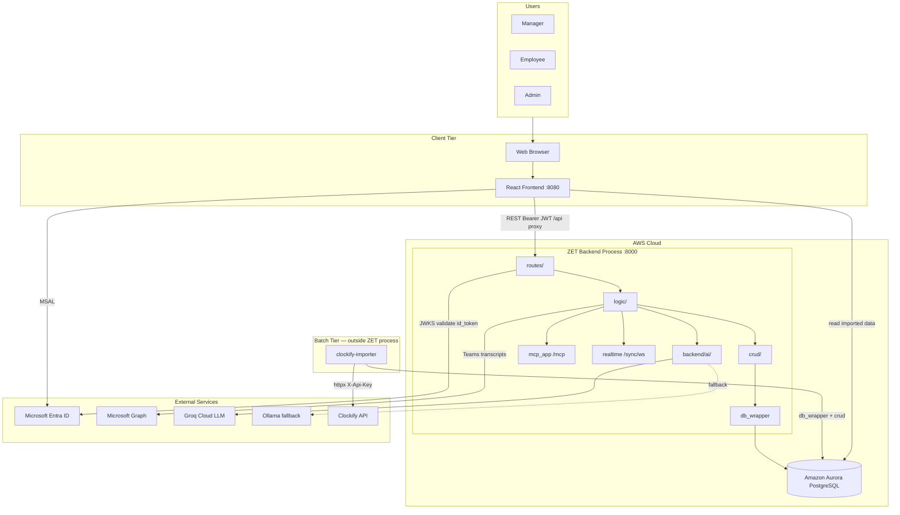
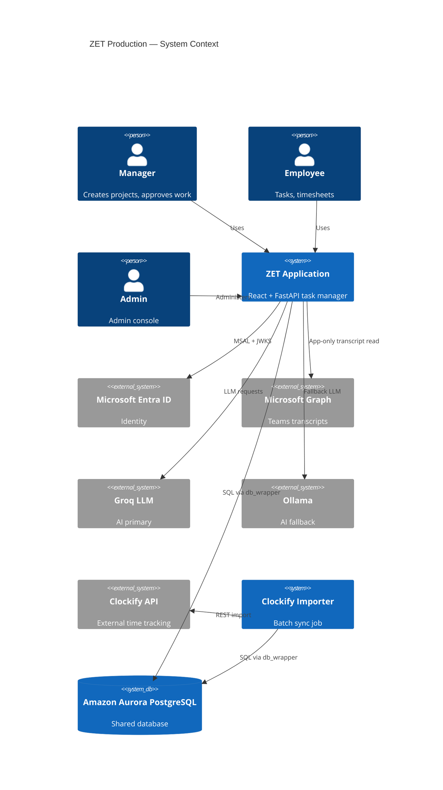
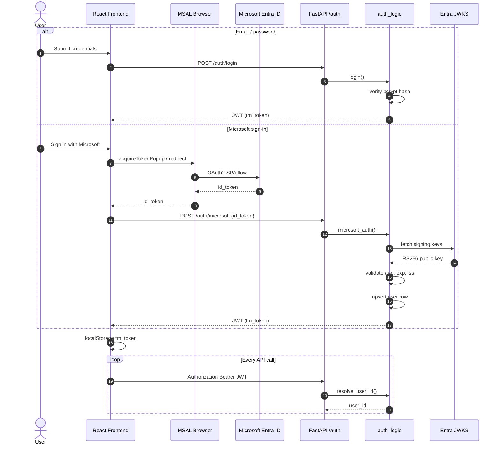
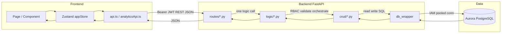
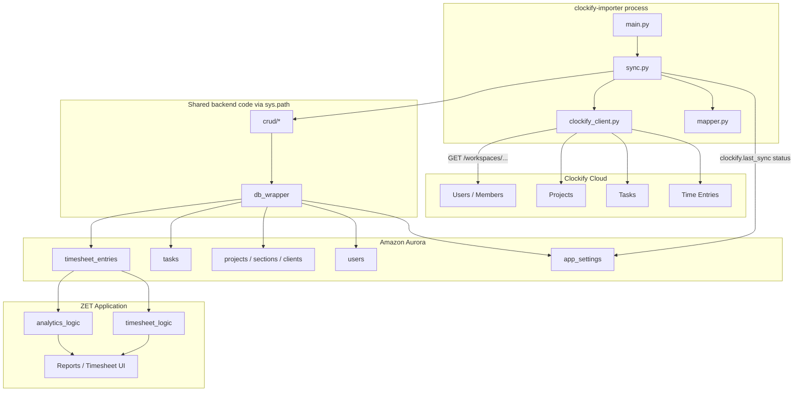
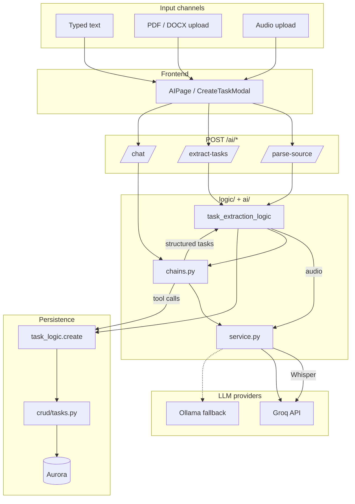

# ZET Application Architecture

**Document version:** 2026-07-10 (post–Clockify decoupling)  
**Status:** Single source of truth for ZET + external Clockify Importer  
**Target Draw.io diagram:** `docs/zet-production-architecture-v7.drawio` (to be created from instructions below; do **not** edit v6)

---

## Overview

**ZET** is a full-stack task and workforce management application:

| Layer | Stack |
|-------|-------|
| Frontend | React 18, TypeScript, Vite (port **8080**), Zustand, TanStack Query, Shadcn/ui, Tailwind, React Router 6 |
| Backend | FastAPI (port **8000**), strict **routes → logic → crud** layering |
| Database | **Amazon Aurora PostgreSQL** in production (IAM auth); SQLite when `ZET_TEST_SQLITE=1` |
| DB access | **`db_wrapper`** — all SQL via `read()` / `write()`; no ORM queries in routes or logic |
| AI | **Groq** primary LLM; **Ollama** automatic fallback |
| Auth | Email/password + **Microsoft Entra ID** (MSAL on frontend, JWKS on backend) → app JWT |
| MCP | Embedded FastMCP server at `/mcp` (OAuth 2.1 + personal access tokens) |
| Realtime | WebSocket `/sync/ws` + optional **Redis** fan-out across workers |

**Clockify** is **not** part of ZET anymore. Time-tracking import is handled by a separate batch process:

| System | Role |
|--------|------|
| **System A — ZET Application** | Web UI + API; reads/writes Aurora for all product features |
| **System B — Clockify Importer** | Standalone Python job in `clockify-importer/`; fetches from Clockify API, transforms, writes directly to Aurora via shared `db_wrapper` + `crud/`, updates `app_settings`, exits |

**Coupling between A and B:** shared Aurora schema only. No HTTP, no shared process, no Clockify credentials in ZET backend.

---

# Step 1 — Clockify Removal Verification

## Summary

Clockify **business logic has been removed from ZET**. The backend no longer exposes `/clockify` routes, `clockify_logic.py` is gone, and `ClockifyCard.tsx` is gone. Import runs only via `clockify-importer/`.

ZET **does not depend on Clockify at runtime**. It displays timesheet/project data that may have been written by the importer.

## Complete reference inventory

### System B — Clockify Importer (intentional, active)

| File | Purpose | Active? | Should remain? |
|------|---------|---------|----------------|
| `clockify-importer/main.py` | CLI entry: `--days`, config check, runs sync, prints summary | **Active** | **Yes** — importer entrypoint |
| `clockify-importer/sync.py` | Full reconciliation: users, projects, tasks, time entries → Aurora | **Active** | **Yes** — core import logic |
| `clockify-importer/clockify_client.py` | httpx client for Clockify REST API | **Active** | **Yes** |
| `clockify-importer/mapper.py` | Date/duration/id mapping helpers | **Active** | **Yes** |
| `clockify-importer/db.py` | Adds `backend/` to `sys.path`; loads `db_wrapper` | **Active** | **Yes** |
| `clockify-importer/importer_config.py` | `CLOCKIFY_API_KEY`, `CLOCKIFY_WORKSPACE_ID`, `CLOCKIFY_BASE_URL` | **Active** | **Yes** |
| `clockify-importer/requirements.txt` | Importer deps (httpx, psycopg2, boto3, bcrypt, …) | **Active** | **Yes** |
| `clockify-importer/README.md` | Importer runbook | **Active** | **Yes** |
| `clockify-importer/.env.example` | Importer env template | **Active** | **Yes** |
| `clockify-importer/.env` | Local credentials (**secrets — do not commit**) | Active locally | **No in git** |

### System A — ZET runtime (no Clockify logic)

| File | Purpose | Active? | Should remain? |
|------|---------|---------|----------------|
| `backend/routes/__init__.py` | Route registration — **no `/clockify` router** | **Active** | **Yes** |
| `backend/logic/analytics_logic.py` L5 | Stale comment: "handled by clockify_logic.py" | Dead comment | **Update comment** — logic file removed |
| `backend/.env.example` L50–52 | Commented `CLOCKIFY_*` vars | **Stale** | **Remove** — Clockify env belongs in importer only |
| `frontend/src/pages/SettingsPage.tsx` L697–711 | Manager info card: "external Clockify Importer" | **Active** | **Yes** — correct messaging |
| `frontend/src/lib/analyticsApi.ts` L4 | Comment mentions `/clockify` route | **Stale** | **Update comment** — route removed |
| `frontend/src/lib/task-utils.ts` L24 | `normalizePriority()` — handles lowercase priorities from imports | **Active** | **Yes** — data compatibility |
| `frontend/src/pages/ClientDetailPage.tsx` | `ClockifyNotice` — always shows "not connected" | **Active but wrong** | **Remove or rewrite** — no in-app connection |
| `frontend/src/components/analytics/ClientSummaryPanel.tsx` | Same `ClockifyNotice` | **Active but wrong** | **Remove or rewrite** |
| `frontend/src/pages/TimesheetPage.tsx` | Comment "Clockify-style quick bar" | **Active** (UI pattern only) | **Yes** — cosmetic naming |
| `frontend/src/pages/CalendarPage.tsx` | Comment "Clockify-style" calendar | **Active** (UI pattern only) | **Yes** |
| `frontend/src/components/CalendarWeekView.tsx` | Comment "Clockify-style" grid | **Active** (UI pattern only) | **Yes** |
| `frontend/src/pages/TimeReportPage.tsx` | Comment "Clockify-style reporting" | **Active** (UI pattern only) | **Yes** |
| `frontend/src/lib/report-export.ts` | Comment "Clockify-style" export styling | **Active** | **Yes** |

### Removed from ZET (confirmed absent)

| Former artifact | Status |
|-----------------|--------|
| `backend/routes/clockify.py` | **Deleted** |
| `backend/logic/clockify_logic.py` | **Deleted** |
| `frontend/src/components/settings/ClockifyCard.tsx` | **Deleted** |
| `clockifyApi` in frontend API client | **Removed** (no references except stale comment) |
| `crud/` Clockify-specific code | **None** |
| `main.py` Clockify startup / background sync | **None** |

### Documentation only (stale — not runtime)

| File | Notes | Should remain? |
|------|-------|----------------|
| `docs/CLOCKIFY_INTEGRATION_ANALYSIS.md` | Pre-decoupling investigation | Archive or replace with this doc |
| `docs/DATABASE_ARCHITECTURE.md` | References `clockify_logic`, `clockify.*` app_settings keys | Update separately |
| `docs/APP_ZET.md`, `docs/product-specification.md` | Describe built-in Clockify | Update separately |
| `docs/zet-production-architecture-v2..v5.drawio` | Clockify in Integrations logic + external API | Historical |
| `docs/zet-production-architecture-v6.drawio` | **No Clockify box** (already cleaned) | Keep as baseline for v7 |

## Does ZET still depend on Clockify?

**No runtime dependency.**

- ZET backend never calls `api.clockify.me`.
- ZET frontend has no sync/connect UI (only informational Settings text and stale notices).
- Imported rows use ID prefixes (`clk_`, `clk_task_`, `clk_tentry_`) and descriptions like "Imported from Clockify"; ZET treats them as normal domain rows.
- Importer writes sync metadata to `app_settings` keys `clockify.last_sync` and `clockify.last_status`; ZET does not currently read these in UI (no status endpoint).

---

# High Level Architecture



---

# Production Components

| Component | Location | Port / trigger | Responsibility |
|-----------|----------|----------------|----------------|
| Frontend | `frontend/` | 8080 | SPA, MSAL sign-in, REST client, live sync WebSocket |
| Backend API | `backend/main.py` | 8000 | FastAPI app, CORS, request timing, static project media |
| MCP server | `backend/mcp_app.py` | 8000 `/mcp` | Agent tools → logic layer |
| DB wrapper | `backend/db_wrapper/` | in-process | Pooled Aurora read/write, IAM tokens |
| Aurora connector | `test-db-connection/connect_rds_iam.py` (configurable via `DB_CONNECTOR_PATH`) | — | Hostnames, IAM token generation |
| Redis subscriber | `backend/realtime.py` | optional | Cross-worker WebSocket fan-out when `REDIS_URL` set |
| Sentry | `main.py` | optional | Error monitoring when `SENTRY_DSN` set |
| Clockify Importer | `clockify-importer/main.py` | cron / manual CLI | Batch sync to Aurora |

---

# Frontend

## Build and API flow

- **Dev server:** Vite on port **8080**; proxies `/api/*` → backend (strip `/api` prefix) per `frontend/vite.config.ts`.
- **API base URL:** `VITE_API_URL` (see `frontend/src/lib/env.ts`, `env.defaults.ts`).
- **Auth token:** JWT stored in `localStorage` key `tm_token`; attached as `Authorization: Bearer` by `frontend/src/lib/api.ts` and `frontend/src/lib/analyticsApi.ts`.
- **State:** Single Zustand store `frontend/src/stores/appStore.ts` — auth, projects, tasks, users, kanban, theme, bootstrap hydration.
- **Live updates:** `useLiveSync` hook → WebSocket `/sync/ws?token=` or polling `/sync/version`.

## Major pages (routes in `frontend/src/App.tsx`)

| Route | Page component | Access | Purpose |
|-------|----------------|--------|---------|
| `/login` | `LoginPage` | Public | Email/password login |
| `/signup` | `SignUpPage` | Public | Registration + role selection |
| `/` | `DashboardPage` | Authenticated | Home dashboard |
| `/overview` | `OverviewPage` | Manager/Admin | Executive analytics (wrapped in `DashboardPanArea`) |
| `/tasks` | `MyTasksPage` | Authenticated | Personal task list / kanban |
| `/timesheet` | `TimesheetPage` | Authenticated | Time entry, submissions, manager approvals (`?manage=1`) |
| `/calendar` | `CalendarPage` | Authenticated | Week/day calendar for time entries |
| `/meeting-notes` | `MeetingNotesPage` | Authenticated | Scrum / MOM notes |
| `/reports` | `TimeReportPage` | Authenticated | Client/project reporting |
| `/reports/clients/:clientId` | `ClientDetailPage` | Manager/Admin | Single-client drill-down |
| `/users` | `UsersPage` | Manager/Admin | Org roster, WIP tab |
| `/users/forecast` | `WhatWillHappenNextPage` | Manager/Admin | Capacity / deadline forecast |
| `/users/:userId` | `UserDetailPage` | Manager/Admin | Employee performance |
| `/manage` | `ManageProjectsOverview` | Manager/Admin | Project portfolio |
| `/manage/:projectId` | `ProjectDetailPage` | Manager/Admin | Project detail, sections, tasks |
| `/settings` | `SettingsPage` | Authenticated | Profile, password, MCP/PAT, Clockify info (external) |
| `/ai` | `AIPage` | Authenticated | Zani AI chat |
| `/admin/login` | `AdminLoginPage` | Public | Admin console login |
| `/admin` | `AdminPage` | Admin session | User/role management |

Redirects: `/wip` → `/users?tab=wip`, `/delivery` → `/manage/status`, `/timesheet/approvals` → `/timesheet?manage=1`.

## Major frontend modules

| Module | Path | Role |
|--------|------|------|
| API client | `lib/api.ts` | Primary REST client for tasks, projects, timesheet, auth, etc. |
| Analytics API | `lib/analyticsApi.ts` | `/analytics/*`, `/insights/generate` |
| Admin API | `lib/adminApi.ts` | `/admin/*` (separate admin JWT) |
| Microsoft auth | `lib/microsoftAuth.ts` | MSAL redirect handling |
| Task utilities | `lib/task-utils.ts`, `lib/subtask-utils.ts` | Assignee helpers, priority normalization |
| Analytics UI | `components/analytics/*` | Overview panels, forecast, org tree, insights |
| Agent UI | `components/agents/Companion.tsx` | Floating Zani companion |
| Navigation | `components/nav-items.tsx`, `AppSidebar.tsx`, `AppNavbar.tsx` | Sidebar routes |

## Frontend authentication flow

1. User clicks **Sign in with Microsoft** → `@azure/msal-browser` obtains `id_token` from Entra.
2. Frontend `POST /auth/microsoft` with `{ id_token, remember_me?, role? }`.
3. Backend validates token via JWKS (`logic/auth_logic.py`), upserts user, returns ZET JWT.
4. JWT stored in `localStorage`; all subsequent API calls include Bearer header.
5. **Admin console:** separate flow via `adminApi.loginMicrosoft` → `/admin/*` routes.
6. **MCP / developer:** Personal access tokens from Settings → Developer settings; OAuth consent at `/oauth/consent`.

---

# Backend

## Layering (mandatory)

```
routes/  →  HTTP only: parse input, call ONE logic function, return
logic/   →  Business rules, permissions, audit, notifications, transactions
crud/    →  ALL SQL (read/write via db_wrapper)
db_wrapper/ → Connection pools, read()/write(), request scope
```

## File structure (active modules)

```
backend/
├── main.py                 # FastAPI app, CORS, MCP mount, lifespan (Redis subscriber)
├── config.py               # Env-derived settings
├── mcp_app.py              # Embedded MCP tools
├── oauth_provider.py       # OAuth 2.1 DCR + consent
├── realtime.py             # WebSocket sync + Redis fan-out
├── routes/                 # HTTP routers (see table below)
├── logic/                  # Business logic modules
├── crud/                   # SQL data access (27 modules)
├── db_wrapper/             # DatabaseWrapper, pools, dialect, loader
├── database/
│   ├── database.py         # get_db(), Db alias
│   ├── init_db.py          # Schema bootstrap + seeds
│   └── models.py           # SQLAlchemy models (metadata only; queries in crud/)
├── ai/                     # LLM service, chains, prompts, tools, router
└── integrations/
    └── msgraph.py          # Microsoft Graph client (Teams transcripts)
```

## Routes (registered in `routes/__init__.py`)

| Prefix | Module | Logic layer | Notes |
|--------|--------|-------------|-------|
| `/health` | `health.py` | health checks | Liveness |
| `/auth` | `auth.py` | `auth_logic` | login, register, microsoft |
| `/auth/tokens` | `tokens.py` | `token_logic` | Personal access tokens |
| `/oauth` | `oauth_consent.py`, `oauth_well_known.py` | `token_logic`, OAuth | MCP OAuth discovery |
| `/admin` | `admin.py` | `admin_logic` | Admin console |
| `/users` | `users.py` | `user_logic` | Profiles, roster |
| `/clients` | `clients.py` | `client_logic` | Client CRUD |
| `/skills` | `skills.py` | `skill_logic` | Skills catalog + user skills |
| `/projects` | `projects.py` | `project_logic` | Projects, members, media |
| `/tasks` | `tasks.py` | `task_logic`, `timer_logic`, `task_feedback_logic` | Tasks, timers, feedback |
| `/tasks/{id}/checklists` | `checklists.py` | `checklist_logic` | Task checklists |
| `/tasks/{id}/attachments` | `attachments.py` | `attachment_logic` | File attachments |
| `/kanban` | `kanban.py` | `kanban_logic` | User kanban columns |
| `/timesheet` | `timesheet.py` | `timesheet_logic` | Entries + submissions |
| `/audit` | `audit.py` | audit read | Audit log |
| `/notifications` | `notifications.py` | `notification_logic` | In-app notifications |
| `/sync` | `sync.py` | `auth_logic`, `realtime` | WebSocket + version polling |
| `/meeting-notes` | `meeting_notes.py` | `meeting_notes_logic` | Scrums / MOM |
| `/integrations/teams` | `integrations_teams.py` | `teams_logic` | Teams transcript import |
| `/analytics` | `analytics.py` | `analytics_logic`, `task_forecast_logic` | Org, WIP, forecast, delivery |
| `/insights` | `insights.py` | `insight_logic` | LLM narrative insights |
| `/ai` | `ai/router.py` | `chains`, `task_extraction_logic`, `daily_summary_logic` | Chat, parse, transcribe |
| `/wrapper-test` | `wrapper_test.py` | `wrapper_test_logic` | DB wrapper diagnostics |

**Not registered:** `/clockify` (removed).

## Logic modules (`backend/logic/`)

| Module | Domain |
|--------|--------|
| `auth_logic.py` | JWT, bcrypt, Microsoft JWKS, admin auth |
| `user_logic.py` | User profiles, permissions |
| `project_logic.py` | Projects, sections, members, media |
| `client_logic.py` | Clients |
| `skill_logic.py` | Skills matching |
| `task_logic.py` | Task CRUD, move, approve, assignees |
| `timer_logic.py` | Running timers, min persist |
| `timesheet_logic.py` | Entries, weekly submissions, manager review |
| `kanban_logic.py` | Column customization |
| `task_feedback_logic.py` | Task comment threads |
| `checklist_logic.py` | Task checklists |
| `attachment_logic.py` | Uploads |
| `notification_logic.py` | In-app alerts |
| `audit.py` | Audit write helper |
| `meeting_notes_logic.py` | Scrum CRUD + AI parse |
| `teams_logic.py` | Teams → MOM pipeline |
| `analytics_logic.py` | Org tree, WIP, client hours, delivery risk |
| `task_forecast_logic.py` | Due-date forecast, smart reassignment |
| `insight_logic.py` | Scoped LLM insights for analytics UI |
| `daily_summary_logic.py` | End-of-day AI recap |
| `task_extraction_logic.py` | Document/audio → tasks |
| `admin_logic.py` | Admin console operations |
| `token_logic.py` | PAT create/revoke/resolve |

## CRUD modules (`backend/crud/`)

One module per domain table group: `users`, `projects`, `sections`, `tasks`, `task_assignees`, `task_feedback`, `timers`, `timelog`, `timesheet_entries`, `timesheet_submissions`, `kanban`, `notifications`, `audit`, `meeting_notes`, `teams`, `attachments`, `checklists`, `clients`, `skills`, `analytics`, `settings`, `access_tokens`, `oauth`, `admin`, `health`, `_base.py`.

All queries use `db.read(sql, params)` or `db.write(sql, params)`.

## Authentication (backend)

| Mechanism | Implementation |
|-----------|----------------|
| Session JWT | HS256, `TASKMANAGER_JWT_SECRET`, `sub` = user id |
| Microsoft | RS256 id_token validated against Entra JWKS; audience = `MICROSOFT_CLIENT_ID` |
| Personal access token | Prefix-based; stored hashed in `personal_access_tokens`; used for MCP and API |
| Admin console | Separate credentials (`ADMIN_USERNAME` / `ADMIN_PASSWORD` or hashed in `app_settings`) |
| WebSocket | Same JWT/PAT via query param `?token=` |

Dependency: `routes/deps.py` → `get_current_user_id` → `auth_logic.resolve_user_id`.

## Notifications

Created in logic layer (task assign, approval, timesheet events) via `notification_logic` → `crud/notifications.py`. Delivered to frontend through REST `/notifications` and live sync channel bumps.

## AI / LLM (`backend/ai/`)

| Piece | Role |
|-------|------|
| `service.py` | Groq ChatGroq + Ollama fallback, Whisper transcribe |
| `chains.py` | Prompt orchestration: chat agent, MOM parse, task parse, descriptions |
| `tools.py` | Zani agent tools (create task, project, etc.) |
| `prompts.py` | System/human prompt templates |
| `response_parser.py` | Strip reasoning tokens from model output |
| `router.py` | FastAPI `/ai/*` endpoints |

Env: `GROQ_API_KEY`, `GROQ_MODEL`, `OLLAMA_*`, `AI_OLLAMA_FALLBACK`.

## Major API surface (representative)

**Auth:** `POST /auth/login`, `/register`, `/microsoft`  
**Tasks:** `GET/POST /tasks`, `PATCH/DELETE /tasks/{id}`, `/move`, `/approve`, timer endpoints  
**Timesheet:** `GET/POST/PATCH/DELETE /timesheet/entries`, submission workflow under `/timesheet/submissions/*`  
**Analytics:** `GET /analytics/organization`, `/employees`, `/wip`, `/overview`, `/forecast`, `/delivery-risk`, …  
**Insights:** `POST /insights/generate`  
**AI:** `POST /ai/chat`, `/extract-tasks`, `/parse-source`, `/summarize-day`, …  
**Teams:** `GET /integrations/teams/status`, `POST /import`, `/sync`  
**Sync:** `GET /sync/version`, `WS /sync/ws`

---

# Database Layer

## ORM models (`database/models.py`)

Tables: `users`, `app_settings`, `clients`, `skills`, `user_skills`, `projects`, `project_members`, `sections`, `tasks`, `task_assignees`, `task_timer_runs`, `task_time_logs`, `kanban_columns`, `timesheet_submissions`, `timesheet_entries`, `task_feedback`, `task_checklists`, `task_attachments`, `audit_logs`, `notifications`, `oauth_clients`, `oauth_grants`, `personal_access_tokens`, `scrums`, `teams_transcript_imports`.

## How db_wrapper works

1. **`get_database()`** returns singleton `DatabaseWrapper`.
2. **Production:** `load_connector()` imports `connect_rds_iam.py` from `DB_CONNECTOR_PATH`; pools separate **reader** and **writer** Aurora endpoints.
3. **IAM auth:** Tokens generated via boto3 RDS API; refreshed ~14 min (`ConnectionPools._iam_token`).
4. **Request scope:** FastAPI `get_db()` calls `enter_request_scope()` — one read + one write connection per HTTP request; read-your-writes after writes.
5. **API:**
   - `read(sql, params)` → `list[dict]`
   - `write(sql, params)` → `{ok, rowcount}`
   - `commit()`, `transaction()` for explicit boundaries
6. **SQLite mode:** `ZET_TEST_SQLITE=1` → local file pool for pytest (`db_wrapper/sqlite_pool.py`, SQL adapted in `dialect.py`).
7. **Bootstrap:** `init_db()` runs `scripts/bootstrap_aurora.sql` or `bootstrap_sqlite.sql` on startup.

## Data flow (ZET request)

```
HTTP Request
  → routes/deps.get_db() → enter_request_scope()
  → logic/*.py (validation, RBAC)
  → crud/*.py → db.read() / db.write()
  → db_wrapper → Aurora reader or writer pool
  → commit on scope exit
  → realtime bump (version counters)
  → JSON response
```

## Importer data flow (Clockify)

Same `db_wrapper` and `crud/` modules; importer calls `db.enter_request_scope()` in `main.py`, runs `sync.run_reconciliation_sync()`, `db.commit()`, `db.close()`.

**Written entities:**

| Entity | ID pattern / notes |
|--------|-------------------|
| `timesheet_entries` | `clk_{clockifyEntryId}` |
| `tasks` (catalog) | `clk_task_{clockifyTaskId}` |
| `tasks` (from time entry) | `clk_tentry_{clockifyEntryId}` |
| `projects`, `sections`, `clients`, `users` | Created if missing; users matched by email |
| `app_settings` | `clockify.last_sync`, `clockify.last_status` (JSON) |

---

# External Services

| Service | Used by | Purpose | Config |
|---------|---------|---------|--------|
| **Microsoft Entra ID** | Frontend MSAL, backend JWKS | User sign-in | `MICROSOFT_CLIENT_ID`, `MICROSOFT_TENANT_ID`, `VITE_MICROSOFT_CLIENT_ID` |
| **Microsoft Graph** | `integrations/msgraph.py` → `teams_logic` | Teams meeting transcripts (app-only) | `MICROSOFT_CLIENT_SECRET`, Graph permissions + Teams access policy |
| **Groq Cloud** | `ai/service.py` | Primary LLM + Whisper STT | `GROQ_API_KEY`, `GROQ_*_MODEL` |
| **Ollama** | `ai/service.py` | Fallback LLM when Groq fails | `OLLAMA_BASE_URL`, `OLLAMA_MODEL`, `OLLAMA_API_KEY` |
| **Amazon Aurora** | `db_wrapper` | Primary datastore | `DB_*` via connector package, IAM |
| **AWS IAM / RDS** | Connector + pool | DB auth tokens | `AWS_REGION`, `DB_WRITE_HOST`, `DB_READ_HOST` |
| **Redis** | `realtime.py` | Optional multi-worker WS fan-out | `REDIS_URL` |
| **Sentry** | `main.py` | Error monitoring | `SENTRY_DSN` |
| **Clockify API** | **`clockify-importer` only** | Time/project/user import | `CLOCKIFY_API_KEY`, `CLOCKIFY_WORKSPACE_ID` in importer `.env` |

---

# Clockify Importer

## Purpose

Standalone batch job that synchronizes Clockify workspace data into the shared ZET Aurora database so ZET analytics, timesheets, and reports show imported hours **without** any Clockify code in the ZET API process.

## Folder structure

```
clockify-importer/
├── main.py              # CLI entry
├── sync.py              # Reconciliation orchestration
├── clockify_client.py   # Clockify REST client (httpx)
├── mapper.py            # Field mapping helpers
├── db.py                # sys.path hook → backend db_wrapper
├── importer_config.py   # CLOCKIFY_* env vars
├── requirements.txt
├── README.md
├── .env.example
└── .env                 # local secrets (not for git)
```

## Independence from ZET

| Aspect | ZET | Importer |
|--------|-----|----------|
| Process | Long-running FastAPI | Short-lived CLI |
| Clockify credentials | None | `clockify-importer/.env` |
| HTTP to ZET API | N/A | **Never** |
| Shared code | — | Imports `backend/crud/*`, `db_wrapper`, `database.models`, `logic.auth_logic.hash_password` via `sys.path` |
| Shared data | Reads Aurora | Writes Aurora |

## Configuration

**Importer `.env`:**

```ini
CLOCKIFY_API_KEY=
CLOCKIFY_WORKSPACE_ID=
CLOCKIFY_BASE_URL=https://api.clockify.me/api/v1
```

**Database:** Importer loads `backend/.env` first (for Aurora connector vars / `ZET_TEST_SQLITE`). Uses same `DB_CONNECTOR_PATH` and IAM settings as ZET.

## Execution

```bash
cd clockify-importer
pip install -r requirements.txt
python main.py              # default 365 days
python main.py --days 30      # custom window
```

Exit codes: `0` success, `1` config/sync failure. Prints summary counts to stdout.

## Import flow (detailed)

1. Validate `CLOCKIFY_API_KEY` + `CLOCKIFY_WORKSPACE_ID`.
2. Open `db_wrapper` request scope.
3. Fix legacy placeholder due dates on `clk_task_*` rows.
4. Fetch Clockify workspace members → email map.
5. Fetch all Clockify projects → ensure ZET `projects` + `sections` (+ `clients`).
6. For each project, fetch Clockify tasks → create `clk_task_*` ZET tasks if absent.
7. For each member, fetch time entries in 30-day chunks over `--days` window.
8. For each entry: upsert `timesheet_entries` (`clk_*` id), optionally create matching task (`clk_tentry_*`).
9. Auto-create ZET users for unknown Clockify emails (employee role, random password).
10. Write `app_settings`: `clockify.last_sync`, `clockify.last_status`.
11. `db.commit()`, close connections, exit.

## Database writes (CRUD used)

`users`, `clients`, `projects`, `sections`, `tasks`, `task_assignees`, `timesheet_entries`, `settings` — all via existing `backend/crud/*` functions; **no duplicate SQL in importer** except one maintenance UPDATE in `sync.py`.

---

# Architecture Diagrams (Mermaid)

## 1. Overall Production Architecture



## 2. Authentication Flow



## 3. Request Flow (Frontend → Aurora → Response)



## 4. Clockify Import Flow



## 5. AI Flow (Transcript / document → tasks → database)



## 6. Database Interaction Flow

```mermaid
flowchart TB
    subgraph Callers["Callers"]
        HTTP[FastAPI get_db]
        MCP[MCP tools SessionLocal]
        IMP[clockify-importer main.py]
    end

    subgraph Wrapper["db_wrapper.DatabaseWrapper"]
        RS[enter_request_scope]
        RD[read]
        WR[write]
        CM[commit]
        EX[exit_request_scope / close]
    end

    subgraph Pools["ConnectionPools"]
        RP[Reader pool]
        WP[Writer pool]
        IAM[IAM token refresh]
    end

    subgraph Aurora["Amazon Aurora PostgreSQL"]
        RR[Read replica endpoint]
        WRN[Writer cluster endpoint]
    end

    HTTP --> RS
    MCP --> RS
    IMP --> RS
    RS --> RD
    RS --> WR
    RD --> RP
    WR --> WP
    IAM --> RP
    IAM --> WP
    RP --> RR
    WP --> WRN
    WR -->|_wrote_in_scope| RP
    CM --> WP
    EX --> RP
    EX --> WP
```



---

# Draw.io Specification (for `zet-production-architecture-v7.drawio`)

Copy `docs/zet-production-architecture-v6.drawio` → `docs/zet-production-architecture-v7.drawio`, then apply the changes below. **Do not modify v6.**

## Canvas

| Property | Value |
|----------|-------|
| Page name | `ZET Production Architecture v7` |
| diagram id | `zet-prod-arch-v7` |
| Page size | 1780 × 1320 (same as v6) |
| Title cell | `ZET TaskManager — Production Software Architecture (v7)` |

## Container hierarchy (preserve from v6)

```
root (id=1)
├── title
├── users_box          [Users — Manager / Employee / Admin]
├── access_box         [Access — Web Browser]
├── aws                [AWS Cloud — large container x=260 y=60 w=1250 h=1120]
│   ├── auth_layer     [Authentication Zone swimlane]
│   │   ├── auth_note  [Sign-in once: MSAL → id_token → JWKS → JWT]
│   │   ├── frontend   [Frontend React :8080]
│   │   │   ├── fe_pages   [Pages & UI]
│   │   │   ├── fe_client  [Client Auth MSAL JWT]
│   │   │   └── fe_http    [HTTP Client REST Bearer]
│   │   ├── backend    [Backend FastAPI :8000]
│   │   │   ├── routes   [API ROUTES — r_0..r_10]
│   │   │   ├── logic    [BUSINESS LOGIC — l_0..l_10]
│   │   │   ├── crud     [CRUD LAYER — c_0..c_9]
│   │   │   └── dbw      [DB Wrapper]
│   │   └── svc_band   [Platform Services]
│   │       ├── svc_0 [AI Engine Groq Ollama]
│   │       ├── svc_1 [MCP Server /mcp]
│   │       ├── svc_2 [Realtime Sync WebSocket]
│   │       └── svc_3 [Cross-cutting Audit Notifications Files]
│   └── data_layer     [Data Layer AWS]
│       ├── aurora_icon
│       └── aurora_label [Amazon Aurora PostgreSQL IAM]
├── ext                [External Services — dashed container x=1590 y=60 w=230 h=520]
│   ├── entra_ext      [Microsoft Entra ID]
│   ├── graph_ext      [Microsoft Graph Teams transcripts]
│   └── groq_ext       [Groq Cloud LLM Ollama fallback]
└── legend             [Path legend bar]
```

## NEW in v7 — Batch tier (outside AWS Cloud box)

Add a **new top-level container** sibling to `aws` and `ext`:

| Cell id (new) | Parent | Style | Position | Label |
|---------------|--------|-------|----------|-------|
| `batch_zone` | `1` (root) | dashed swimlane, fill `#FFF8E1`, stroke `#F9A825` | x=260, y=1190, w=600, h=160 | **Batch Jobs (outside ZET API process)** |
| `importer_box` | `batch_zone` | rounded rect fill `#FFE082` | x=20, y=40, w=260, h=100 | **Clockify Importer**<br>`clockify-importer/`<br>CLI · cron · manual |
| `importer_dbw` | `batch_zone` | rounded rect fill `#FFCDD2` stroke `#E53935` | x=300, y=40, w=130, h=100 | **DB Wrapper**<br>(shared library) |

## NEW in v7 — External Clockify API

Add inside `ext` container (below `groq_ext`):

| Cell id (new) | Parent | Position | Label |
|---------------|--------|----------|-------|
| `clockify_ext` | `ext` | x=18, y=324, w=194, h=72 | **Clockify API**<br>Time · projects · users |

Increase `ext` container height from **520** to **620** to fit the new box.

## v7 route / logic box label updates

**Remove any reference to Clockify inside ZET backend boxes** (v6 already has no Clockify route; verify):

| Cell | v6 label | v7 label (confirm unchanged) |
|------|----------|------------------------------|
| `l_10` | Meeting Notes MOM Transcribe | Same — **no Integrations/Clockify box** |
| All `r_*` | No clockify.py | Same |

Optional subtitle on `fe_pages`: append `· Settings notes external Clockify import`.

## Edge catalog (v6 — keep all)

| Edge id | Source | Target | Label | Style |
|---------|--------|--------|-------|-------|
| e1 | users_box | access_box | (none) | solid gray |
| e2 | access_box | auth_layer | enter | solid blue |
| e_jwt | fe_http | routes | JWT Bearer · REST / JSON | solid blue |
| e6 | routes | logic | (none) | solid orange |
| e7 | logic | crud | (none) | solid purple |
| e8 | crud | dbw | (none) | solid red |
| e_svc | logic | svc_band | uses | solid purple |
| e9 | dbw | data_layer | SQL (IAM) | solid magenta |
| ex_msal | fe_client | entra_ext | MSAL · id_token | dashed blue |
| ex_jwks | entra_ext | auth_note | JWKS · validate (BE) | dashed blue |
| ex_graph | backend/logic area | graph_ext | Teams | dashed indigo |
| ex_groq | svc_0 | groq_ext | LLM | dashed purple |

## NEW edges in v7

| Edge id (new) | Source | Target | Label | Style |
|---------------|--------|--------|-------|-------|
| `e_imp_clockify` | importer_box | clockify_ext | REST X-Api-Key | dashed green |
| `e_imp_dbw` | importer_box | importer_dbw | import | solid red |
| `e_imp_aurora` | importer_dbw | data_layer | SQL (IAM) | solid magenta; route **below** aws box, **not** through ZET backend |
| `e_zet_read` | data_layer | fe_pages | imported hours/tasks | dashed gray optional annotation |

**Critical:** `e_imp_aurora` must **not** connect through `backend` → `routes` → `logic`. Importer bypasses ZET API entirely.

## REMOVE in v7 (if copying from older v2–v5 instead of v6)

| Remove | Reason |
|--------|--------|
| `clockify_ext` → `logic` edge labeled "Sync" | Clockify no longer in ZET logic |
| `routes/clockify.py` box | Deleted |
| `clockify_logic.py` box | Deleted |
| `l_11 Integrations Teams · Clockify` | Replace with Teams-only in meeting/teams path OR omit |

## Legend text (v7)

Replace legend value with:

> **Path:** User → Frontend → Backend (JWT) → Routes → Logic → CRUD → DB Wrapper → Aurora | **Batch:** Clockify → Importer → DB Wrapper → Aurora → ZET reads | **Entra:** MSAL (FE) · JWKS (BE) | **Dashed** = external

---

# Draw.io Update Instructions

Instructions for an AI editing **`zet-production-architecture-v7.drawio`** (copy from v6):

## Boxes that must exist

1. All v6 boxes listed in container hierarchy above.
2. **NEW** `batch_zone` swimlane outside AWS cloud.
3. **NEW** `importer_box` (Clockify Importer).
4. **NEW** `importer_dbw` (shared DB Wrapper library — visual duplicate of backend dbw concept).
5. **NEW** `clockify_ext` in External Services.

## Boxes that changed (content)

| Box | Change |
|-----|--------|
| `title` | Append "(v7)" |
| `legend` | Add batch import path (see legend text) |
| `ext` | Taller; add Clockify API |
| `fe_pages` | Optional: mention Settings external import note |

## Boxes removed (if migrating from pre-v6 diagrams)

- `routes/clockify.py` or any `/clockify` route cell
- `clockify_logic.py` logic cell
- `Integrations · Teams · Clockify` combined logic cell — use v6's separate Meeting Notes / Teams via Graph edge instead
- Arrow from ZET `logic` → `Clockify API` labeled "Sync"

## Arrows changed

| Action | Detail |
|--------|--------|
| **Add** | `importer_box` → `clockify_ext` ("REST X-Api-Key", dashed) |
| **Add** | `importer_box` → `importer_dbw` ("reuse crud + db_wrapper", solid) |
| **Add** | `importer_dbw` → `data_layer` / Aurora ("SQL IAM", solid magenta) — parallel to backend `e9`, not through backend |
| **Remove** | Any `logic` → `clockify_ext` "Sync" arrow |
| **Keep** | All v6 internal ZET arrows unchanged |

## Where Clockify appears in v7

| Location | Representation |
|----------|----------------|
| External Services | `clockify_ext` — Clockify API |
| Batch zone | `importer_box` — standalone Python project |
| **Not** in Backend routes/logic/crud | ZET has zero Clockify orchestration |

## Importer connection model

```
Clockify API  ←──(httpx)──  clockify-importer  ──→  db_wrapper  ──→  Aurora
                                                              ↑
ZET Backend ──→  db_wrapper  ──────────────────────────────┘
(reads same tables; no API call to importer)
```

## What should remain from v6

- Full AWS Cloud authentication zone with Frontend + Backend layering
- Routes / Logic / CRUD / DB Wrapper stack inside backend
- Platform Services band (AI, MCP, Realtime, Cross-cutting)
- Aurora data layer with IAM
- Entra, Graph, Groq external services and their existing dashed edges to FE/BE/services
- User → Browser → AWS entry path

---

# Appendix — Roles and RBAC

| Role | Scope |
|------|-------|
| `employee` | Own tasks, timesheets, projects where member |
| `manager` | Member projects + create/assign/approve + analytics (scoped subtree) |
| `admin` | All data + `/admin` console |

Enforced in `logic/` per endpoint (not in routes).

---

# Appendix — Environment variables (ZET backend)

See `backend/.env.example`. **Clockify vars should not be in ZET** — only in `clockify-importer/.env`.

Production-required: `TASKMANAGER_JWT_SECRET`, `ADMIN_PASSWORD`, `CORS_ORIGINS`, Aurora connector settings, `MICROSOFT_CLIENT_ID` (if Microsoft login enabled), `GROQ_API_KEY` (if AI enabled).

---

*End of document. Target diagram file: `docs/zet-production-architecture-v7.drawio` (create separately from this spec).*
