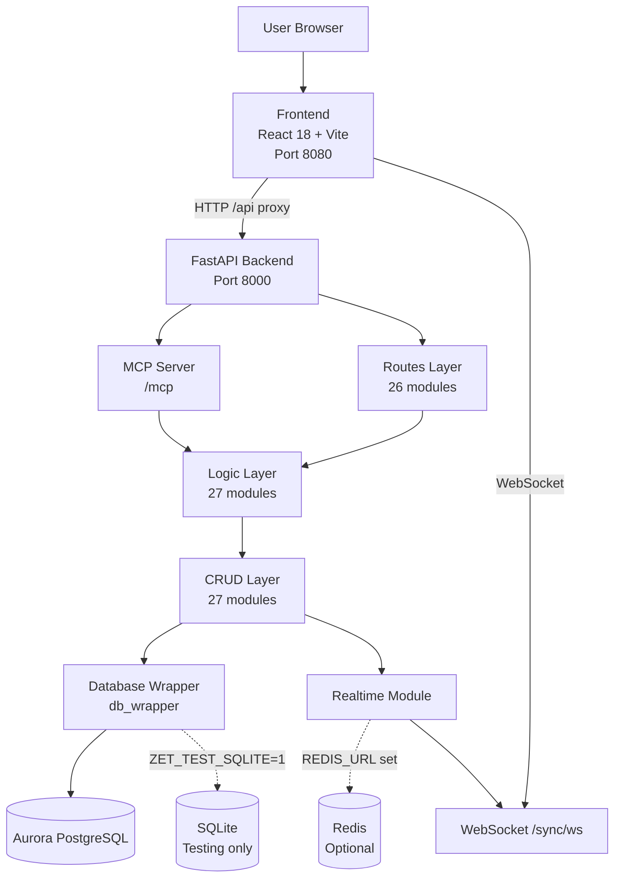
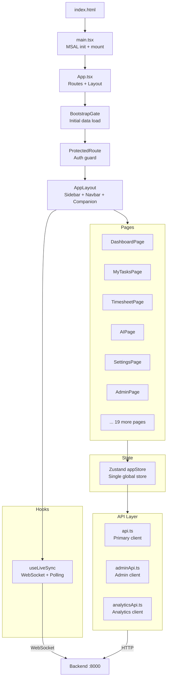
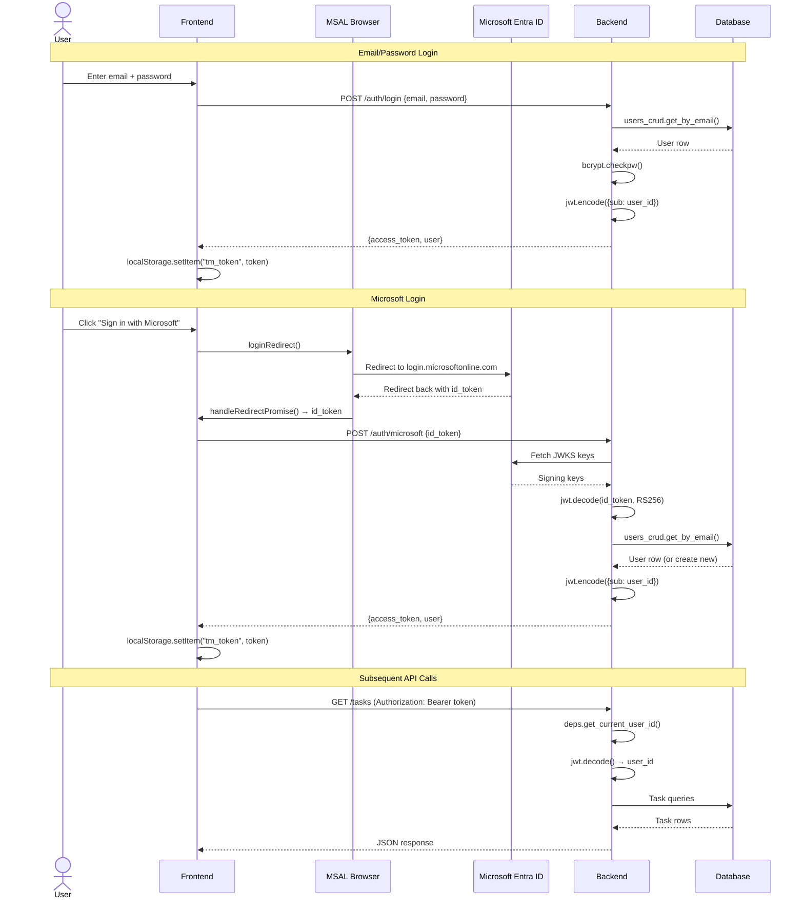
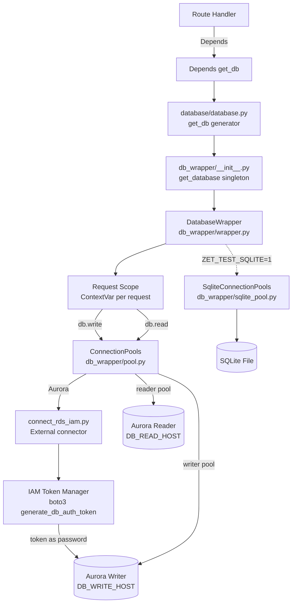
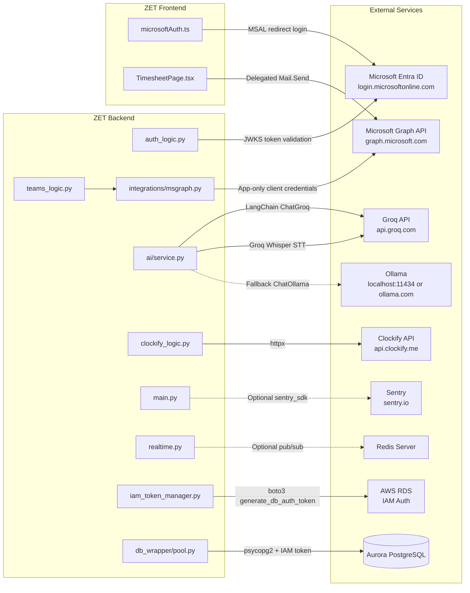

# APP_ZET — Application Architecture Document

> Generated from the actual repository source code.
> Every statement below is extracted from the codebase. Nothing is assumed or invented.

---

## 1. Overall Architecture

### Complete Request Flow

```
User (Browser)
     │
     ▼
Frontend (React 18 SPA — Vite dev server port 8080)
     │
     ▼
Vite Dev Proxy rewrites /api → http://127.0.0.1:8000
(in production: direct HTTP to backend origin)
     │
     ▼
API Client (frontend/src/lib/api.ts)
  ├── Attaches JWT Bearer token from localStorage (key: tm_token)
  ├── Sets Content-Type: application/json (or multipart for file uploads)
  └── On 401: clears token, redirects to /login
     │
     ▼
FastAPI Application (backend/main.py — port 8000)
     │
     ├── CORS Middleware (configurable origins via CORS_ORIGINS env)
     ├── Request Timing Middleware (logs slow requests > 200ms)
     │
     ▼
Router Registration (routes/__init__.py → register_routes())
     │
     ▼
Route Handler (routes/<module>.py)
  ├── Depends: get_db() → DatabaseWrapper (request-scoped)
  ├── Depends: get_current_user_id() → validates Bearer token → returns user_id
  └── Calls exactly ONE logic/ function
     │
     ▼
Logic Layer (logic/<module>.py)
  ├── Business rules, validation, permissions
  ├── Audit logging (logic/audit.py)
  ├── Notification creation (logic/notification_logic.py)
  ├── db.commit() for transaction boundaries
  └── Delegates ALL database access to crud/
     │
     ▼
CRUD Layer (crud/<module>.py)
  ├── Every SQL query lives here — no exceptions
  ├── Uses db.read() for SELECT queries
  ├── Uses db.write() for INSERT/UPDATE/DELETE
  ├── row_to_model() / rows_to_models() to hydrate ORM model classes
  └── Calls realtime.bump() after writes to trigger live sync
     │
     ▼
Database Wrapper (db_wrapper/wrapper.py — DatabaseWrapper)
  ├── read(sql, params) → list[dict]
  ├── write(sql, params) → int (affected rows)
  ├── Request-scoped connection pooling (reader + writer)
  ├── Aurora: psycopg2 connection pools with IAM token refresh
  └── SQLite: sqlite3 for testing (ZET_TEST_SQLITE=1)
     │
     ▼
Database
  ├── Production: Amazon Aurora PostgreSQL (RDS)
  └── Testing: SQLite (file-based)
     │
     ▼
Response returns through each layer back to the browser
```

---

## 2. Frontend

### Framework

- **React 18** with TypeScript
- **Vite** as build tool and dev server (port 8080)
- **SWC** via `@vitejs/plugin-react-swc` for fast compilation

### Folder Structure

```
frontend/src/
├── main.tsx              ← Entry point (initializes MSAL, mounts <App />)
├── App.tsx               ← Root component (routes, layout, auth gate)
├── index.css             ← Global styles (Tailwind CSS)
├── App.css
├── vite-env.d.ts
├── pages/                ← Route-level page components (25 files)
│   ├── LoginPage.tsx
│   ├── SignUpPage.tsx
│   ├── DashboardPage.tsx
│   ├── MyTasksPage.tsx
│   ├── TimesheetPage.tsx
│   ├── CalendarPage.tsx
│   ├── TimeReportPage.tsx
│   ├── UsersPage.tsx
│   ├── UserDetailPage.tsx
│   ├── WhatWillHappenNextPage.tsx
│   ├── ManageProjectsOverview.tsx
│   ├── ProjectDetailPage.tsx
│   ├── SettingsPage.tsx
│   ├── AIPage.tsx
│   ├── MeetingNotesPage.tsx
│   ├── OverviewPage.tsx
│   ├── AdminLoginPage.tsx
│   ├── AdminPage.tsx
│   ├── ClientDetailPage.tsx
│   └── ... (ManageEmployeesPage, WipPage, DeliveryPage, AuditPage, NotFound, Index)
├── components/           ← Reusable UI components (~100 files)
│   ├── AppSidebar.tsx
│   ├── AppNavbar.tsx
│   ├── TaskCard.tsx
│   ├── CreateTaskModal.tsx
│   ├── TaskDetailModal.tsx
│   ├── KanbanBoardPan.tsx
│   ├── NotificationBell.tsx
│   ├── GlobalSearchModal.tsx
│   ├── CalendarView.tsx
│   ├── CalendarWeekView.tsx
│   ├── MobileNav.tsx
│   ├── ProjectSectionPicker.tsx
│   ├── CreateProjectDialog.tsx
│   ├── SubtaskSection.tsx
│   ├── SkillsPicker.tsx
│   ├── TaskSuggest.tsx
│   ├── agents/           ← AI mascot / companion system
│   │   ├── Companion.tsx
│   │   ├── AgentAvatar.tsx
│   │   ├── TaskerThinking.tsx
│   │   ├── agents.ts
│   │   ├── shared.ts
│   │   ├── shared-ui.tsx
│   │   └── confetti.ts
│   ├── analytics/        ← Analytics dashboards
│   │   ├── DashboardPanArea.tsx
│   │   ├── ForecastPanel.tsx
│   │   ├── AIInsightsPanel.tsx
│   │   ├── OrgTree.tsx
│   │   ├── TimesheetAnalyticsPanel.tsx
│   │   ├── ClientSummaryPanel.tsx
│   │   ├── WorkHistorySheet.tsx
│   │   ├── NeedsAttentionList.tsx
│   │   ├── RecommendationScoreCard.tsx
│   │   └── AnalyticsMetricCard.tsx
│   ├── timesheet/        ← Timesheet-specific components
│   │   ├── TimesheetManagePanel.tsx
│   │   ├── TimesheetSubmissionAuditInfo.tsx
│   │   └── TimesheetSubmissionReviewPanel.tsx
│   ├── settings/
│   │   └── ClockifyCard.tsx
│   ├── brand/
│   │   └── ZetLogo.tsx
│   └── ui/               ← Shadcn/ui + Radix primitives (~50 files)
│       ├── button.tsx, card.tsx, dialog.tsx, dropdown-menu.tsx, ...
│       ├── sonner.tsx (toast notifications)
│       └── progressive-flux-loader.tsx
├── stores/
│   └── appStore.ts       ← Single Zustand store (all global state)
├── hooks/
│   ├── useTaskSync.ts    ← Live sync (WebSocket + polling fallback)
│   ├── useInsightGenerate.ts
│   └── use-toast.ts
├── lib/                  ← Utilities and API clients (23 files)
│   ├── api.ts            ← Primary HTTP client (JWT auth)
│   ├── adminApi.ts       ← Admin console HTTP client (separate token)
│   ├── analyticsApi.ts   ← Analytics endpoints client
│   ├── microsoftAuth.ts  ← MSAL browser integration
│   ├── env.ts            ← Environment variable helpers
│   ├── utils.ts          ← cn() classname merge (clsx + tailwind-merge)
│   ├── motion.ts         ← Framer Motion presets
│   ├── task-utils.ts
│   ├── project-utils.ts
│   ├── manage-utils.ts
│   ├── due-date-utils.ts
│   ├── subtask-utils.ts
│   ├── report-export.ts
│   ├── timesheetSubmission.ts
│   ├── analyticsLabels.ts
│   ├── insightUtils.ts
│   ├── healthStatus.ts
│   ├── client-summary.ts
│   ├── pill-color.ts
│   ├── image-color.ts
│   ├── zet-charts.ts
│   ├── recommendationDisplay.ts
│   └── agent-brand.tsx
├── types/
│   └── index.ts          ← Shared TypeScript interfaces
└── test/                 ← Frontend tests
```

### Entry Point

**`frontend/src/main.tsx`**:
1. Calls `initializeMsalBeforeReact()` to process any Microsoft redirect hash **before** React mounts (prevents BrowserRouter from consuming the URL fragment).
2. Dynamically imports `react-dom/client` and `App.tsx`.
3. Calls `createRoot(document.getElementById("root")!).render(<App />)`.

**`frontend/index.html`**: Single `<div id="root">` with `<script type="module" src="/src/main.tsx">`.

### Routing

React Router 6 with `<BrowserRouter>`. All routes defined in `App.tsx`:

| Path | Component | Access |
|---|---|---|
| `/login` | `LoginPage` | Public |
| `/signup` | `SignUpPage` | Public |
| `/` | `DashboardPage` | Protected |
| `/tasks` | `MyTasksPage` | Protected |
| `/timesheet` | `TimesheetPage` | Protected |
| `/calendar` | `CalendarPage` | Protected |
| `/meeting-notes` | `MeetingNotesPage` | Protected |
| `/reports` | `TimeReportPage` | Protected |
| `/reports/clients/:clientId` | `ClientDetailPage` | Manager only |
| `/users` | `UsersPage` | Manager only |
| `/users/forecast` | `WhatWillHappenNextPage` | Manager only |
| `/users/:userId` | `UserDetailPage` | Manager only |
| `/manage` | `ManageProjectsOverview` | Manager only |
| `/manage/:projectId` | `ProjectDetailPage` | Manager only |
| `/settings` | `SettingsPage` | Protected |
| `/ai` | `AIPage` | Protected |
| `/overview` | `OverviewPage` | Manager only |
| `/admin/login` | `AdminLoginPage` | Public |
| `/admin` | `AdminPage` | Admin token |
| `*` | Redirect to `/` | — |

**`ProtectedRoute`** wrapper: checks `currentUser` from Zustand store. If null, redirects to `/login`. If `managerOnly` and user is not `manager` or `admin`, redirects to `/`.

**`AppLayout`** wrapper: renders `<AppSidebar>`, `<AppNavbar>`, `<main>` content area, and `<Companion>` (AI mascot). Calls `useLiveSync()` for real-time updates.

### Communication Flow (Example: Dashboard)

```
DashboardPage
     │
     ▼
useAppStore (Zustand) — reads tasks, projects, users, kanbanColumns
     │
     ▼
On mount: bootstrap() called in BootstrapGate
     │  ├── api.getMe()
     │  ├── api.getUsers()
     │  ├── api.getProjects()
     │  ├── api.getTasks()
     │  ├── api.getKanbanColumns()
     │  ├── api.getActiveTimers()
     │  └── api.getClients() (manager/admin only)
     │
     ▼
api.ts → request() → fetch(`${baseUrl()}${path}`)
     │  ├── Attaches Bearer token from localStorage
     │  ├── Parses JSON response
     │  └── On 401: clears token, redirects to /login
     │
     ▼
Backend (FastAPI port 8000)
```

### State Management

**Single Zustand store** at `stores/appStore.ts`. Contains:

- `currentUser` — logged-in user object
- `login()`, `register()`, `loginWithMicrosoft()`, `logout()`
- `theme` — `'dark' | 'light'`
- `projects`, `selectedProjectId`, `createProject()`, `addSection()`, ...
- `users`
- `tasks`, `createTask()`, `updateTask()`, `moveTask()`, `approveTask()`, ...
- `kanbanColumns`, `addColumn()`, `removeColumn()`, `reorderColumns()`
- `activeTimers`, `startTimer()`, `stopTimer()`
- `clients`, `skills`
- `searchQuery`
- `mascotsEnabled`, `agentEvent` — AI companion state
- `mascotDrag`, `mascotDropTaskId` — drag-and-drop onto mascot
- `bootstrap()` — initial data load on app start
- `syncTasks()`, `syncProjectsAndUsers()` — live sync refresh
- `hydrated` — whether initial load is complete
- `timesheetEpoch` — cache invalidation signal

On app load, `BootstrapGate` calls `bootstrap()` which: reads JWT from `localStorage`, calls `api.getMe()` to validate, then fetches all initial data (users, projects, tasks, kanban columns, timers, clients) in parallel.

### API Layer

Three separate API clients:

1. **`lib/api.ts`** — Primary client. Token stored at `localStorage.tm_token`. Used by all user-facing pages.
2. **`lib/adminApi.ts`** — Admin console client. Token stored at `localStorage.tm_admin_token`. Used by `AdminPage`.
3. **`lib/analyticsApi.ts`** — Analytics client. Same token as primary (`tm_token`). Calls `/analytics`, `/clockify`, `/insights` endpoints.

All three follow the same pattern: `fetch()` with `Authorization: Bearer <token>`, JSON body, error parsing from `res.json().detail`.

### Authentication Flow (Frontend Side)

1. **Email/Password**: `LoginPage` → `appStore.login()` → `api.login()` → stores `access_token` in localStorage → redirects to `/`.
2. **Microsoft**: `LoginPage` → `loginWithMicrosoftRedirect()` → MSAL `loginRedirect()` → Microsoft login page → redirect back → `initializeMsalBeforeReact()` processes hash → stores `idToken` in sessionStorage → `MsalRedirectResume` component sends token to backend → stores `access_token` in localStorage.
3. **Registration**: `SignUpPage` → `appStore.register()` or Microsoft sign-up flow with role selection.

---

## 3. Backend

### Layer Diagram

```
FastAPI App (main.py, port 8000)
     │
     ├── CORS Middleware
     ├── Request Timing Middleware
     │
     ▼
routes/__init__.py → register_routes() → APIRouter
     │
     ▼
routes/<module>.py (26 route modules)
     │  ├── Depends: get_db() → DatabaseWrapper
     │  ├── Depends: get_current_user_id() → user_id
     │  ├── Depends: require_admin() (admin routes)
     │  └── Calls exactly ONE logic/ function
     │
     ▼
logic/<module>.py (27 logic modules)
     │  ├── All business rules and validation
     │  ├── Permission checks
     │  ├── Audit logging
     │  ├── Notification creation
     │  ├── db.commit() (transaction boundaries)
     │  └── Delegates ALL SQL to crud/
     │
     ▼
crud/<module>.py (27 CRUD modules)
     │  ├── Every db.read() and db.write() call
     │  ├── row_to_model() hydration
     │  └── realtime.bump() after mutations
     │
     ▼
db_wrapper/wrapper.py (DatabaseWrapper)
     │  ├── read(sql, params) → list[dict]
     │  ├── write(sql, params) → int
     │  ├── commit() / rollback() / transaction()
     │  └── Request-scoped pooled connections
     │
     ▼
Database (Aurora PostgreSQL or SQLite for tests)
```

### Route Modules — What Each Calls

Every route module follows the same pattern: thin endpoint → one logic call → return result. Routes **never** call CRUD directly (with three exceptions noted below where CRUD is imported for user lookup in dependency injection).

| Route Module | Prefix | Calls (Logic) | Never Calls |
|---|---|---|---|
| `routes/auth.py` | `/auth` | `auth_logic.login`, `auth_logic.register`, `auth_logic.microsoft_auth` | CRUD directly, DB directly |
| `routes/tokens.py` | `/auth/tokens` | `token_logic.list_tokens`, `token_logic.create_token`, `token_logic.revoke_token` | CRUD directly, DB directly |
| `routes/admin.py` | `/admin` | `admin_logic.*` (all admin operations) | CRUD directly (exception: `require_admin` dependency) |
| `routes/users.py` | `/users` | `user_logic.get_me`, `user_logic.list_users`, `user_logic.update_profile`, `skill_logic.set_user_skills`, `auth_logic.change_password` | CRUD directly, DB directly |
| `routes/projects.py` | `/projects` | `project_logic.*` (list, create, set_client, set_appearance, upload_media, add_section, delete_section, delete_project, add_member, remove_member) | CRUD directly, DB directly |
| `routes/tasks.py` | `/tasks` | `task_logic.*`, `timer_logic.*`, `task_feedback_logic.*` | CRUD directly, DB directly |
| `routes/kanban.py` | `/kanban` | `kanban_logic.*` (list, add, rename, delete, reorder columns) | CRUD directly, DB directly |
| `routes/timesheet.py` | `/timesheet` | `timesheet_logic.*` (submissions, entries, approvals) | CRUD directly, DB directly |
| `routes/notifications.py` | `/notifications` | `notification_logic.*` (list, unread_count, mark_read, mark_all_read) | CRUD directly, DB directly |
| `routes/meeting_notes.py` | `/meeting-notes` | `meeting_notes_logic.*` (list_days, list_day, create_scrum, transcribe, update, reparse, delete) | CRUD directly, DB directly |
| `routes/audit.py` | `/audit` | `audit_logic` (list_audit_logs) | CRUD directly, DB directly |
| `routes/sync.py` | `/sync` | `realtime.snapshot()`, WebSocket management | Logic directly |
| `routes/checklists.py` | `/tasks/{task_id}/checklists` | `checklist_logic.*` | CRUD directly, DB directly |
| `routes/attachments.py` | `/tasks/{task_id}/attachments` | `attachment_logic.*` | CRUD directly, DB directly |
| `routes/clients.py` | `/clients` | `client_logic.*` | CRUD directly, DB directly |
| `routes/skills.py` | `/skills` | `skill_logic.*` | CRUD directly, DB directly |
| `routes/analytics.py` | `/analytics` | `analytics_logic.*`, `task_forecast_logic.*` | DB directly (exception: imports `crud.users` for `_get_current_user` dependency) |
| `routes/clockify.py` | `/clockify` | `clockify_logic.*` | DB directly (exception: imports `crud.users` for manager check) |
| `routes/insights.py` | `/insights` | `insight_logic.generate_insights` | CRUD directly, DB directly |
| `routes/integrations_teams.py` | `/integrations/teams` | `teams_logic.*` | CRUD directly, DB directly |
| `routes/health.py` | `/health` | `health_crud.ping()` | Logic layer (health is a direct DB ping) |
| `routes/wrapper_test.py` | `/wrapper` | `wrapper_test_logic.*` | CRUD directly |
| `routes/oauth_consent.py` | `/oauth` | `auth_logic.*`, `oauth_provider.*` | CRUD directly |
| `routes/oauth_well_known.py` | `/.well-known` | Static metadata dicts | Logic, CRUD, DB |

### Route Dependencies (`routes/deps.py`)

```
get_token(authorization: Header) → extracts Bearer token string
     │
     ▼
get_current_user_id(token, db) → auth_logic.resolve_user_id(db, token)
     │  ├── If token starts with "zet_pat_": token_logic.resolve_user_id() (personal access token)
     │  └── Else: auth_logic.decode_token() (JWT)
     │
     ▼
require_admin(token, db) → auth_logic.require_admin() (admin-scoped JWT check)
```

### How Responses Are Returned

All route handlers return Pydantic `response_model` schemas defined in `logic/schemas.py`. FastAPI serializes them to JSON automatically. File downloads use `FileResponse`. Delete operations return `status_code=204`. The WebSocket endpoint (`/sync/ws`) uses `websocket.send_json()`.

---

## 4. Database Layer

### Database Technology

- **Production**: Amazon Aurora PostgreSQL (RDS)
- **Testing**: SQLite (enabled via `ZET_TEST_SQLITE=1` environment variable)

### Database Wrapper (`db_wrapper/`)

The application does **not** use SQLAlchemy's ORM query system. Instead, a custom `DatabaseWrapper` provides two methods:

- **`read(sql, params)`** → `list[dict]` — executes a SELECT and returns rows as dictionaries
- **`write(sql, params)`** → `int` — executes INSERT/UPDATE/DELETE and returns affected row count

The wrapper manages:
- **Request-scoped connections**: `enter_request_scope()` / `exit_request_scope()` bind one reader + one writer connection per request via `ContextVar`.
- **Connection pooling**: `ConnectionPools` class manages psycopg2 connection pools for Aurora (separate reader/writer hosts). IAM tokens refreshed every 12 minutes.
- **SQLite adaptation**: `dialect.py` converts `%s` placeholders to `?` and `= ANY(%s)` to `IN (?,...)` for SQLite compatibility.
- **Read-your-writes**: After any write in a request scope, subsequent reads are routed to the writer connection (Aurora replication lag safety).

### Connection Flow

```
Route handler
     │
     ▼
Depends(get_db) → get_database() returns singleton DatabaseWrapper
     │             → enter_request_scope() binds connections
     │
     ▼
CRUD function calls db.read() or db.write()
     │
     ▼
DatabaseWrapper
     ├── Aurora mode: ConnectionPools.checkout(write=True/False)
     │   ├── Writer pool → DB_WRITE_HOST (cluster endpoint)
     │   └── Reader pool → DB_READ_HOST (reader endpoint)
     │   └── IAM token as password (boto3.rds.generate_db_auth_token)
     │   └── SSL via RDS CA bundle (sslmode=verify-full)
     │
     └── SQLite mode: SqliteConnectionPools → sqlite3.connect(path)
     │
     ▼
After request: get_db() generator yields → finally: db.close()
     └── Releases pooled connections back to pool
```

### ORM (Partial)

SQLAlchemy `declarative_base()` is kept in `database/database.py` for **model column metadata only**. ORM model classes in `database/models.py` define table columns as `Column(...)` declarations. These classes are used:

1. By `crud/_base.py`'s `row_to_model()` to hydrate dict rows into typed objects.
2. By type annotations in logic/crud layers.
3. The SQLAlchemy `__table__.columns` metadata is read to know which dict keys to map.

No SQLAlchemy `Session`, `Query`, or engine-based querying is used. All SQL is hand-written strings passed to `db.read()` / `db.write()`.

### CRUD Layer

One CRUD module per domain table (27 modules). Every module:
- Imports `from crud._base import Db, fetch_all, fetch_one, row_to_model, rows_to_models`
- Defines functions named for intent: `get_by_id`, `list_all`, `list_for_member`, `create`, `update`, `delete`
- Calls `realtime.bump("channel")` after mutations to trigger live sync

### Tables (23 tables)

`users`, `app_settings`, `clients`, `projects`, `project_members`, `sections`, `tasks`, `task_assignees`, `task_timer_runs`, `task_time_logs`, `kanban_columns`, `timesheet_submissions`, `timesheet_entries`, `task_feedback`, `task_checklists`, `task_attachments`, `audit_logs`, `notifications`, `oauth_clients`, `oauth_grants`, `personal_access_tokens`, `scrums`, `teams_transcript_imports`

(Plus migration-added tables: `skills`, `user_skills`, `task_skills`)

---

## 5. External Services

### 1. Microsoft Entra ID (Azure AD)

- **Where called**: `frontend/src/lib/microsoftAuth.ts` (MSAL browser SDK), `backend/logic/auth_logic.py` (JWKS token validation)
- **Which module**: Frontend uses `@azure/msal-browser` `PublicClientApplication` for redirect-based login. Backend uses `PyJWKClient` to fetch Microsoft JWKS keys and `jwt.decode()` to validate `id_token`.
- **Why used**: User authentication — "Sign in with Microsoft" and "Sign up with Microsoft".
- **Features**: Login, signup, admin login via Microsoft. Conditional — buttons appear only when `VITE_MICROSOFT_CLIENT_ID` is set.

### 2. Microsoft Graph API

- **Where called**: `backend/integrations/msgraph.py`
- **Which module**: `logic/teams_logic.py` calls `msgraph.*` functions. `routes/integrations_teams.py` exposes the endpoints.
- **Why used**: Read Microsoft Teams online-meeting transcripts (app-only client-credentials flow via MSAL).
- **Features**: Import Teams meeting transcripts into MOM (Minutes of Meeting) system. Transcripts are fetched as WebVTT, parsed to text, then processed by the AI chain into per-person scrum breakdowns.
- **Auth**: MSAL `ConfidentialClientApplication` with `client_credentials` grant. Requires `OnlineMeetingTranscript.Read.All` application permission + Teams application-access-policy.

### 3. Microsoft Graph API (Frontend — Direct)

- **Where called**: `frontend/src/pages/TimesheetPage.tsx` line 1248
- **Which module**: TimesheetPage directly calls `https://graph.microsoft.com/v1.0/me/sendMail` via `fetch()`.
- **Why used**: Send timesheet submission notification emails from the user's Microsoft account.
- **Features**: Email sending on timesheet submission. Uses `acquireGraphToken()` (delegated `Mail.Send` scope). Only works if user signed in with Microsoft.

### 4. Groq

- **Where called**: `backend/ai/service.py`
- **Which module**: `ai/service.py` creates `ChatGroq` instances (via `langchain-groq`). Called by `ai/chains.py`, `logic/insight_logic.py`, `logic/daily_summary_logic.py`, `logic/task_extraction_logic.py`.
- **Why used**: Primary AI/LLM provider for all AI features.
- **Features**: Chat (Zani agent), task description generation, task summarization, task parsing from natural language, timesheet parsing, daily summary generation, AI insights, meeting notes parsing. Default model: `llama-3.3-70b-versatile`.

### 5. Groq Whisper

- **Where called**: `backend/ai/service.py` → `transcribe()` function
- **Which module**: Called by `ai/chains.py` and `logic/meeting_notes_logic.py`.
- **Why used**: Speech-to-text transcription.
- **Features**: Transcribe uploaded audio files (meeting recordings, voice notes) into text for task extraction or meeting notes. Model: `whisper-large-v3-turbo`. Uses `groq.Groq` client (not LangChain).

### 6. Ollama (Local or Cloud)

- **Where called**: `backend/ai/service.py`
- **Which module**: `ai/service.py` creates `ChatOllama` instances (via `langchain-ollama`). Used as automatic fallback when Groq fails.
- **Why used**: Fallback AI provider when Groq is unavailable (quota, outage, bad key).
- **Features**: Same features as Groq — all AI chains use `_with_fallback()` which tries Groq first, then Ollama. Supports local Ollama (`http://localhost:11434`) or Ollama Cloud (`https://ollama.com` with `OLLAMA_API_KEY`). Default model: `llama3.3:70b` (local) or `gpt-oss:120b` (cloud).

### 7. Clockify

- **Where called**: `backend/logic/clockify_logic.py`
- **Which module**: `routes/clockify.py` → `clockify_logic.*`. Frontend: `lib/analyticsApi.ts` → `clockifyApi.*`, `components/settings/ClockifyCard.tsx`.
- **Why used**: Time tracking integration — import time entries from Clockify into ZET.
- **Features**: Connect with API key + workspace ID, incremental/full sync, auto-sync toggle, disconnect. Calls `https://api.clockify.me/api/v1` via `httpx`. Credentials stored in `app_settings` table.

### 8. Redis

- **Where called**: `backend/realtime.py`
- **Which module**: `realtime.py` uses `redis` (sync) for publishing and `redis.asyncio` for subscribing. `main.py` starts `redis_subscriber()` task in lifespan.
- **Why used**: Multi-worker/multi-container real-time sync fan-out.
- **Features**: When `REDIS_URL` is set, version counters are stored in Redis (shared across workers), and writes are published to channel `zet:sync` so every worker pushes to its own WebSocket clients. Without Redis, sync is process-local only.
- **Status**: Optional — activated only when `REDIS_URL` environment variable is set.

### 9. Sentry

- **Where called**: `backend/main.py` lines 27-34
- **Which module**: `main.py` at startup.
- **Why used**: Error monitoring and performance tracing.
- **Features**: `sentry_sdk.init()` with configurable `traces_sample_rate` and `environment`. Activated only when `SENTRY_DSN` environment variable is set.
- **Status**: Optional.

### 10. Amazon Aurora PostgreSQL (RDS)

- **Where called**: `backend/db_wrapper/pool.py`, `backend/database/iam_token_manager.py`, `backend/test-db-connection/connect_rds_iam.py`
- **Which module**: `db_wrapper/pool.py` manages psycopg2 connection pools. `iam_token_manager.py` generates/refreshes IAM auth tokens. `test-db-connection/connect_rds_iam.py` is the external connector module.
- **Why used**: Production database.
- **Features**: IAM authentication (boto3 `generate_db_auth_token`), SSL with RDS CA bundle (sslmode=verify-full), separate reader/writer endpoints, connection pool with IAM token refresh every 12 minutes.

### 11. AWS (boto3)

- **Where called**: `backend/database/iam_token_manager.py`, `backend/db_wrapper/pool.py`, `backend/test-db-connection/connect_rds_iam.py`
- **Which module**: boto3 `rds` client for IAM database authentication token generation.
- **Why used**: Authenticate to Aurora PostgreSQL without static database passwords.
- **Features**: `boto3.client("rds").generate_db_auth_token()` — generates a 15-minute IAM token used as the psycopg2 connection password. Region: `ap-south-2` (configured via `AWS_REGION`).

### Services NOT Used

- **Kubernetes**: Not used. No k8s manifests found.
- **Docker**: Not used. No Dockerfile or docker-compose found.
- **Terraform**: Not used. No `.tf` files found.
- **ECS/EKS**: Not used. No ECS/EKS configuration found.

---

## 6. Authentication Flow

### Email/Password Login

```
User
     │
     ▼
Frontend LoginPage
     │  └── Collects email, password, rememberMe checkbox
     │
     ▼
appStore.login(email, password, rememberMe)
     │
     ▼
api.login() → POST /auth/login { email, password, remember_me }
     │
     ▼
routes/auth.py → auth_logic.login(db, body)
     │  ├── crud/users.get_by_email(db, email)
     │  ├── bcrypt.checkpw(password, user.password_hash)
     │  ├── Check user.is_active
     │  └── auth_logic.create_access_token(user.id, remember_me)
     │       └── jwt.encode({sub: user_id, exp: ...}, JWT_SECRET, HS256)
     │           ├── remember_me=false → 24 hours
     │           └── remember_me=true → 30 days
     │
     ▼
Response: { access_token: "eyJ...", user: {...} }
     │
     ▼
Frontend stores token in localStorage (key: "tm_token")
     │
     ▼
All subsequent API calls: Authorization: Bearer <token>
     │
     ▼
routes/deps.py → get_current_user_id()
     │  ├── Extract token from Authorization header
     │  ├── If starts with "zet_pat_": token_logic.resolve_user_id() (PAT lookup)
     │  └── Else: auth_logic.decode_token() → jwt.decode() → returns user_id
     │
     ▼
Protected API endpoint executes
```

### Microsoft Login

```
User clicks "Sign in with Microsoft"
     │
     ▼
Frontend LoginPage → loginWithMicrosoftRedirect()
     │  ├── Saves options to sessionStorage (flow, rememberMe)
     │  └── MSAL loginRedirect({ scopes: ["openid", "profile", "email"] })
     │
     ▼
Browser redirects to https://login.microsoftonline.com/{tenant}/...
     │
     ▼
User authenticates with Microsoft
     │
     ▼
Redirect back to app origin with #code=... in URL hash
     │
     ▼
main.tsx → initializeMsalBeforeReact()
     │  ├── pca.initialize()
     │  ├── pca.handleRedirectPromise() → { idToken: "eyJ..." }
     │  └── Stores PendingMicrosoftAuth in sessionStorage
     │
     ▼
React mounts → App.tsx → MsalRedirectResume component
     │  ├── consumePendingMicrosoftAuth() reads from sessionStorage
     │  └── appStore.loginWithMicrosoft(idToken, rememberMe)
     │
     ▼
api.loginMicrosoft() → POST /auth/microsoft { id_token, remember_me, role? }
     │
     ▼
routes/auth.py → auth_logic.microsoft_auth(db, body)
     │  ├── _decode_microsoft_id_token(id_token)
     │  │   ├── PyJWKClient fetches JWKS from login.microsoftonline.com
     │  │   ├── jwt.decode(id_token, signing_key, algorithms=["RS256"], audience=CLIENT_ID)
     │  │   └── Validates issuer starts with https://login.microsoftonline.com/
     │  ├── Extract email from claims (email or preferred_username)
     │  ├── users_crud.get_by_email(db, email)
     │  │   ├── If existing user: create_access_token → return
     │  │   ├── If no user AND no role provided: raise 404 "no_account"
     │  │   │   └── Frontend catches "no_account" → redirects to /signup
     │  │   └── If no user AND role provided: create new user → create_access_token → return
     │  └── Response: { access_token, user }
     │
     ▼
Frontend stores token → navigates to "/"
```

### Admin Authentication

Separate from user auth. Two paths:

1. **Master admin**: username `admin` (env `ADMIN_USERNAME`) + password (env `ADMIN_PASSWORD` or runtime-changed bcrypt hash in `app_settings`).
2. **App user with admin role**: email + password, user must have `role == "admin"`.

Both produce an admin-scoped JWT (`scope: "admin"` in payload). Stored at `localStorage.tm_admin_token`. Verified by `require_admin()` dependency.

### Personal Access Tokens (PAT)

- Generated via Settings → Developer settings → `POST /auth/tokens`.
- Prefixed with `zet_pat_`. Stored hashed (SHA-256) in `personal_access_tokens` table.
- Used for MCP OAuth access and programmatic API calls.
- `resolve_user_id()` checks the prefix and looks up the token in the database.

---

## 7. Real-time Communication

### Architecture

```
Backend writes (crud/ modules)
     │
     ▼
realtime.bump("tasks") / realtime.bump("projects") / realtime.bump("users")
     │  ├── Increments in-memory monotonic counter for the channel
     │  ├── If REDIS_URL set: INCR zet:ver:{channel}, PUBLISH zet:sync
     │  └── _notify() → schedules _broadcast() on the event loop
     │
     ▼
_broadcast() → sends {type: "sync", versions: {tasks: N, projects: N, users: N}}
     │         to all connected WebSocket subscribers
     │
     ▼
Frontend useLiveSync() hook (hooks/useTaskSync.ts)
     │
     ├── Primary: WebSocket /sync/ws?token=<jwt>
     │   ├── On open: fullReconcile() (syncTasks + syncProjectsAndUsers)
     │   ├── On message: applyVersions() — compares version numbers
     │   │   ├── tasks version changed → appStore.syncTasks()
     │   │   └── projects/users version changed → appStore.syncProjectsAndUsers()
     │   ├── On close: start polling fallback, schedule reconnect with exponential backoff
     │   └── On error: close socket (triggers reconnect)
     │
     └── Fallback: Polling GET /sync/version every 4 seconds
         └── Same applyVersions() logic
```

### Modules Involved

**Sends updates (server)**:
- `crud/tasks.py` → `realtime.bump("tasks")` after create/update/delete
- `crud/projects.py` → `realtime.bump("projects")` after create/update/delete; also `"users"` for member changes
- `crud/users.py` → `realtime.bump("users")` after create/update/role change
- `crud/sections.py` → `realtime.bump("projects")` after section changes
- `crud/task_assignees.py` → `realtime.bump("tasks")` after assignee changes
- `crud/timelog.py` → `realtime.bump("tasks")` after time log
- `crud/skills.py` → `realtime.bump("users")` after skill assignment
- `logic/admin_logic.py` → `realtime.bump("users", "projects", "tasks")` after admin operations

**Receives updates (client)**:
- `hooks/useTaskSync.ts` — `useLiveSync()` hook, mounted in `AppLayout`
- Zustand store actions: `syncTasks()` → `api.getTasks()`, `syncProjectsAndUsers()` → `api.getUsers()` + `api.getProjects()` + `api.getClients()`

### Channels

Three channels: `tasks`, `projects`, `users`. Versions are process-local monotonic integers that reset on server restart. With Redis, versions are stored in Redis keys (`zet:ver:tasks`, etc.) shared across workers.

### WebSocket Auth

The WebSocket endpoint (`/sync/ws`) authenticates via `?token=` query parameter (browsers can't set headers on WebSocket). The token is validated by `auth_logic.resolve_user_id()` before accepting the connection.

---

## 8. AI Flow

### Architecture

```
Frontend (AIPage.tsx or other pages)
     │
     ├── Chat: api.aiChat(messages, users, projects)
     ├── Generate description: api.generateDescription(title, project, section)
     ├── Summarize task: api.summarizeTask(taskId)
     ├── Parse timesheet: api.parseTimesheet(summary, date, projects)
     ├── Summarize day: api.summarizeDay(date?)
     ├── Extract tasks: api.extractTasks(text?, file?)
     ├── Parse source: api.parseSource(text?, file?)
     ├── Parse task: api.parseTask(text, users, projects)
     ├── Generate insights: analyticsApi.insights.generate(scope, context)
     │
     ▼
ai/router.py (routes — /ai prefix)
     │  ├── /ai/health         → ai_health() — config check, no LLM call
     │  ├── /ai/chat           → chains.chat(body, db, current_user)
     │  ├── /ai/generate-description → chains.generate_description(...)
     │  ├── /ai/summarize-task/{id} → chains.summarize_task(db, task_id)
     │  ├── /ai/parse-timesheet → chains.parse_timesheet(...)
     │  ├── /ai/summarize-day  → daily_summary_logic.summarize_day(db, user_id, date)
     │  ├── /ai/extract-tasks  → task_extraction_logic.extract_tasks(db, user_id, ...)
     │  ├── /ai/parse-source   → task_extraction_logic.resolve_source(...)
     │  └── /ai/parse-task     → chains.parse_task(text, users, projects)
     │
     ▼
routes/insights.py (/insights prefix)
     │  └── /insights/generate → insight_logic.generate_insights(scope, context)
     │
     ▼
ai/chains.py (high-level AI chains)
     │  ├── Combines ai/service.py + ai/prompts.py + domain data
     │  ├── chat() — agentic loop with tool calling (max 8 iterations)
     │  ├── generate_description() — service.complete() with prompt
     │  ├── summarize_task() — loads feedback from DB, service.complete()
     │  ├── parse_task() — service.complete_structured() → ParseTaskResponse
     │  ├── parse_timesheet() — service.complete_structured_strict() with Groq
     │  │                       falls back to service.complete_structured()
     │  ├── parse_meeting_notes() — service.complete_structured_strict()
     │  └── summarize_day() — called from daily_summary_logic
     │
     ▼
ai/tools.py (Zani agent tools — for chat() agentic loop)
     │  ├── create_project — returns PROPOSED: json (user must confirm)
     │  ├── create_section — returns PROPOSED: json
     │  ├── create_task — returns PROPOSED: json
     │  ├── add_member_to_project — returns PROPOSED: json
     │  ├── list_projects — read-only, immediate
     │  ├── list_users — read-only, immediate
     │  ├── get_my_tasks — returns CARDS: json
     │  ├── get_my_tasks_due_today — returns CARDS: json
     │  ├── get_my_overdue_tasks — returns CARDS: json
     │  ├── get_my_stats — returns CARDS: json
     │  ├── get_my_timesheet_this_week — returns CARDS: json
     │  └── get_my_projects — returns CARDS: json
     │
     ▼
ai/service.py (LLM provider abstraction)
     │  ├── complete(prompt, vars) → plain text
     │  ├── complete_structured(prompt, vars, Model) → Pydantic model
     │  ├── complete_structured_strict(prompt, vars, Model) → constrained JSON
     │  ├── bind_agent(tools) → tool-bound chat runnable
     │  ├── transcribe(audio_bytes, filename) → text (Groq Whisper)
     │  └── _with_fallback(groq, [ollama]) → chained runnable
     │
     ▼
LLM Providers
     ├── Primary: Groq (ChatGroq via langchain-groq)
     │   ├── Model: llama-3.3-70b-versatile (default, env GROQ_MODEL)
     │   ├── Agent model: llama-3.3-70b-versatile (env GROQ_AGENT_MODEL)
     │   ├── Strict model: llama-3.3-70b-versatile (env GROQ_STRICT_MODEL)
     │   ├── Whisper model: whisper-large-v3-turbo (env GROQ_WHISPER_MODEL)
     │   └── Requires GROQ_API_KEY
     │
     └── Fallback: Ollama (ChatOllama via langchain-ollama)
         ├── Local: http://localhost:11434, model llama3.3:70b
         ├── Cloud: https://ollama.com with OLLAMA_API_KEY, model gpt-oss:120b
         └── Disabled via AI_OLLAMA_FALLBACK=0
```

### Supporting Modules

- **`ai/prompts.py`** — System prompts and prompt templates for each chain.
- **`ai/schemas.py`** — Pydantic models for AI request/response structures (ChatRequest, ChatResponse, ParseTaskResponse, etc.).
- **`ai/response_parser.py`** — `extract_final_answer()` strips reasoning tags, `message_to_text()` normalizes LLM output.
- **`ai/parsers.py`** — Additional parsing utilities.
- **`logic/task_extraction_logic.py`** — Orchestrates file parsing (PDF via pypdf, DOCX via python-docx, plain text) and audio transcription before passing to AI chains.
- **`logic/daily_summary_logic.py`** — Gathers user's tasks/timelogs/timesheets for a day, builds a text log, delegates to AI chains for natural language summary.
- **`logic/insight_logic.py`** — AI-powered analytics insights; calls `ai/service.py` directly with scope-specific prompts.

### Document/Audio Processing Pipeline

```
Upload (text or file)
     │
     ▼
task_extraction_logic.resolve_source()
     ├── Audio (.mp3, .wav, .m4a, .webm, etc.) → service.transcribe() → Groq Whisper → text
     ├── PDF → pypdf.PdfReader → extracted text
     ├── DOCX → python-docx Document → paragraphs + tables → text
     └── Plain text (.txt, .md, .csv) → decode UTF-8
     │
     ▼
chains.parse_task(text, users, projects) → structured task objects
```

---

## 9. Module Dependency Map

### Frontend Module Dependencies

```
Pages (DashboardPage, MyTasksPage, TimesheetPage, ...)
     │
     ├── useAppStore (Zustand) — global state read/write
     │   │
     │   └── api.ts — HTTP calls to backend
     │       │
     │       └── Backend (port 8000)
     │
     ├── Components (TaskCard, CreateTaskModal, KanbanBoardPan, ...)
     │   │
     │   └── ui/ (Shadcn/ui primitives — button, dialog, card, ...)
     │
     ├── TanStack Query (useQuery, useMutation) — used by analytics/forecast panels
     │   │
     │   └── analyticsApi.ts — HTTP calls to /analytics, /clockify, /insights
     │
     └── hooks/ (useLiveSync, useInsightGenerate)
         │
         └── api.ts / appStore
```

### Backend Module Dependencies

#### Tasks

```
routes/tasks.py
     │  Calls: task_logic.*, timer_logic.*, task_feedback_logic.*
     │  Never calls: crud/*, db directly
     │
     ▼
logic/task_logic.py
     │  Calls: crud/tasks.*, crud/projects.*, crud/sections.*,
     │         crud/task_assignees.*, crud/timelog.*, crud/users.*
     │         logic/project_logic, logic/user_logic, logic/notification_logic, logic/audit
     │  Never calls: db.read(), db.write() directly
     │
     ▼
crud/tasks.py
     │  Calls: db.read(), db.write(), realtime.bump("tasks")
     │  Never calls: logic/*, routes/*
     │
     ▼
DatabaseWrapper → Database
```

#### Projects

```
routes/projects.py
     │  Calls: project_logic.*
     │
     ▼
logic/project_logic.py
     │  Calls: crud/projects.*, crud/sections.*, crud/tasks.*,
     │         crud/clients.*, crud/timesheet_entries.*
     │         logic/client_logic
     │
     ▼
crud/projects.py
     │  Calls: db.read(), db.write(), realtime.bump("projects", "users")
     │
     ▼
DatabaseWrapper → Database
```

#### Users

```
routes/users.py
     │  Calls: user_logic.*, skill_logic.*, auth_logic.change_password
     │
     ▼
logic/user_logic.py
     │  Calls: crud/users.*
     │
     ▼
crud/users.py
     │  Calls: db.read(), db.write(), realtime.bump("users")
     │
     ▼
DatabaseWrapper → Database
```

#### Auth

```
routes/auth.py
     │  Calls: auth_logic.login, auth_logic.register, auth_logic.microsoft_auth
     │
     ▼
logic/auth_logic.py
     │  Calls: crud/users.*, crud/settings.*
     │         logic/user_logic, logic/token_logic
     │         PyJWKClient (Microsoft JWKS), jwt.encode/decode, bcrypt
     │
     ▼
crud/users.py → db.read(), db.write()
```

#### Timesheet

```
routes/timesheet.py
     │  Calls: timesheet_logic.*
     │
     ▼
logic/timesheet_logic.py
     │  Calls: crud/timesheet_entries.*, crud/timesheet_submissions.*,
     │         crud/users.*, crud/projects.*
     │         logic/notification_logic, logic/audit
     │
     ▼
crud/timesheet_entries.py, crud/timesheet_submissions.py
     │
     ▼
DatabaseWrapper → Database
```

#### Kanban

```
routes/kanban.py
     │  Calls: kanban_logic.*
     │
     ▼
logic/kanban_logic.py
     │  Calls: crud/kanban.*
     │
     ▼
crud/kanban.py → db.read(), db.write()
```

#### Notifications

```
routes/notifications.py
     │  Calls: notification_logic.*
     │
     ▼
logic/notification_logic.py
     │  Calls: crud/notifications.*
     │  Note: notification_logic.mark_read() contains one direct db.write() call
     │
     ▼
crud/notifications.py → db.read(), db.write()
```

#### Meeting Notes (MOM)

```
routes/meeting_notes.py
     │  Calls: meeting_notes_logic.*
     │
     ▼
logic/meeting_notes_logic.py
     │  Calls: crud/meeting_notes.*, ai/service.transcribe(), ai/chains.parse_meeting_notes()
     │
     ▼
crud/meeting_notes.py → db.read(), db.write()
```

#### Teams Integration

```
routes/integrations_teams.py
     │  Calls: teams_logic.*
     │
     ▼
logic/teams_logic.py
     │  Calls: integrations/msgraph.*, crud/teams.*, logic/meeting_notes_logic.*,
     │         logic/project_logic, logic/audit
     │
     ▼
integrations/msgraph.py → Microsoft Graph API (https://graph.microsoft.com)
crud/teams.py → db.read(), db.write()
```

#### Analytics

```
routes/analytics.py
     │  Calls: analytics_logic.*, task_forecast_logic.*
     │
     ▼
logic/analytics_logic.py
     │  Calls: crud/analytics.*, crud/users.*, crud/projects.*, crud/tasks.*,
     │         crud/timelog.*, crud/timesheet_entries.*
     │
     ▼
crud/analytics.py → db.read()
```

#### Clockify

```
routes/clockify.py
     │  Calls: clockify_logic.*
     │
     ▼
logic/clockify_logic.py
     │  Calls: crud/settings.* (store credentials/status)
     │         httpx → https://api.clockify.me/api/v1 (external API)
     │
     ▼
crud/settings.py → db.read(), db.write()
```

#### AI Insights

```
routes/insights.py
     │  Calls: insight_logic.generate_insights
     │
     ▼
logic/insight_logic.py
     │  Calls: ai/service.complete_structured()
     │
     ▼
ai/service.py → Groq (primary) → Ollama (fallback)
```

#### MCP Server

```
MCP Client (Claude, Cursor, etc.) connects to /mcp
     │
     ▼
mcp_app.py (FastMCP, mounted at /mcp on the same FastAPI process)
     │  ├── Auth: PATVerifier validates personal access tokens
     │  ├── OAuth 2.1: ZetOAuthProvider (oauth_provider.py)
     │  │   ├── Dynamic Client Registration (DCR)
     │  │   ├── Consent page: /oauth/consent (email/password or Microsoft)
     │  │   ├── Issues ZET PATs as access tokens
     │  │   └── DB-backed: oauth_clients, oauth_grants tables
     │  └── @mcp.tool handlers call logic/ functions directly (in-process)
     │
     ▼
logic/* → crud/* → DatabaseWrapper → Database
```

---

## 10. Infrastructure

### CI/CD

**GitHub Actions** — `.github/workflows/ci.yml`:

- **Trigger**: Push to `main` or pull request.
- **Backend job**: Ubuntu, Python 3.12, `pip install -r requirements.txt pytest`, `pytest -q`.
- **Frontend job**: Ubuntu, Node 20, `npm ci`, `npx tsc --noEmit`, `npm run lint`, `npx vitest run`.

### Production Database

**Amazon Aurora PostgreSQL** (RDS) in `ap-south-2` region. IAM authentication via boto3. Separate reader and writer endpoints. SSL required (sslmode=verify-full with RDS CA bundle).

### Docker

Not used. No Dockerfile or docker-compose files exist in the repository.

### Kubernetes

Not used. No Kubernetes manifests or Helm charts exist in the repository.

### Terraform

Not used. No Terraform files exist in the repository.

### ECS / EKS

Not found in codebase.

### Static File Serving

- **Project media** (backgrounds, project images): Served by FastAPI `StaticFiles` at `/project-media` from `backend/data/project_media/`.
- **Task attachments**: Stored on local disk at `backend/data/attachments/`, served via `FileResponse` from `routes/attachments.py`.

### MCP Server Deployment

Embedded in the FastAPI backend — same process, same port (8000). Mounted at `/mcp`. No separate service or container.

---

## 11. Mermaid Diagrams

### Overall Architecture



### Frontend Architecture



### Backend Architecture

```mermaid
graph TB
    subgraph FastAPI[FastAPI App - main.py]
        CORS[CORS Middleware]
        Timing[Request Timing Middleware]
    end

    subgraph RoutesLayer[Routes - 26 modules]
        AuthR[auth]
        TaskR[tasks]
        ProjR[projects]
        UserR[users]
        TSR[timesheet]
        KanR[kanban]
        NotifR[notifications]
        MeetR[meeting_notes]
        AdminR[admin]
        SyncR[sync]
        AIR[ai/router]
        ClockR[clockify]
        AnalR[analytics]
        InsightR[insights]
        TeamsR[integrations_teams]
        OtherR[... 11 more]
    end

    subgraph LogicLayer[Logic - 27 modules]
        AuthL[auth_logic]
        TaskL[task_logic]
        ProjL[project_logic]
        UserL[user_logic]
        TSL[timesheet_logic]
        KanL[kanban_logic]
        NotifL[notification_logic]
        MeetL[meeting_notes_logic]
        AdminL[admin_logic]
        ClockL[clockify_logic]
        AnalL[analytics_logic]
        InsightL[insight_logic]
        TeamsL[teams_logic]
        OtherL[... 14 more]
    end

    subgraph CRUDLayer[CRUD - 27 modules]
        TaskC[tasks]
        ProjC[projects]
        UserC[users]
        TSC[timesheet_entries]
        OtherC[... 23 more]
    end

    subgraph DB[Database]
        DBW[DatabaseWrapper<br/>read/write]
        Aurora[(Aurora PostgreSQL)]
    end

    FastAPI --> RoutesLayer
    RoutesLayer --> LogicLayer
    LogicLayer --> CRUDLayer
    CRUDLayer --> DBW
    DBW --> Aurora
```



### Authentication Flow



### AI Flow

```mermaid
graph TB
    subgraph Frontend
        AIPage[AIPage.tsx<br/>Chat UI]
        OtherPages[Other pages<br/>description gen, insights, etc.]
    end

    subgraph AIRouter[ai/router.py]
        Chat[/ai/chat]
        GenDesc[/ai/generate-description]
        SumTask[/ai/summarize-task]
        ParseTS[/ai/parse-timesheet]
        SumDay[/ai/summarize-day]
        ExtTask[/ai/extract-tasks]
        ParseSrc[/ai/parse-source]
        ParseTask[/ai/parse-task]
    end

    subgraph InsightsRouter[routes/insights.py]
        GenInsight[/insights/generate]
    end

    subgraph Chains[ai/chains.py]
        ChatChain[chat<br/>Agentic loop max 8 iters]
        DescChain[generate_description]
        SumChain[summarize_task]
        ParseChain[parse_task / parse_timesheet]
    end

    subgraph Tools[ai/tools.py]
        CreateProj[create_project → PROPOSED]
        CreateTask[create_task → PROPOSED]
        ListProj[list_projects → SUCCESS]
        GetMyTasks[get_my_tasks → CARDS]
        MoreTools[... 8 more tools]
    end

    subgraph ExtractionLogic[logic/task_extraction_logic.py]
        FileParser[PDF / DOCX / TXT parser]
    end

    subgraph DailyLogic[logic/daily_summary_logic.py]
        WorkLog[Build work log from DB]
    end

    subgraph InsightLogic[logic/insight_logic.py]
        InsightGen[Scope-based insight generation]
    end

    subgraph Service[ai/service.py]
        Complete[complete → text]
        Structured[complete_structured → Pydantic]
        Strict[complete_structured_strict → constrained JSON]
        BindAgent[bind_agent → tool-bound runnable]
        Transcribe[transcribe → Groq Whisper STT]
    end

    subgraph Providers[LLM Providers]
        Groq[Groq<br/>llama-3.3-70b-versatile]
        Ollama[Ollama Fallback<br/>llama3.3:70b / gpt-oss:120b]
        Whisper[Groq Whisper<br/>whisper-large-v3-turbo]
    end

    AIPage --> Chat
    OtherPages --> GenDesc & SumTask & ParseTS & SumDay & ExtTask & ParseSrc & ParseTask & GenInsight

    Chat --> ChatChain
    GenDesc --> DescChain
    SumTask --> SumChain
    ParseTS --> ParseChain
    ParseTask --> ParseChain
    SumDay --> DailyLogic --> Chains
    ExtTask --> ExtractionLogic --> ParseChain
    ExtTask --> Transcribe
    ParseSrc --> ExtractionLogic
    GenInsight --> InsightLogic --> Structured

    ChatChain --> BindAgent --> Tools
    Tools -->|read DB| CRUD[(CRUD Layer)]
    DescChain --> Complete
    SumChain --> Complete
    ParseChain --> Structured & Strict

    Complete --> Groq
    Structured --> Groq
    Strict --> Groq
    BindAgent --> Groq
    Groq -.->|fallback| Ollama
    Transcribe --> Whisper
```

### Database Access Flow



### External Integrations



---

## 12. Important

- Every statement in this document is extracted from the actual repository source code.
- No components have been invented.
- No AWS services have been assumed beyond what is referenced in code (`Aurora PostgreSQL`, `boto3 RDS IAM auth`, region `ap-south-2`).
- No architecture improvements or recommendations are included.
- No simplifications have been made — all intermediate layers are documented.
- Where a service is optional (Redis, Sentry), it is explicitly marked as such.
- Where something does not exist (Docker, Kubernetes, Terraform, ECS/EKS), it is explicitly stated as "Not used."
