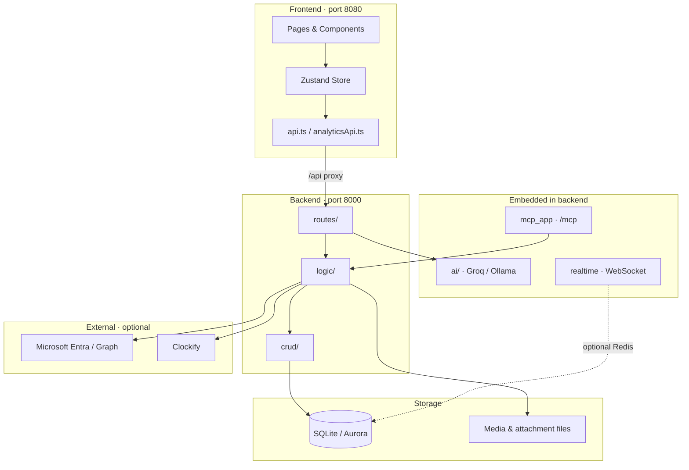
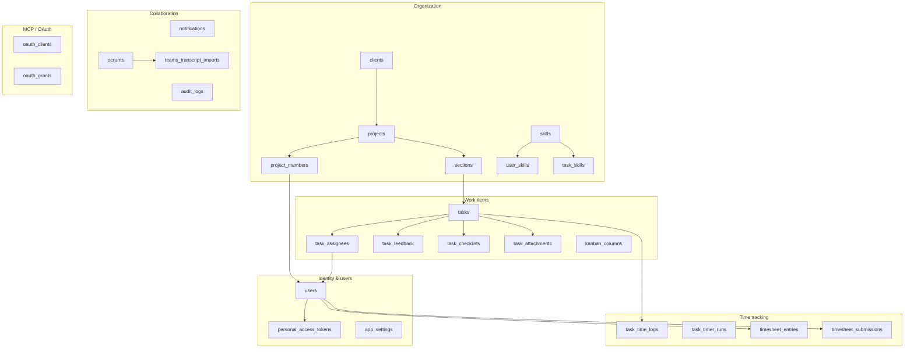
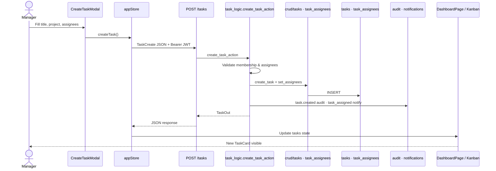
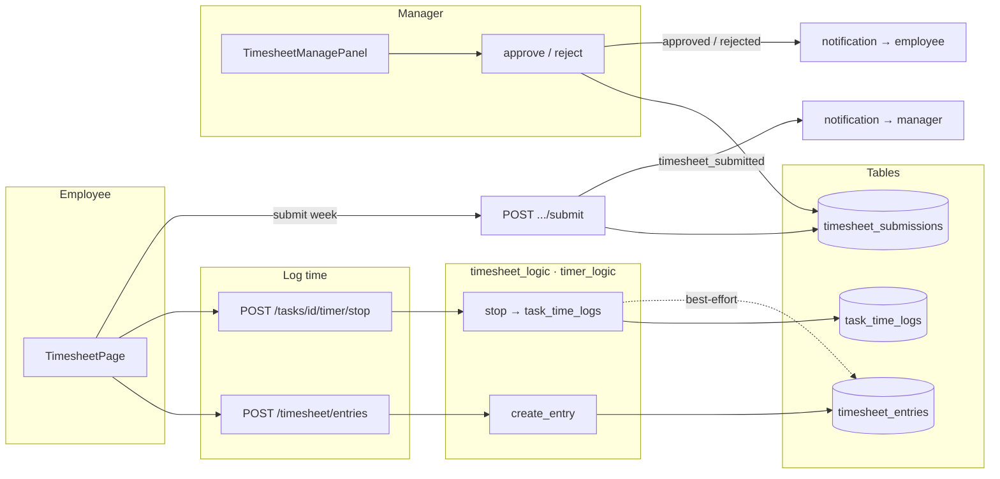

# ZET Architecture — Presentation Summary

Simplified overview for technical presentations. Each section is one diagram plus a short script (~2 minutes).  
Full detail: [architecture.md](./architecture.md) · [erd.md](./erd.md)

---

## 1. Overall System Architecture

**What to say:** The browser runs a React app on port 8080. All API calls go through a thin client layer into FastAPI on port 8000. The backend follows a strict three-layer pattern: routes parse HTTP, logic holds business rules, and crud is the only layer that touches the database. AI and MCP run inside the same backend process. Optional services (Microsoft, Groq, Redis, Sentry) connect only where the code explicitly calls them.



| Layer | Role |
|-------|------|
| **Frontend** | React + Zustand; JWT in `localStorage` |
| **routes/** | Auth, parse input, call one logic function |
| **logic/** | RBAC, validation, audit, notifications |
| **crud/** | All SQL — no queries elsewhere |
| **ai/** | LLM chat, parsing, insights |
| **/mcp** | OAuth/PAT tools for external agents |

---

## 2. Database Module Diagram

**What to say:** The database is not one flat schema — it groups into six domains. Identity covers users and tokens. Organization is clients, projects, sections, and skills. Work items are tasks and everything hung off a task. Time tracking splits task-level logs from manual timesheet rows and weekly submissions. Collaboration covers notifications, audit, and meeting notes. Auth tables support MCP OAuth. All access goes through `crud/` modules, one per domain.



**27 tables total** · Source: `backend/database/models.py` + `task_skills` migration

---

## 3. Create Task Flow

**What to say:** A manager opens Create Task in the UI. The modal calls the Zustand store, which POSTs to `/tasks`. The route delegates to `task_logic.create_task_action`, which validates project membership and assignees, writes the task and assignee rows via crud, logs an audit entry, and notifies new assignees. The API returns a `TaskOut` object; the store updates and the kanban board re-renders the new card.



| Step | File / table |
|------|----------------|
| UI entry | `frontend/src/components/CreateTaskModal.tsx` |
| API client | `frontend/src/stores/appStore.ts` → `lib/api.ts` |
| Route | `backend/routes/tasks.py` |
| Business logic | `backend/logic/task_logic.py` |
| Persistence | `tasks`, `task_assignees` |
| Side effects | `audit_logs`, `notifications` |

---

## 4. Timesheet Flow

**What to say:** Timesheet has two time paths. Employees log work as manual rows in `timesheet_entries`, or time accumulates on tasks via timers into `task_time_logs`. Each week the employee submits; that creates a `timesheet_submissions` record and notifies their manager. The manager reviews entries, then approves or rejects. Locked weeks cannot be edited until reopened.



| Action | API | Tables updated |
|--------|-----|----------------|
| Add manual row | `POST /timesheet/entries` | `timesheet_entries` |
| Stop task timer | `POST /tasks/{id}/timer/stop` | `task_time_logs`, optionally `timesheet_entries` |
| Submit week | `POST /timesheet/submissions/{week}/submit` | `timesheet_submissions` |
| Manager approve | `POST .../submissions/{id}/approve` | `timesheet_submissions` |

**UI:** `TimesheetPage.tsx` (employee) · `TimesheetManagePanel.tsx` (manager)

---

## 5. AI Recommendation Flow

**What to say:** Recommendations are two-stage. First, a deterministic engine in `task_forecast_logic` scores employees by skill match and availability — no LLM. Managers call `/analytics/forecast` or `/analytics/smart-reassignment` from the Forecast page. Second, optional LLM narration via `POST /insights/generate` turns the numbers into plain-language advice using Groq or Ollama. Employees cannot access these endpoints.

```mermaid
flowchart TB
    subgraph UI["Manager UI"]
        FP[ForecastPanel]
        WW[WhatWillHappenNextPage]
        RC[RecommendationScoreCard]
        IP[AIInsightsPanel]
    end

    subgraph Rule["Rule-based engine · no LLM"]
        API1[GET /analytics/forecast]
        API2[GET /analytics/smart-reassignment]
        TF[task_forecast_logic]
        SC[Score: 50% skills + 50% availability]
    end

    subgraph LLM["Optional narration"]
        API3[POST /insights/generate]
        IL[insight_logic]
        SVC[ai/service · Groq / Ollama]
    end

    subgraph Read["Data read via crud"]
        D[(users · tasks · task_assignees<br/>skills · user_skills · task_skills)]
    end

    WW --> FP --> RC
    FP --> API1 & API2
    API1 & API2 --> TF --> SC
    TF --> D
    SC -->|recommendations[]| RC

    FP --> IP
    IP --> API3 --> IL --> SVC
    IL -->|InsightsResponse| IP
```

| Output | Endpoint | Content |
|--------|----------|---------|
| Deadline forecast | `GET /analytics/forecast` | Risk labels, workload, reassignments |
| Smart reassignment | `GET /analytics/smart-reassignment` | Ranked owner suggestions + why bullets |
| Plain-language insight | `POST /insights/generate` | `decision`, `why`, `evidence`, `recommendation` |

**Scopes used:** `deadline_forecast`, `smart_task_reassignment`  
**Access:** Manager/admin only — 403 for `employee` role

---

## Quick reference

```
UI → Store / api.ts → routes → logic → crud → Database
```

| Topic | Deep dive |
|-------|-----------|
| All flows & APIs | [architecture.md](./architecture.md) |
| Full ERD | [erd.md](./erd.md) / [erd.mmd](./erd.mmd) |
