# Application Architecture

End-to-end technical documentation for ZET TaskManager, derived entirely from the codebase.

---

## Table of contents

1. [System overview](#1-system-overview)
2. [High-level architecture](#2-high-level-architecture)
3. [Frontend architecture](#3-frontend-architecture)
4. [Backend architecture](#4-backend-architecture)
5. [Database architecture](#5-database-architecture)
6. [API architecture](#6-api-architecture)
7. [Request lifecycle](#7-request-lifecycle)
8. [Authentication flow](#8-authentication-flow)
9. [Task flow](#9-task-flow)
10. [Timesheet flow](#10-timesheet-flow)
11. [AI recommendation flow](#11-ai-recommendation-flow)
12. [Forecast flow](#12-forecast-flow)
13. [Notifications](#13-notifications)
14. [External integrations](#14-external-integrations)
15. [Roles and permissions](#15-roles-and-permissions)

---

## 1. System overview

ZET is a full-stack task management application:

| Layer | Technology | Location |
|-------|------------|----------|
| Frontend | React 18, TypeScript, Vite, Zustand, TanStack Query, Shadcn/ui, Tailwind | `frontend/` |
| Backend | FastAPI, `db_wrapper` (SQLite dev / Aurora prod) | `backend/` |
| AI | Groq (primary), Ollama (fallback) | `backend/ai/` |
| MCP | FastMCP embedded at `/mcp` | `backend/mcp_app.py` |

**Data flow:**

```
UI → Zustand Store / page-level fetch → lib/api.ts → FastAPI routes → logic → crud → Database
```

**Mandatory layering:** Every SQL query lives in `crud/`. Routes call exactly one `logic/` function. Logic holds business rules, audit, notifications, and transaction boundaries.

---

## 2. High-level architecture

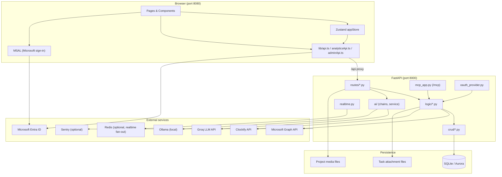

### Module connection map

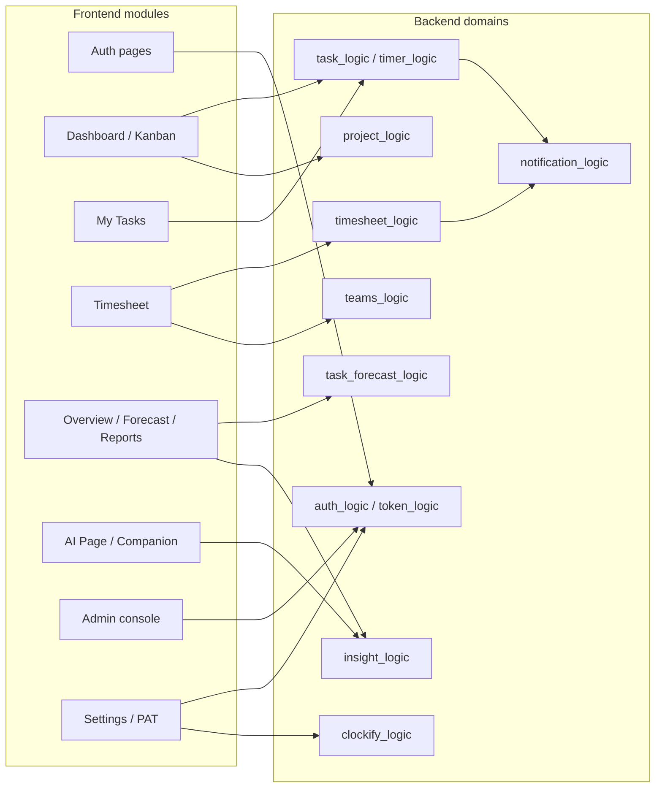

---

## 3. Frontend architecture

### 3.1 Bootstrap and shell

| File | Role |
|------|------|
| `frontend/src/main.tsx` | Entry; initializes MSAL before React mount |
| `frontend/src/App.tsx` | Router, `BootstrapGate`, `ThemeHandler`, `MsalRedirectResume`, `ProtectedRoute` |
| `frontend/src/components/AppLayout.tsx` | Sidebar, navbar, `useLiveSync()` WebSocket |
| `frontend/src/stores/appStore.ts` | Single global Zustand store |

On load, `bootstrap()` restores JWT from `localStorage` (`tm_token`), calls `GET /users/me`, and fetches projects, tasks, users, kanban columns, active timers.

### 3.2 Routes

| Route | Page | Access |
|-------|------|--------|
| `/login` | `LoginPage` | Public |
| `/signup` | `SignUpPage` | Public |
| `/` | `DashboardPage` | Authenticated |
| `/tasks` | `MyTasksPage` | Authenticated |
| `/timesheet` | `TimesheetPage` | Authenticated |
| `/calendar` | `CalendarPage` | Authenticated |
| `/meeting-notes` | `MeetingNotesPage` | Authenticated |
| `/reports` | `TimeReportPage` | Authenticated |
| `/reports/clients/:clientId` | `ClientDetailPage` | Manager |
| `/users` | `UsersPage` | Manager |
| `/users/forecast` | `WhatWillHappenNextPage` | Manager |
| `/users/:userId` | `UserDetailPage` | Manager |
| `/manage` | `ManageProjectsOverview` | Manager |
| `/manage/status` | `ManageProjectsOverview` (delivery view) | Manager |
| `/manage/:projectId` | `ProjectDetailPage` | Manager |
| `/settings` | `SettingsPage` | Authenticated |
| `/ai` | `AIPage` | Authenticated |
| `/overview` | `OverviewPage` | Manager |
| `/admin/login` | `AdminLoginPage` | Public |
| `/admin` | `AdminPage` | Admin token |

Redirects: `/timesheet/approvals` → `/timesheet?manage=1`, `/wip` → `/users?tab=wip`, `/delivery` → `/manage/status`.

**Unrouted pages (exist but no route in App.tsx):** `AuditPage.tsx`, `ManageEmployeesPage.tsx`, `NotFound.tsx`, `Index.tsx`.

### 3.3 State management

**Zustand (`appStore.ts`)** holds server state for: `currentUser`, `projects`, `tasks`, `users`, `kanbanColumns`, `activeTimers`, `clients`, `skills`.

**Page-level fetch** (not in store): timesheet entries, submissions, scrums, notifications, analytics data.

**TanStack Query:** Used on analytics/insight pages with 60s stale time.

### 3.4 API clients

| Client | Token key | Purpose |
|--------|-----------|---------|
| `lib/api.ts` | `tm_token` | Main REST API |
| `lib/adminApi.ts` | `tm_admin_token` | Admin console |
| `lib/analyticsApi.ts` | `tm_token` | Analytics, forecast, Clockify, insights |

Path alias: `@/` → `frontend/src/`.

### 3.5 Key components by domain

| Domain | Components |
|--------|------------|
| Layout | `AppSidebar`, `AppNavbar`, `NotificationBell`, `GlobalSearchModal` |
| Kanban | `DashboardPage`, `TaskCard`, `SortableTaskCard`, `KanbanBoardPan` |
| Tasks | `CreateTaskModal`, `TaskDetailModal`, `SubtaskSection` |
| Timesheet | `TimesheetManagePanel`, `TimesheetSubmissionReviewPanel`, `CalendarView` |
| Analytics | `OverviewPage`, `ForecastPanel`, `AIInsightsPanel`, `OrgTree`, `DeliveryPage` |
| AI | `AIPage`, `Companion`, `AgentAvatar` |
| Settings | `SettingsPage`, `SkillsPicker`, `ClockifyCard` (import exists; hidden in Settings) |

### 3.6 Live sync

`hooks/useTaskSync.ts` (`useLiveSync`):

1. Connects WebSocket `GET /sync/ws?token=<jwt>`
2. On version change, calls `getSyncVersion()` and refreshes tasks/projects via store
3. Falls back to polling if WebSocket unavailable

---

## 4. Backend architecture

### 4.1 Entry point

`backend/main.py`:

- Loads `.env`, configures logging
- Optional Sentry (`SENTRY_DSN`)
- `init_db()` on startup
- CORS middleware (`config.cors_origins()`)
- Request timing middleware (warns on slow requests)
- Mounts: `register_routes()`, `/project-media`, `/mcp`
- Lifespan: MCP + optional Redis subscriber (`REDIS_URL`) for cross-worker realtime

### 4.2 Layer structure

```
routes/     HTTP parsing, Depends(auth), call ONE logic function, return
logic/      Validation, RBAC, orchestration, audit, notifications, db.commit()
crud/       All SQL / ORM queries — no exceptions
database/   models.py (schema metadata), database.py (Db wrapper), init_db.py
```

### 4.3 Logic modules (26)

| Module | Responsibility |
|--------|----------------|
| `auth_logic` | Login, register, Microsoft auth, JWT, admin auth |
| `token_logic` | Personal access tokens (PAT) |
| `user_logic` | Profile, password, user listing |
| `admin_logic` | Admin console operations |
| `project_logic` | Projects, sections, members, media |
| `client_logic` | Client CRUD |
| `skill_logic` | Skills catalog, user skills |
| `task_logic` | Task CRUD, move, approve, log time |
| `task_feedback_logic` | Task comments |
| `checklist_logic` | Task checklists |
| `attachment_logic` | File uploads/downloads |
| `timer_logic` | Task timers |
| `kanban_logic` | Kanban columns |
| `timesheet_logic` | Entries, submissions, approval workflow |
| `notification_logic` | In-app notifications |
| `audit` | Audit log writes and reads |
| `analytics_logic` | Org tree, WIP, overview, delivery risk |
| `task_forecast_logic` | Deadline forecast, smart reassignment |
| `insight_logic` | LLM insight narration |
| `meeting_notes_logic` | Scrum/MOM notes |
| `teams_logic` | Teams transcript import |
| `clockify_logic` | Clockify sync |
| `daily_summary_logic` | AI day summary |
| `task_extraction_logic` | AI task extraction from text/files |

### 4.4 CRUD modules (25 + `_base.py`)

One module per table/domain: `users`, `projects`, `tasks`, `task_assignees`, `timelog`, `timers`, `timesheet_entries`, `timesheet_submissions`, `notifications`, `audit`, `skills`, `analytics`, etc.

### 4.5 MCP server

`mcp_app.py` — 27 tools mounted at `/mcp`. Tools resolve caller via OAuth/PAT, call `logic/` directly (never DB). Employee role cannot call project membership tools.

### 4.6 AI subsystem

`backend/ai/`:

| File | Role |
|------|------|
| `service.py` | Groq primary, Ollama fallback |
| `chains.py` | Chat, description generation, task parsing, summarization |
| `router.py` | `/ai/*` endpoints |

---

## 5. Database architecture

| Aspect | Detail |
|--------|--------|
| ORM models | `backend/database/models.py` — 26 tables |
| Migration table | `task_skills` — created in `init_db.py`, no ORM class |
| Access layer | `db_wrapper.DatabaseWrapper` via `get_db()` dependency |
| Dev storage | SQLite (`ZET_TEST_SQLITE=1`) at `backend/data/taskmanager.db` |
| Prod storage | Aurora (via `db_wrapper` connection pool) |
| Schema init | `database/init_db.py` + `bootstrap_sqlite.sql` / `bootstrap_aurora.sql` |

See [erd.md](./erd.md) for complete table definitions and relationships.

---

## 6. API architecture

### 6.1 Authentication on requests

```
Authorization: Bearer <jwt_or_pat>
```

Resolved by `routes/deps.py` → `auth_logic.resolve_user_id()`:

1. Try JWT decode (HS256, `TASKMANAGER_JWT_SECRET`)
2. Fall back to PAT hash lookup in `personal_access_tokens`

Admin routes use `require_admin` — master admin JWT or user with `admin` role.

### 6.2 API prefix groups

| Prefix | Router file | Auth |
|--------|-------------|------|
| `/health` | `health.py` | None |
| `/auth` | `auth.py` | None (login/register) |
| `/auth/tokens` | `tokens.py` | Bearer |
| `/oauth` | `oauth_consent.py` | None |
| `/.well-known/*` | `oauth_well_known.py` | None |
| `/admin` | `admin.py` | Admin token |
| `/users` | `users.py` | Bearer |
| `/clients` | `clients.py` | Bearer |
| `/skills` | `skills.py` | Bearer |
| `/projects` | `projects.py` | Bearer |
| `/tasks` | `tasks.py` | Bearer |
| `/tasks/{id}/checklists` | `checklists.py` | Bearer |
| `/tasks/{id}/attachments` | `attachments.py` | Bearer |
| `/kanban` | `kanban.py` | Bearer |
| `/timesheet` | `timesheet.py` | Bearer |
| `/audit` | `audit.py` | Bearer |
| `/notifications` | `notifications.py` | Bearer |
| `/sync` | `sync.py` | Bearer / WS token |
| `/meeting-notes` | `meeting_notes.py` | Bearer |
| `/integrations/teams` | `integrations_teams.py` | Bearer |
| `/analytics` | `analytics.py` | Bearer (+ role checks) |
| `/clockify` | `clockify.py` | Bearer + manager/admin |
| `/insights` | `insights.py` | Bearer |
| `/ai` | `ai/router.py` | Bearer (except `/ai/health`) |

**~130 REST endpoints** + WebSocket `/sync/ws` + 27 MCP tools.

### 6.3 Response shapes

Domain objects are Pydantic models in `logic/schemas.py` (e.g. `TaskOut`, `ProjectOut`, `UserOut`, `TimesheetEntryOut`, `NotificationOut`).

---

## 7. Request lifecycle

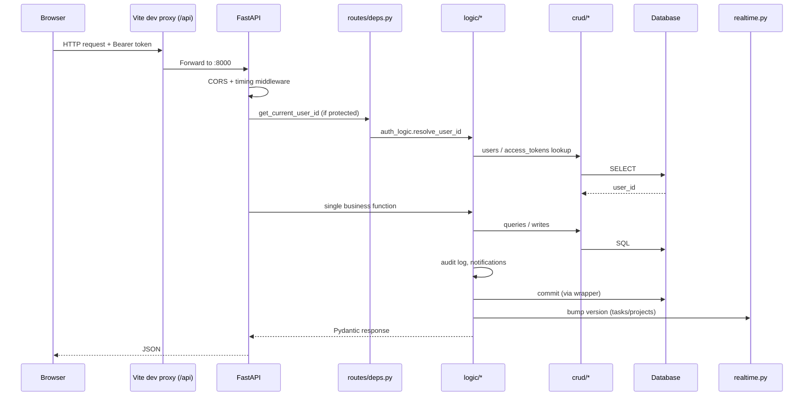

**Steps:**

1. Frontend attaches JWT from `localStorage` via `lib/api.ts`
2. Vite proxies `/api/*` → `http://127.0.0.1:8000`
3. FastAPI route parses input, resolves `user_id` from Bearer token
4. Route calls exactly one `logic/` function
5. Logic validates permissions, orchestrates CRUD calls
6. Logic writes audit logs and notifications as side effects
7. Logic commits transaction
8. `realtime.py` bumps entity versions for WebSocket subscribers
9. JSON response returned to frontend; store or page state updated

---

## 8. Authentication flow

### 8.1 Email/password login

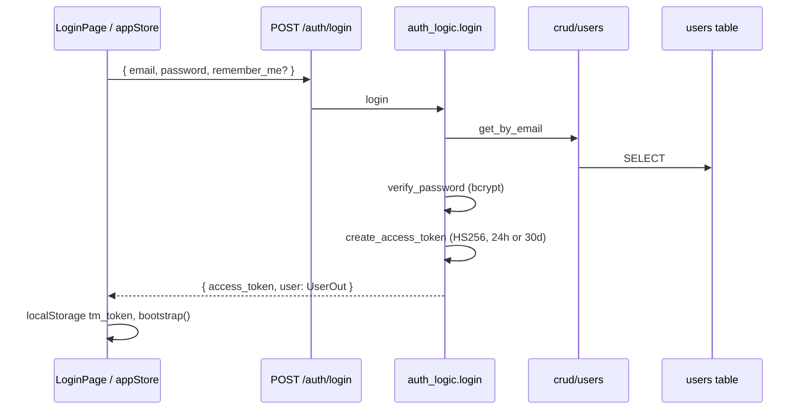

**Files:** `frontend/src/pages/LoginPage.tsx`, `frontend/src/stores/appStore.ts`, `backend/routes/auth.py`, `backend/logic/auth_logic.py`, `backend/crud/users.py`

**Tables:** `users` (read)

**Note:** Current UI primarily uses Microsoft sign-in; email/password endpoints exist but no active UI path uses `store.login()` / `store.register()`.

### 8.2 Microsoft sign-in

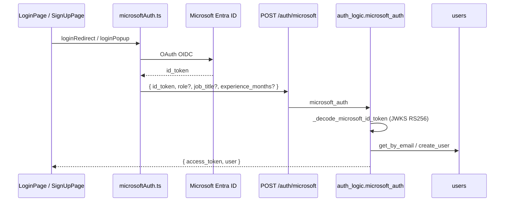

**Files:** `frontend/src/lib/microsoftAuth.ts`, `frontend/src/App.tsx` (`MsalRedirectResume`), `backend/logic/auth_logic.py`

**Env:** `MICROSOFT_CLIENT_ID`, `VITE_MICROSOFT_CLIENT_ID`, optional `MICROSOFT_TENANT_ID`

**Tables:** `users` (read/create)

### 8.3 Session restore

On app load: `bootstrap()` → `GET /users/me` with stored token → populates `currentUser` and refetches domain data.

### 8.4 Personal access tokens (MCP / API)

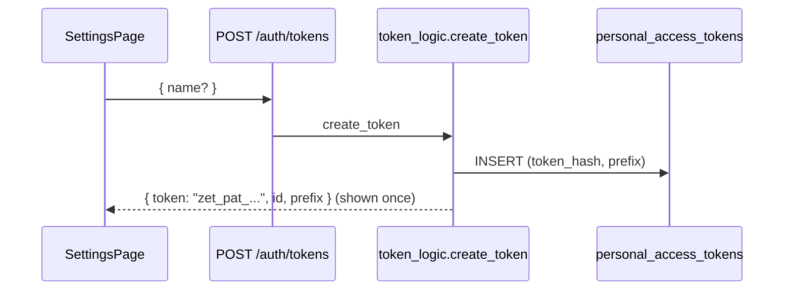

PAT usable as `Authorization: Bearer zet_pat_...` — resolved by `token_logic.resolve_user_id`.

### 8.5 OAuth 2.1 + MCP consent

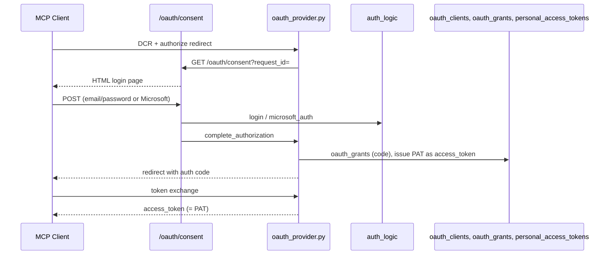

**Files:** `backend/oauth_provider.py`, `backend/routes/oauth_consent.py`, `backend/routes/oauth_well_known.py`, `backend/mcp_app.py`

**Tables:** `oauth_clients`, `oauth_grants`, `personal_access_tokens`, `users`

### 8.6 Admin authentication

Separate flow via `POST /admin/login` or `POST /admin/login/microsoft`. Returns admin-scoped JWT (`scope: "admin"`). Stored in `localStorage` as `tm_admin_token`. Used only by `AdminPage` via `adminApi.ts`.

---

## 9. Task flow

### 9.1 Create task

| Step | Location |
|------|----------|
| **UI starts** | `CreateTaskModal.tsx` → `appStore.createTask()` |
| **API** | `POST /tasks` |
| **Route** | `routes/tasks.py` |
| **Logic** | `task_logic.create_task_action` → `create_task` |
| **CRUD** | `crud/tasks.create_task`, `crud/task_assignees.set_assignees` |
| **Tables** | `tasks`, `task_assignees` |
| **Side effects** | `audit_logs`, `notifications` (type: `task_assigned`) |
| **Returns** | `TaskOut` |
| **Displayed in** | Kanban (`DashboardPage`), My Tasks, Project Detail |

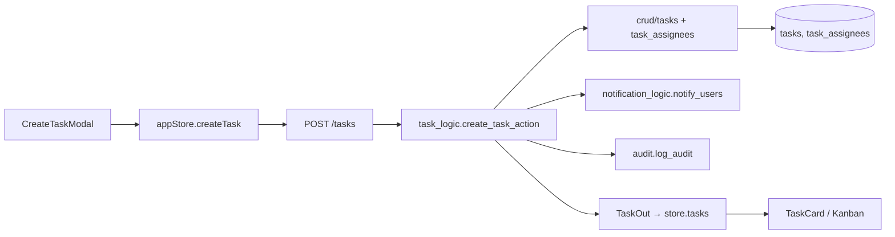

### 9.2 Assign / reassign

Via `PATCH /tasks/{id}` with `assigneeIds` in `TaskPatch`. Logic: `patch_task_action` → `patch_task` → `assignees_crud.set_assignees`. Notifies new assignees (`task_assigned`).

**UI:** `TaskDetailModal.tsx`

### 9.3 Move task (status change)

| Step | Location |
|------|----------|
| **UI** | Drag on `DashboardPage` or status picker in `TaskDetailModal` |
| **Store** | `appStore.moveTask()` |
| **API** | `POST /tasks/{id}/move` body: `{ status }` |
| **Logic** | `move_task_action` → `move_task` |
| **Tables** | `tasks` (status column) |
| **Side effects** | Audit, `task_status_changed` notification |
| **Returns** | `TaskOut` |

### 9.4 Start task

`POST /tasks/{id}/start` → sets `is_started=True`, `started_at`. UI: task detail or kanban actions.

### 9.5 Approve task (manager)

| Step | Location |
|------|----------|
| **UI** | `DashboardPage` approve button, `TaskDetailModal` |
| **API** | `POST /tasks/{id}/approve` |
| **Logic** | `approve_task_action` → `approve_task` (manager-only) |
| **Tables** | `tasks` (`status=completed`, `approved_by_manager=True`, `completed_at`) |
| **Side effects** | `task_approved` notification |
| **Returns** | `TaskOut` |

### 9.6 Task feedback (comments)

| Step | Location |
|------|----------|
| **UI** | `TaskDetailModal.tsx` |
| **API** | `GET/POST/PATCH/DELETE /tasks/{id}/feedback` |
| **Logic** | `task_feedback_logic` |
| **CRUD** | `crud/task_feedback` |
| **Tables** | `task_feedback` |
| **Side effects** | `task_commented`, `task_mentioned` notifications |
| **Returns** | `TaskFeedbackOut[]` |

### 9.7 Task timer

| Action | API | Logic | Tables |
|--------|-----|-------|--------|
| Start | `POST /tasks/{id}/timer/start` | `timer_logic.start` | `task_timer_runs` |
| Stop | `POST /tasks/{id}/timer/stop` | `timer_logic.stop` | `task_timer_runs` (delete), `task_time_logs`, optionally `timesheet_entries` |
| Active list | `GET /tasks/timers/active` | `timer_logic.list_active` | `task_timer_runs` |

**UI:** `TaskCard.tsx` timer buttons, `Companion.tsx`

### 9.8 Manual time log

`POST /tasks/{id}/log-time` → `task_logic.log_time` → `crud/timelog.add_seconds` → updates `task_time_logs` and `tasks.time_tracked`.

### 9.9 Related sub-resources

| Resource | API prefix | Logic | Tables |
|----------|------------|-------|--------|
| Checklists | `/tasks/{id}/checklists` | `checklist_logic` | `task_checklists` |
| Attachments | `/tasks/{id}/attachments` | `attachment_logic` | `task_attachments` + disk files |

---

## 10. Timesheet flow

Two parallel time-tracking mechanisms:

### 10.1 Per-task time logs (`task_time_logs`)

Tied to specific tasks. Updated by timer stop and manual `log-time`. Aggregated in `TaskOut.timeLog`.

### 10.2 Manual timesheet entries (`timesheet_entries`)

Project/section-level work rows independent of tasks.

```mermaid
flowchart TB
    subgraph Employee
        TP[TimesheetPage]
        CP[CalendarPage]
    end

    subgraph APIs
        GE[GET /timesheet/entries]
        CE[POST /timesheet/entries]
        SS[POST /timesheet/submissions/{week}/submit]
    end

    subgraph Logic
        TL[timesheet_logic]
    end

    subgraph Tables
        TE[(timesheet_entries)]
        TS[(timesheet_submissions)]
    end

    subgraph Manager
        TMP[TimesheetManagePanel]
        AP[POST .../approve | reject]
    end

    TP --> GE & CE & SS
    CE --> TL --> TE
    SS --> TL --> TS
    SS -->|timesheet_submitted| N[notifications]
    TMP --> AP --> TL
    AP -->|approved/rejected| N2[notifications]
```

### 10.3 Create entry

| Step | Location |
|------|----------|
| **UI** | `TimesheetPage.tsx`, `CalendarPage.tsx` |
| **API** | `POST /timesheet/entries` |
| **Logic** | `timesheet_logic.create_entry` |
| **CRUD** | `crud/timesheet_entries.create_entry` |
| **Tables** | `timesheet_entries` |
| **Returns** | `TimesheetEntryOut` |

Body: `workDate`, `projectId`, `sectionId`, `description`, `timeFrom`, `timeTo`, `billable`.

### 10.4 Weekly submission and approval

| Action | API | Logic | Tables |
|--------|-----|-------|--------|
| Check status | `GET /timesheet/submissions/status?week_start=` | `get_week_status` | `timesheet_submissions` |
| Submit week | `POST /timesheet/submissions/{week_start}/submit` | `submit_week` | `timesheet_submissions` |
| Manager list | `GET /timesheet/submissions` | `list_manager_submissions` | `timesheet_submissions` |
| Review | `GET /timesheet/submissions/{id}/review` | `get_submission_review` | `timesheet_submissions`, `timesheet_entries` |
| Approve | `POST .../approve` | `approve_submission` | `timesheet_submissions` |
| Reject | `POST .../reject` | `reject_submission` | `timesheet_submissions` |
| Reopen | `POST .../reopen` | `reopen_submission` | `timesheet_submissions` |

**UI:** `TimesheetPage.tsx` (employee), `TimesheetManagePanel.tsx` + `TimesheetSubmissionReviewPanel.tsx` (manager)

**Notifications:** `timesheet_submitted` → manager; `timesheet_approved` / `timesheet_rejected` → employee

### 10.5 AI timesheet parsing

`TimesheetPage` → `POST /ai/parse-timesheet` → `ai/chains.parse_timesheet` → returns parsed rows for user confirmation before creating entries.

### 10.6 Timer → timesheet bridge

When `timer_logic.stop` runs, elapsed seconds are written to `task_time_logs` and a best-effort `timesheet_entries` row is created via `timesheet_logic.create_entry`.

---

## 11. AI recommendation flow

AI recommendations have **two layers**: a deterministic scoring engine and optional LLM narration.

### 11.1 Rule-based recommendations (no LLM)

```mermaid
flowchart TB
    UI[ForecastPanel / WhatWillHappenNextPage]
    API1[GET /analytics/forecast]
    API2[GET /analytics/smart-reassignment]
    TF[task_forecast_logic]
    CRUD[crud/analytics + crud/skills]
    DB[(users, tasks, task_assignees, skills, user_skills, task_skills)]

    UI --> API1 & API2
    API1 --> TF
    API2 --> TF
    TF --> CRUD --> DB
    TF -->|recommendations[]| UI
```

**Scoring engine** (`task_forecast_logic.py`):

- `_build_recommendation_score` — 50% skill match + 50% availability
- Skills from `user_skills` + `task_skills` (via `crud/skills.skill_names_by_task_ids`)
- `_pick_best_recommendation`, `_score_recommendation_candidate`
- `_recommendation_why_bullets` — human-readable explanation

**Access:** Manager/admin only (403 for `employee` role).

**Returns (`GET /analytics/smart-reassignment`):**

```text
{
  asOf, module: "smart_task_reassignment",
  summary: { highCriticalTasksReviewed, atRiskCount, recommendationCount },
  recommendations: [{
    taskId, currentOwner, recommendedOwner,
    whyBullets, calculations, score, ...
  }]
}
```

**UI:** `ForecastPanel.tsx`, `RecommendationScoreCard.tsx`, `frontend/src/lib/recommendationDisplay.ts`

### 11.2 LLM insight narration

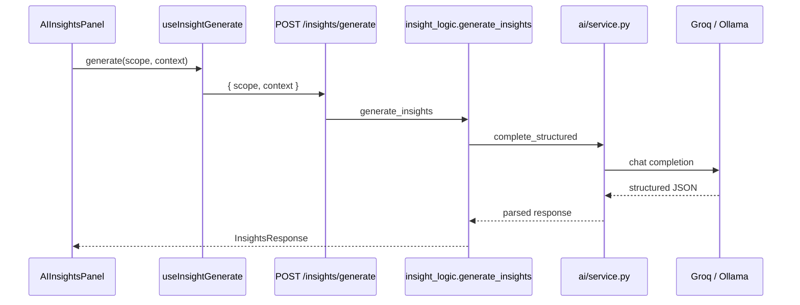

**Relevant scopes:** `deadline_forecast`, `smart_task_reassignment`, `recommendations`, `capacity_forecast`

**Returns (`InsightsResponse`):**

```text
{ scope, available, decision, why, evidence[], recommendation, fallbackUsed }
```

**UI callers:**

| Page/Component | Scope |
|----------------|-------|
| `ForecastPanel` | `deadline_forecast` |
| `OverviewPage` | `overview_team_summary` |
| `UsersPage` (org tab) | `team_structure` |
| `WipPage` | `workload` |
| `DeliveryPage` | `delivery_risk` |
| `WorkHistorySheet` | `employee_work` |
| `TimesheetAnalyticsPanel` | `timesheet_analytics` |

### 11.3 Other AI endpoints (not recommendation-specific)

| Endpoint | Purpose | UI |
|----------|---------|-----|
| `POST /ai/chat` | Zani AI chat | `AIPage` |
| `POST /ai/extract-tasks` | Extract tasks from text/file | `AIPage`, `Companion` |
| `POST /ai/generate-description` | Task description | `CreateTaskModal` |
| `POST /ai/summarize-task/{id}` | Task summary | `TaskDetailModal` |
| `GET /ai/summarize-day` | Daily summary | `Companion` |
| `POST /ai/parse-timesheet` | Parse timesheet text | `TimesheetPage` |

---

## 12. Forecast flow

Deterministic schedule simulation — **not LLM-based**.

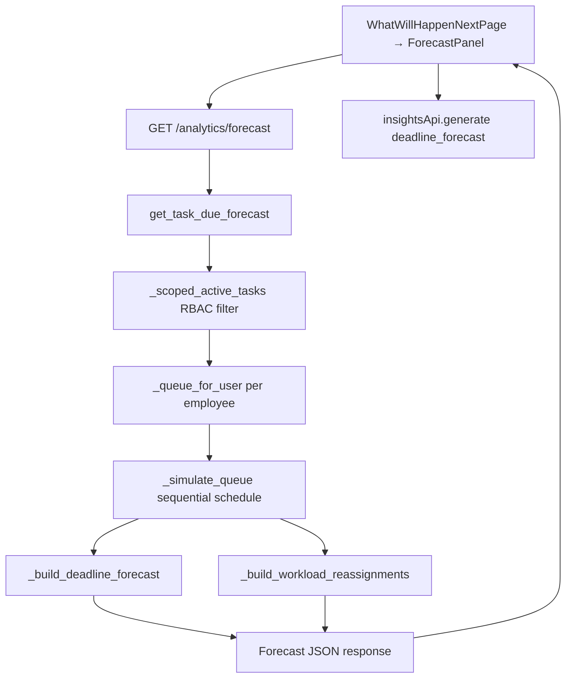

**Pipeline** (`task_forecast_logic.get_task_due_forecast`):

1. Load active tasks visible to caller (RBAC via `_scoped_active_tasks`)
2. Build per-user task queues ordered by priority/due date
3. Simulate sequential completion (`_simulate_queue`)
4. Classify risk: `healthy | moderate | high | critical`
5. Predict status: `On Track | At Risk | Delayed`
6. Build workload analysis (heavy vs available employees)
7. Build reassignment suggestions

**CRUD inputs:** `crud/analytics.py` — `list_active_tasks`, `list_task_assignees_for_tasks`, `get_projects_by_ids`

**Tables read:** `users`, `tasks`, `task_assignees`, `projects`, `skills`, `user_skills`, `task_skills`, `project_members`

**Returns:**

```text
{
  asOf,
  summary: { totalTasks, healthy, moderate, high, critical, atRisk, reassignmentCount, ... },
  prediction: { onTrackTasks, atRiskTasks, delayedTasks, ... },
  workload: { heavy[], available[] },
  employees: [{ userId, name, tasks[], workloadStatus, ... }],
  deadlines: [...],
  reassignments: [...]
}
```

**UI:** `frontend/src/pages/WhatWillHappenNextPage.tsx` (route `/users/forecast`, manager-only) embeds `ForecastPanel.tsx` which calls `analyticsExtApi.getForecast()`.

---

## 13. Notifications

**In-app only.** No email/SMTP integration found in codebase.

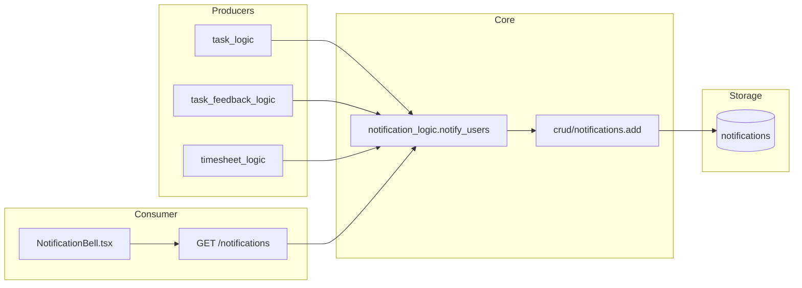

### 13.1 Notification types (from code)

| Type | Producer | Recipient |
|------|----------|-----------|
| `task_assigned` | `task_logic` | New assignees |
| `task_status_changed` | `task_logic` | Task stakeholders |
| `task_approved` | `task_logic` | Assignees |
| `task_commented` | `task_feedback_logic` | Task stakeholders |
| `task_mentioned` | `task_feedback_logic` | Mentioned users |
| `timesheet_submitted` | `timesheet_logic` | Manager |
| `timesheet_approved` | `timesheet_logic` | Employee |
| `timesheet_rejected` | `timesheet_logic` | Employee |

### 13.2 API

| Method | Path | Logic | Returns |
|--------|------|-------|---------|
| GET | `/notifications` | `get_notifications` | `NotificationOut[]` |
| GET | `/notifications/unread-count` | `unread_count` | `{ count }` |
| POST | `/notifications/read-all` | `mark_all_read` | 204 |
| POST | `/notifications/{id}/read` | `mark_read` | 204 |

**UI:** `NotificationBell.tsx` (30s poll), `Companion.tsx` (badge)

**Table:** `notifications` — `user_id`, `type`, `title`, `message`, `entity_type`, `entity_id`, `is_read`, `triggered_by`, `created_at`

---

## 14. External integrations

### 14.1 Integration map

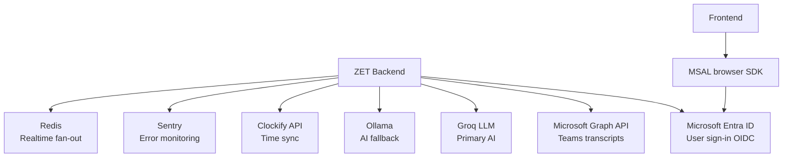

### 14.2 Microsoft Entra (user sign-in)

| Layer | File | Env vars |
|-------|------|----------|
| Frontend SPA | `frontend/src/lib/microsoftAuth.ts` | `VITE_MICROSOFT_CLIENT_ID`, `VITE_MICROSOFT_TENANT_ID` |
| Backend validation | `backend/logic/auth_logic.py` (`_decode_microsoft_id_token`) | `MICROSOFT_CLIENT_ID`, `MICROSOFT_TENANT_ID` |
| OAuth consent callback | `backend/routes/oauth_consent.py` (`/oauth/msal-callback`) | Same client ID |

JWKS fetched from `login.microsoftonline.com`. Token validated RS256.

### 14.3 Microsoft Graph (Teams transcripts)

| Layer | File | Env vars |
|-------|------|----------|
| API routes | `backend/routes/integrations_teams.py` | — |
| Logic | `backend/logic/teams_logic.py` | — |
| HTTP client | `backend/integrations/msgraph.py` | `MICROSOFT_CLIENT_ID`, `MICROSOFT_CLIENT_SECRET`, `MICROSOFT_TENANT_ID` |
| Config check | `backend/config.py` (`graph_configured()`) | Requires real tenant + secret |

**Endpoints:**

- `GET /integrations/teams/status`
- `POST /integrations/teams/import`
- `POST /integrations/teams/sync`

**Tables:** `teams_transcript_imports`, `scrums`

**UI:** `MeetingNotesPage.tsx` (also supports client-side VTT import via MS Graph token from MSAL)

### 14.4 Clockify

| Layer | File |
|-------|------|
| Routes | `backend/routes/clockify.py` |
| Logic | `backend/logic/clockify_logic.py` |

**Access:** Manager/admin only.

**Endpoints:** `/clockify/status`, `/connect`, `/disconnect`, `/sync/incremental`, `/sync/full`, `/auto-sync`

**UI:** `ClockifyCard.tsx` exists but is commented out in `SettingsPage.tsx`. **No active UI integration.**

### 14.5 AI providers

| Provider | Config | Used by |
|----------|--------|---------|
| Groq | `GROQ_API_KEY` | `ai/service.py` (primary) |
| Ollama | `OLLAMA_BASE_URL`, `OLLAMA_MODEL` | `ai/service.py` (fallback) |

Endpoints: `/ai/*`, `/insights/generate`, `/meeting-notes/transcribe`

### 14.6 Sentry

Optional error monitoring. `SENTRY_DSN` env var in `main.py`. **Unknown:** exact dashboard configuration.

### 14.7 Redis

Optional realtime fan-out across workers. `REDIS_URL` env var enables `realtime.redis_subscriber()` in app lifespan.

### 14.8 Email / SMTP

**Not found.** No SMTP configuration, mail library, or outbound email notification path exists in the codebase.

---

## 15. Roles and permissions

| Role | Capabilities |
|------|-------------|
| `employee` | Own work; sees only member projects/tasks; cannot create projects or assign members; no admin console; blocked from analytics forecast/reassignment and Clockify |
| `manager` | Create projects, assign members, approve tasks, move any task in member projects; analytics and forecast access; no `/admin` console |
| `admin` | Full in-app access plus standalone `/admin` console; sees all projects and tasks; admin role granted only from admin console |

**Enforcement:** Route-level auth via `Depends(get_current_user_id)`; business RBAC in `logic/` (e.g. `project_logic.ensure_manager`, `task_forecast_logic` scope filters, analytics 403 for employees).

**MCP:** Employees cannot list or call `assign_user_to_project` / `remove_user_from_project` tools.

---

## Appendix: Environment variables

| Variable | Purpose |
|----------|---------|
| `TASKMANAGER_JWT_SECRET` | JWT signing (required in prod) |
| `ADMIN_PASSWORD` | Master admin password |
| `MICROSOFT_CLIENT_ID` | Microsoft auth (backend) |
| `MICROSOFT_CLIENT_SECRET` | Graph app-only auth |
| `MICROSOFT_TENANT_ID` | Entra tenant |
| `GROQ_API_KEY` | Primary LLM |
| `OLLAMA_BASE_URL` / `OLLAMA_MODEL` | Fallback LLM |
| `SENTRY_DSN` | Error monitoring |
| `REDIS_URL` | Cross-worker realtime |
| `CORS_ORIGINS` | Allowed origins (required in prod) |
| `APP_ENV` | `development` or `production` |
| `ZET_TEST_SQLITE` | Use SQLite for tests/dev |
| `VITE_MICROSOFT_CLIENT_ID` | Frontend MSAL |
| `VITE_API_URL` | Backend URL (frontend `.env`) |

---

[ ] Files modified: `docs/README.md`, `docs/erd.mmd`, `docs/erd.md`, `docs/architecture.md`  
[ ] Commands to run: none  
[ ] Manual steps: open `docs/architecture.md` in a Mermaid-capable viewer for diagrams
