# Driftal Vault — Enterprise Architecture Document

| Field | Value |
|-------|-------|
| **Product** | Driftal Vault |
| **Audience** | CTO / Principal Architect / Engineering Leads |
| **Status** | Architecture baseline for MVP (pre-implementation) |
| **Version** | 1.0 |
| **Date** | 2026-07-15 |
| **Auth** | Microsoft Entra ID only (no local auth) |
| **Stack** | React + TypeScript · FastAPI · PostgreSQL |

**Related diagrams (editable Draw.io):**

- [`application-architecture.drawio`](./application-architecture.drawio) — clients, extension, auth, layers, modules, DB
- [`erd.drawio`](./erd.drawio) — complete database ERD

**MVP source of truth:** Engineering Vault MVP Features (internal), plus required platform features listed below.

---

## 1. Executive Summary

Driftal Vault is an internal enterprise secrets manager for Driftal employees, positioned similarly to Zoho Vault for engineering day-to-day use: store credentials, share them safely across teams, launch / autofill website logins, and retain a complete audit trail.

### Design posture

| Principle | Choice |
|-----------|--------|
| Scope | Single deployable application (web + API + browser extension clients) |
| Tenancy | Single organization (Driftal only) |
| Identity | Microsoft Entra ID exclusively — JWT session after OIDC login |
| Backend shape | Monolith FastAPI with strict layers: **Routes → Logic → CRUD → DB Wrapper → PostgreSQL** |
| Trust model | **Trusted server** (org trusts platform operators). Server decrypts on authorized request. Not consumer zero-knowledge. |
| Complexity budget | No microservices, Redis, Kafka, RabbitMQ, Kubernetes, or cloud KMS. Encryption keys managed via OS/env secret mount + envelope DEKs in PostgreSQL. |

### What MVP delivers

- Personal vault per employee + shared workspaces (teams/collections)
- Typed secrets: website, API keys, SSH keys, DB credentials, secure notes, certificates, env vars, plus MVP types (application login, service accounts, generic)
- Categories, tags, favorites, archive, attachments, custom fields, TOTP
- Sharing with View / Copy / Edit / Manage permissions
- Secret version history
- Global search + filters (mine, shared with me, expiring)
- Login launcher + browser extension autofill
- Activity visibility + immutable audit logs
- RBAC: Admin, Workspace Admin (Team Admin), User

### Explicit non-goals (MVP)

- Public signup / local passwords / “forgot password”
- Multi-tenant SaaS
- Client-side zero-knowledge encryption
- Offline-first sync
- Hardware HSM / Azure Key Vault integration (deferred; design leaves a clean hook)

---

## 2. High-Level Application Architecture

```
┌──────────────────────────────────────────────────────────────────────────┐
│                         Clients (HTTPS only)                             │
│  React Web App          Chromium Extension (MV3)                         │
│  (MSAL SPA)             Popup · Service Worker · Content Script          │
└───────────────┬──────────────────────────────┬───────────────────────────┘
                │                              │
                │   REST + JWT Bearer          │
                └──────────────┬───────────────┘
                               ▼
┌──────────────────────────────────────────────────────────────────────────┐
│                     Driftal Vault API (FastAPI)                          │
│  Auth (Entra verify → issue app JWT) · RBAC · Encryption · Audit         │
│  Routes → Logic → CRUD → DB Wrapper                                      │
└──────────────────────────────┬───────────────────────────────────────────┘
                               ▼
┌──────────────────────────────────────────────────────────────────────────┐
│                         PostgreSQL                                       │
│  Users · Workspaces · Secrets · Versions · Shares · Attachments · Audit  │
│  Ciphertext + GCM nonce/tag stored; plaintext never at rest              │
└──────────────────────────────────────────────────────────────────────────┘
                               ▲
                               │ OIDC / JWKS (login only)
┌──────────────────────────────┴───────────────────────────────────────────┐
│                      Microsoft Entra ID                                  │
└────────────────────────────────────────────────────────────────────────────────────────────────────┘
```

**Deployment (simple production):** one HTTPS-terminated reverse proxy → FastAPI process(es) → managed PostgreSQL. Frontend is a static SPA. Extension talks only to the same API origin (or configured API base URL).

---

## 3. Low-Level Application Architecture

### 3.1 Layer contracts (mandatory)

| Layer | Responsibility | Allowed | Forbidden |
|-------|----------------|---------|-----------|
| **routes/** | Parse HTTP, deps (`db`, `current_user`), call **one** logic function, return response | `UploadFile`, `Response`, status codes | Business rules, SQL, encryption orchestration beyond passing DTOs |
| **logic/** | Validation, RBAC, permissions, encryption/decryption orchestration, audit writes, `commit` | Construct domain DTOs; call crud + crypto helpers | Direct SQL / ORM queries |
| **crud/** | Every SQL statement for a domain table | Parameterized queries via DB wrapper | Business policy (“may user edit?”) |
| **db_wrapper/** | `read()` / `write()` connection, transactions, SQL execution | Connection pooling config | Domain logic |
| **PostgreSQL** | Durable state | — | — |

### 3.2 Request path (typical secret reveal)

1. Client sends `Authorization: Bearer <app_jwt>`
2. Route dependency validates JWT, loads user, rejects inactive users
3. Logic resolves effective permission on secret (workspace membership ∪ direct share ∪ admin)
4. If authorized: CRUD loads ciphertext; logic decrypts with workspace DEK; returns DTO (sensitive fields only when explicitly requested)
5. Logic inserts audit event (`secret.view` / `secret.copy` / `secret.launch`)
6. Commit and return

### 3.3 Encryption placement

- **Encrypt/decrypt lives in logic** (or `logic/crypto/` helpers called only from logic)
- CRUD stores/retrieves opaque `BYTEA` / base64 ciphertext columns only
- DB wrapper never sees plaintext passwords

### 3.4 Browser extension path

Extension → HTTPS REST → same FastAPI stack → PostgreSQL.  
Extension never opens a DB connection and never holds long-lived plaintext.

---

## 4. Application Module Diagram

Logical modules (not separate deployables):

| Module | Owns |
|--------|------|
| **Identity & Auth** | Entra OIDC login, JWT issue/verify, session claims, user sync |
| **Directory / Admin** | Users, global roles, categories catalog, password policies, app settings |
| **Workspace** | Personal + shared workspaces, membership, workspace admin |
| **Secrets** | CRUD lifecycle, types, custom fields, archive, favorites, attachments |
| **Sharing & RBAC** | Direct shares, effective permission resolver |
| **Versions** | Immutable version snapshots on update |
| **Search** | Filtered queries across searchable metadata |
| **Launcher** | Launch URL + last-used tracking |
| **TOTP** | Store encrypted TOTP seed; generate codes server-side on reveal |
| **Audit** | Append-only audit_events; activity feed projections |
| **Extension API** | Autofill match-by-URL, reveal-for-fill, permission checks |
| **Crypto** | AES-256-GCM, envelope DEK unwrap, key versioning |

See [`application-architecture.drawio`](./application-architecture.drawio).

---

## 5. Browser Extension Architecture

**Target:** Chromium Manifest V3 (Chrome / Edge). Firefox can follow same messaging model later.

### 5.1 Components

| Component | Role |
|-----------|------|
| **Popup** | Signed-in UI: search recent matches, open vault, lock session, status |
| **Service Worker (background)** | Auth token in memory, message hub, API client, autofill orchestration, idle lock timer |
| **Content Script** | Detect login forms, receive one-shot fill payload, write into DOM, then drop references |
| **Options page (optional)** | API base URL (enterprise), default vault behavior |

### 5.2 Communication with backend

- Extension uses `fetch` from the **service worker only** to API base URL
- Auth: same app JWT as web (obtained after Entra login via extension popup / launched web handshake)
- Endpoints: `/extension/match`, `/extension/secrets/{id}/reveal`, `/auth/me`
- **Never** connect to PostgreSQL from the extension

### 5.3 Launch flow

1. User clicks Launch on a website secret (web or popup)
2. API `POST /secrets/{id}/launch` → checks Copy+ (or Launch policy), logs `secret.launch`, updates `last_used_*`
3. Client opens `url` in new tab
4. Content script on that origin requests match; service worker calls API; autofill if single match and user consented

### 5.4 Autofill flow

1. Content script detects username/password fields → message SW: `{type:"autofill.request", origin, url}`
2. SW calls `GET /extension/match?url=...` with JWT
3. Backend returns **metadata matches only** (id, name, username hint) — no password yet
4. If one match or user picks from popup: SW calls `POST /extension/secrets/{id}/reveal` with `purpose=autofill`
5. Backend checks **Copy** (minimum for autofill), decrypts, returns credentials **once**
6. SW forwards to content script via one-time message; content script fills; SW **zeros** in-memory payload within ≤30s idle / immediately after ack
7. Audit: `secret.autofill`

### 5.5 Permission validation

Effective permission computed server-side on every reveal:

```
Admin → full
else Workspace membership role mapped to max permission
else Direct secret_share.permission
else Personal vault owner → manage
else deny
```

Autofill requires at least **copy**. Edit/manage not required. View-only users cannot autofill or copy.

### 5.6 Extension security rules

- Store JWT in memory or session storage; never store plaintext secrets in `chrome.storage`
- Content scripts hold credentials only for the fill call stack
- Host permissions: configurable list or `<all_urls>` with enterprise policy justification
- Idle lock clears SW memory

See [`application-architecture.drawio`](./application-architecture.drawio) (extension section).

---

## 6. Authentication Architecture

### 6.1 Principles

- **No** local passwords, signup, or password reset
- Users must exist in Entra and (for first login) be allowable by policy (e.g. `@driftal.com`)
- First successful login **provisions** the local `users` row (JIT) and creates a **personal workspace**

### 6.2 Login sequence (web)

1. SPA redirects to Entra via MSAL (OIDC Authorization Code + PKCE)
2. Entra returns ID token / account; SPA posts `id_token` (or access token per chosen flow) to `POST /auth/microsoft`
3. Backend validates token against Entra JWKS (issuer, audience, tenant, expiry, email domain)
4. Backend upserts user (`entra_oid`, email, display name); ensures personal workspace
5. Backend issues **short-lived app JWT** (15 min access) + optional refresh token / rotating session record
6. SPA stores access token; all API calls use Bearer JWT
7. Audit: `auth.login`

### 6.3 Extension auth

Preferred: popup opens web auth page / MSAL in extension context → same `POST /auth/microsoft` → JWT held by service worker.  
Logout / disable in Entra eventually fails refresh; access tokens expire quickly.

### 6.4 Token contents (claims)

- `sub` = user UUID
- `entra_oid`
- `email`
- `role` = global role (`admin` | `team_admin` | `user`)
- `iat`, `exp`, `jti`

Authorization for secrets is **not** embedded in JWT beyond global role; secret ACL is evaluated per request.

See [`application-architecture.drawio`](./application-architecture.drawio) (authentication strip).

---

## 7. Repository Structure

```
driftal-vault/
├── README.md
├── docs/
│   └── architecture/          # this document + drawio
├── frontend/                  # React + TypeScript (Vite)
│   ├── src/
│   │   ├── pages/
│   │   ├── components/
│   │   ├── lib/               # api client, msal, crypto-free helpers
│   │   ├── stores/
│   │   ├── hooks/
│   │   └── types/
│   └── package.json
├── extension/                 # Manifest V3
│   ├── manifest.json
│   ├── src/
│   │   ├── popup/
│   │   ├── background/        # service worker
│   │   ├── content/
│   │   └── shared/
│   └── package.json
└── backend/
    ├── main.py
    ├── requirements.txt
    ├── routes/                # thin HTTP
    │   ├── auth.py
    │   ├── users.py
    │   ├── workspaces.py
    │   ├── secrets.py
    │   ├── shares.py
    │   ├── search.py
    │   ├── attachments.py
    │   ├── admin.py
    │   ├── audit.py
    │   └── extension.py
    ├── logic/                 # business rules + crypto orchestration
    │   ├── auth_logic.py
    │   ├── workspace_logic.py
    │   ├── secret_logic.py
    │   ├── share_logic.py
    │   ├── search_logic.py
    │   ├── launch_logic.py
    │   ├── totp_logic.py
    │   ├── audit_logic.py
    │   ├── admin_logic.py
    │   ├── extension_logic.py
    │   ├── permission_logic.py
    │   └── crypto/
    │       ├── aes_gcm.py
    │       └── envelope.py
    ├── crud/                  # SQL only
    │   ├── users.py
    │   ├── workspaces.py
    │   ├── workspace_members.py
    │   ├── secrets.py
    │   ├── secret_versions.py
    │   ├── secret_shares.py
    │   ├── categories.py
    │   ├── tags.py
    │   ├── favorites.py
    │   ├── attachments.py
    │   ├── custom_fields.py
    │   ├── audit_events.py
    │   ├── password_policies.py
    │   └── app_settings.py
    ├── db_wrapper/            # read/write abstraction
    ├── database/              # migrations / bootstrap SQL
    └── tests/
```

---

## 8. Database Design

### 8.1 Design goals

- One PostgreSQL database
- Searchable **metadata in plaintext**; sensitive values **ciphertext only**
- Soft-archive for secrets; hard-delete optional for Admin with audited trail
- Append-only audit table
- Workspace-scoped DEK (envelope encryption)

### 8.2 Conceptual domains

1. Identity (users)
2. Collaboration (workspaces, members)
3. Taxonomy (categories, tags)
4. Secrets (core + versions + shares + favorites + attachments + custom fields)
5. Governance (audit, policies, settings)
6. Crypto metadata (key versions / wrapped DEKs)

### 8.3 Secret type taxonomy

Stored as `secrets.secret_type` enum/text + JSON schema validation in logic:

| Type | Typical sensitive fields (encrypted blob) |
|------|-------------------------------------------|
| `website` | password, totp_seed, notes |
| `application` | password / secret, notes |
| `database` | password, connection extras |
| `api_key` | key / token |
| `ssh_key` | private_key, passphrase |
| `certificate` | private material / PEM |
| `service_account` | password / key |
| `secure_note` | body |
| `env_var` | value (or multi KV) |
| `generic` | free-form sensitive map |

Non-sensitive searchable fields stay on `secrets` row: name, description, url, username, environment, expiry, category.

---

## 9. Complete ERD

Entities and cardinalities:

```
users 1──* workspace_members *──1 workspaces
users 1──* secrets (owner)
workspaces 1──* secrets
workspaces 1──* categories
workspaces 1──* tags
secrets 1──* secret_versions
secrets 1──* secret_shares
secrets 1──* secret_tags *──1 tags
secrets 1──* attachments
secrets 1──* custom_fields
users 1──* favorites *──1 secrets
users 1──* audit_events
workspaces 1──1 (wrapped_dek metadata)
```

Full visual ERD: [`erd.drawio`](./erd.drawio).

---

## 10. Table Specifications

Convention: primary keys are `UUID` (`gen_random_uuid()`). Timestamps are `TIMESTAMPTZ`. Soft flags use `BOOLEAN NOT NULL DEFAULT FALSE`.

---

### 10.1 `users`

**Purpose:** Local profile mirror of Entra identities. No password columns.

| Column | Type | Notes |
|--------|------|-------|
| id | UUID | PK |
| entra_oid | TEXT | Unique Entra object id |
| email | CITEXT | Unique |
| display_name | TEXT | NOT NULL |
| global_role | TEXT | `admin` \| `team_admin` \| `user` |
| is_active | BOOLEAN | Default true |
| last_login_at | TIMESTAMPTZ | Nullable |
| created_at | TIMESTAMPTZ | NOT NULL |
| updated_at | TIMESTAMPTZ | NOT NULL |

- **PK:** `id`
- **UK:** `entra_oid`, `email`
- **Indexes:** `(global_role)`, `(is_active)`
- **Relationships:** members, owned secrets, favorites, audit actor
- **Rules:** Inactive users cannot obtain new JWT; no self-signup outside Entra JIT with allowlist

---

### 10.2 `workspaces`

**Purpose:** Personal vault or shared team collection.

| Column | Type | Notes |
|--------|------|-------|
| id | UUID | PK |
| name | TEXT | NOT NULL |
| workspace_type | TEXT | `personal` \| `shared` |
| description | TEXT | Nullable |
| owner_user_id | UUID | FK → users |
| wrapped_dek | BYTEA | DEK encrypted by Vault Master Key |
| dek_key_version | INT | VMK version used to wrap |
| created_at | TIMESTAMPTZ | |
| updated_at | TIMESTAMPTZ | |

- **UK:** partial unique — one personal workspace per user: `UNIQUE (owner_user_id) WHERE workspace_type = 'personal'`
- **Indexes:** `(workspace_type)`, `(owner_user_id)`
- **Rules:** Personal workspace auto-created on first login; cannot be deleted if secrets exist (or cascade archive)

---

### 10.3 `workspace_members`

**Purpose:** Membership & workspace-level role for shared workspaces.

| Column | Type | Notes |
|--------|------|-------|
| id | UUID | PK |
| workspace_id | UUID | FK → workspaces ON DELETE CASCADE |
| user_id | UUID | FK → users ON DELETE CASCADE |
| member_role | TEXT | `owner` \| `admin` \| `member` |
| created_at | TIMESTAMPTZ | |
| created_by | UUID | FK → users |

- **UK:** `(workspace_id, user_id)`
- **Indexes:** `(user_id)`
- **Rules:** Personal workspaces: only owner row; Team Admin / owner can manage members

**Role → default max permission on workspace secrets:**

| member_role | Max permission |
|-------------|----------------|
| owner / admin | manage |
| member | edit (configurable via policy; default **copy** if tighter policy preferred) |

MVP default: workspace **member → copy**; workspace **admin/owner → manage**. Individual secret shares can elevate within that workspace only via explicit share? Simpler rule: workspace role sets baseline; secret_shares used for cross-workspace / user grants.

---

### 10.4 `categories`

**Purpose:** Browse/filter taxonomy (SAP, BTP, AWS, Databases, …).

| Column | Type | Notes |
|--------|------|-------|
| id | UUID | PK |
| workspace_id | UUID | NULL = org-global; else scoped |
| name | TEXT | NOT NULL |
| color | TEXT | Nullable |
| sort_order | INT | Default 0 |
| created_by | UUID | FK users |
| created_at | TIMESTAMPTZ | |

- **UK:** `(COALESCE(workspace_id, nil-uuid), lower(name))`
- **Indexes:** `(workspace_id)`, `(name)`

---

### 10.5 `tags`

**Purpose:** Free-form labels.

| Column | Type | Notes |
|--------|------|-------|
| id | UUID | PK |
| workspace_id | UUID | FK workspaces (nullable for global) |
| name | TEXT | NOT NULL |
| created_at | TIMESTAMPTZ | |

- **UK:** `(workspace_id, lower(name))` with NULLS NOT DISTINCT if PG 15+

---

### 10.6 `secrets`

**Purpose:** Core secret metadata + encrypted payload pointer.

| Column | Type | Notes |
|--------|------|-------|
| id | UUID | PK |
| workspace_id | UUID | FK workspaces NOT NULL |
| name | TEXT | NOT NULL |
| description | TEXT | |
| secret_type | TEXT | See taxonomy |
| category_id | UUID | FK categories NULL |
| environment | TEXT | `DEV`\|`QA`\|`UAT`\|`PROD` NULL |
| url | TEXT | For website/app launch |
| username | TEXT | Searchable; not encrypted |
| ciphertext | BYTEA | AES-256-GCM blob (sensitive JSON) |
| nonce | BYTEA | 12-byte nonce |
| auth_tag | BYTEA | GCM tag (or included in ciphertext encoding) |
| owner_user_id | UUID | FK users |
| expires_at | TIMESTAMPTZ | NULL |
| is_archived | BOOLEAN | Default false |
| current_version | INT | Starts at 1 |
| last_used_at | TIMESTAMPTZ | |
| last_used_by | UUID | FK users |
| created_by | UUID | |
| updated_by | UUID | |
| created_at | TIMESTAMPTZ | |
| updated_at | TIMESTAMPTZ | |
| deleted_at | TIMESTAMPTZ | Soft delete NULL |

- **Indexes:**  
  - `(workspace_id, is_archived) WHERE deleted_at IS NULL`  
  - GIN/trgm on `name`, `url`, `username` (pg_trgm)  
  - `(expires_at) WHERE expires_at IS NOT NULL AND deleted_at IS NULL`  
  - `(owner_user_id)`  
  - `(secret_type)`  
  - `(category_id)`
- **Rules:** Updates increment version and write `secret_versions`; archive ≠ delete; reveal never logged with plaintext

---

### 10.7 `secret_versions`

**Purpose:** Immutable history for rollback / audit of content changes.

| Column | Type | Notes |
|--------|------|-------|
| id | UUID | PK |
| secret_id | UUID | FK secrets ON DELETE CASCADE |
| version | INT | NOT NULL |
| name | TEXT | Snapshot metadata |
| description | TEXT | |
| secret_type | TEXT | |
| category_id | UUID | |
| environment | TEXT | |
| url | TEXT | |
| username | TEXT | |
| ciphertext | BYTEA | |
| nonce | BYTEA | |
| auth_tag | BYTEA | |
| change_summary | TEXT | Optional |
| created_by | UUID | FK users |
| created_at | TIMESTAMPTZ | |

- **UK:** `(secret_id, version)`
- **Indexes:** `(secret_id, created_at DESC)`
- **Rules:** Insert-only; restore creates a **new** version (never mutate old)

---

### 10.8 `secret_shares`

**Purpose:** Direct ACL grants to a user (and optionally to another workspace/team).

| Column | Type | Notes |
|--------|------|-------|
| id | UUID | PK |
| secret_id | UUID | FK secrets CASCADE |
| grantee_user_id | UUID | FK users NULL |
| grantee_workspace_id | UUID | FK workspaces NULL |
| permission | TEXT | `view` \| `copy` \| `edit` \| `manage` |
| created_by | UUID | |
| created_at | TIMESTAMPTZ | |
| expires_at | TIMESTAMPTZ | NULL |

- **CHECK:** exactly one of `grantee_user_id` / `grantee_workspace_id` NOT NULL
- **UK:** `(secret_id, grantee_user_id)` NULLs distinct; `(secret_id, grantee_workspace_id)`
- **Indexes:** `(grantee_user_id)`, `(grantee_workspace_id)`
- **Rules:** Only users with **manage** (or admin) may create/modify shares; cannot share below own permission

**Permission hierarchy:** `view < copy < edit < manage`

---

### 10.9 `secret_tags`

| Column | Type | Notes |
|--------|------|-------|
| secret_id | UUID | FK |
| tag_id | UUID | FK |
| **PK** | `(secret_id, tag_id)` | |

---

### 10.10 `favorites`

| Column | Type | Notes |
|--------|------|-------|
| user_id | UUID | FK |
| secret_id | UUID | FK |
| created_at | TIMESTAMPTZ | |
| **PK** | `(user_id, secret_id)` | |

---

### 10.11 `attachments`

**Purpose:** Encrypted file attachments on secrets.

| Column | Type | Notes |
|--------|------|-------|
| id | UUID | PK |
| secret_id | UUID | FK CASCADE |
| file_name | TEXT | |
| content_type | TEXT | |
| byte_size | BIGINT | |
| ciphertext | BYTEA | Encrypted file bytes (MVP stores in DB; size-limited) |
| nonce | BYTEA | |
| auth_tag | BYTEA | |
| uploaded_by | UUID | |
| created_at | TIMESTAMPTZ | |

- **Indexes:** `(secret_id)`
- **Rules:** Max size policy (e.g. 5 MB); requires edit+; download audited

---

### 10.12 `custom_fields`

**Purpose:** Extensible key/value fields per secret.

| Column | Type | Notes |
|--------|------|-------|
| id | UUID | PK |
| secret_id | UUID | FK |
| field_key | TEXT | |
| is_sensitive | BOOLEAN | If true, value encrypted |
| value_text | TEXT | Non-sensitive only |
| ciphertext / nonce / auth_tag | BYTEA | Sensitive path |
| sort_order | INT | |

- **UK:** `(secret_id, field_key)`

---

### 10.13 `audit_events`

**Purpose:** Immutable compliance + activity feed source.

| Column | Type | Notes |
|--------|------|-------|
| id | BIGSERIAL / UUID | PK |
| occurred_at | TIMESTAMPTZ | Default now() |
| actor_user_id | UUID | NULL for system |
| action | TEXT | e.g. `secret.update` |
| entity_type | TEXT | `secret`, `workspace`, `share`, … |
| entity_id | UUID | |
| secret_id | UUID | Denormalized for filter NULL |
| workspace_id | UUID | NULL |
| ip_address | INET | |
| user_agent | TEXT | |
| client_type | TEXT | `web` \| `extension` |
| metadata | JSONB | Non-sensitive diffs / counts only |
| visibility | TEXT | `admin` \| `workspace` \| `actor` |

- **Indexes:** `(occurred_at DESC)`, `(actor_user_id, occurred_at DESC)`, `(secret_id, occurred_at DESC)`, `(action)`, GIN `(metadata)`
- **Rules:** Insert-only; no UPDATE/DELETE from app role; never store plaintext secrets in metadata

**Activity Logs UI** = events visible to actor/workspace members.  
**Audit Logs UI** = admin sees all.

---

### 10.14 `password_policies`

**Purpose:** Admin-configured generation/validation rules.

| Column | Type | Notes |
|--------|------|-------|
| id | UUID | PK |
| name | TEXT | |
| min_length | INT | |
| require_upper | BOOLEAN | |
| require_lower | BOOLEAN | |
| require_digit | BOOLEAN | |
| require_symbol | BOOLEAN | |
| exclude_ambiguous | BOOLEAN | |
| is_default | BOOLEAN | |
| updated_at | TIMESTAMPTZ | |

---

### 10.15 `app_settings`

**Purpose:** Key/value application configuration.

| Column | Type | Notes |
|--------|------|-------|
| key | TEXT | PK |
| value | JSONB | |
| updated_by | UUID | |
| updated_at | TIMESTAMPTZ | |

Examples: `allowed_email_domains`, `session_ttl_minutes`, `attachment_max_bytes`, `extension_autofill_enabled`.

---

### 10.16 `refresh_sessions` (supporting)

**Purpose:** Revocable refresh tokens for web/extension.

| Column | Type | Notes |
|--------|------|-------|
| id | UUID | PK |
| user_id | UUID | FK |
| token_hash | TEXT | UK |
| client_type | TEXT | web/extension |
| expires_at | TIMESTAMPTZ | |
| revoked_at | TIMESTAMPTZ | |
| created_at | TIMESTAMPTZ | |

---

## 11. Sequence Diagrams

### 11.1 Login

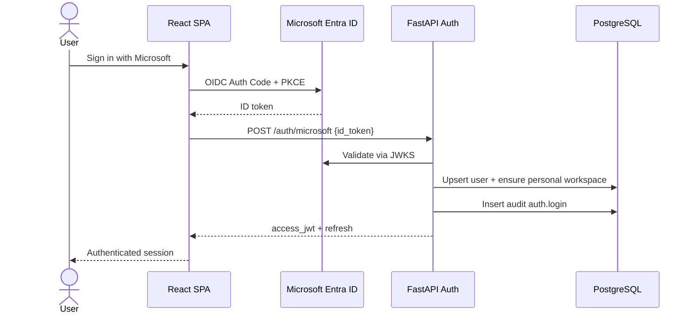

### 11.2 Create Secret

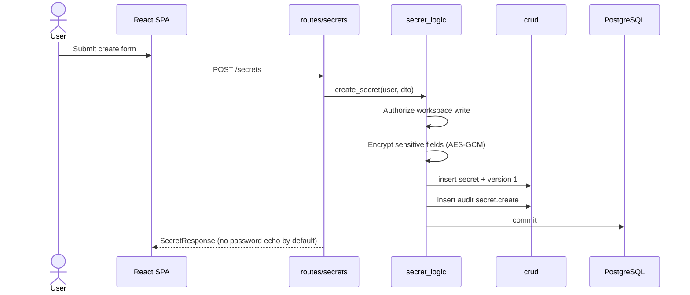

### 11.3 Update Secret

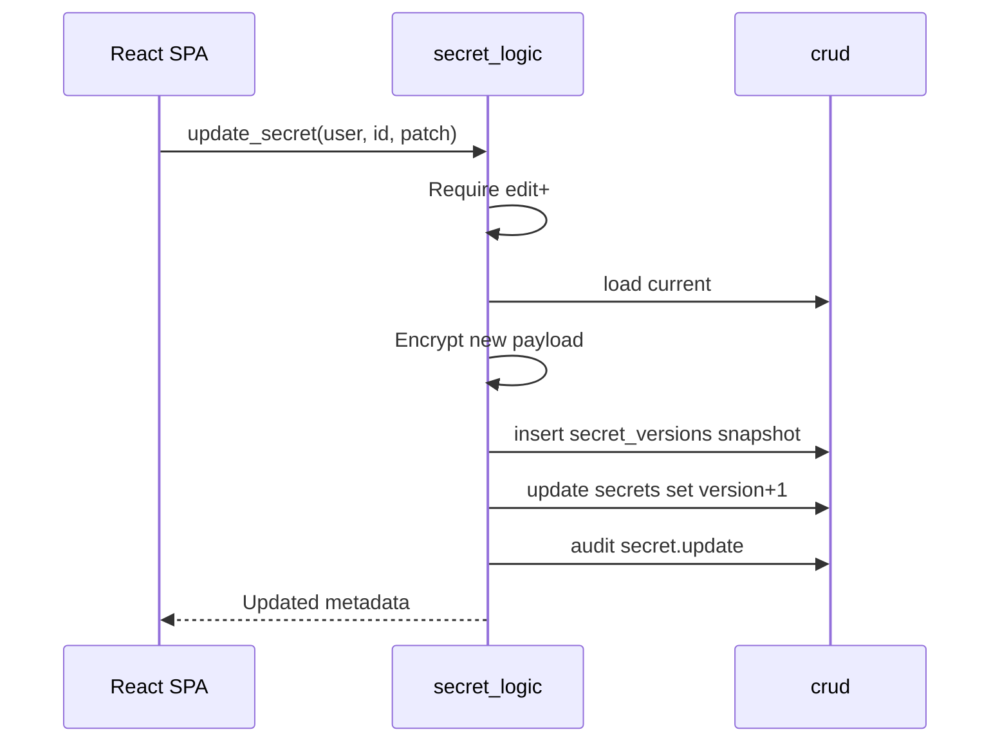

### 11.4 Delete Secret

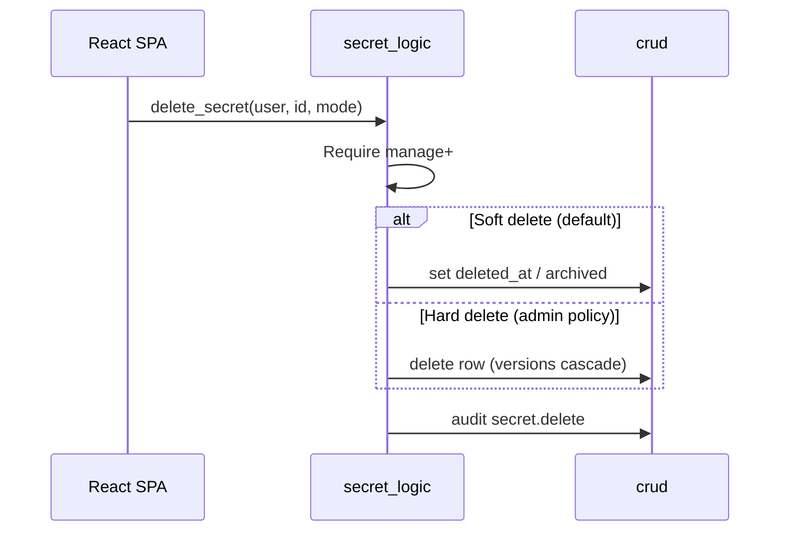

### 11.5 Share Secret

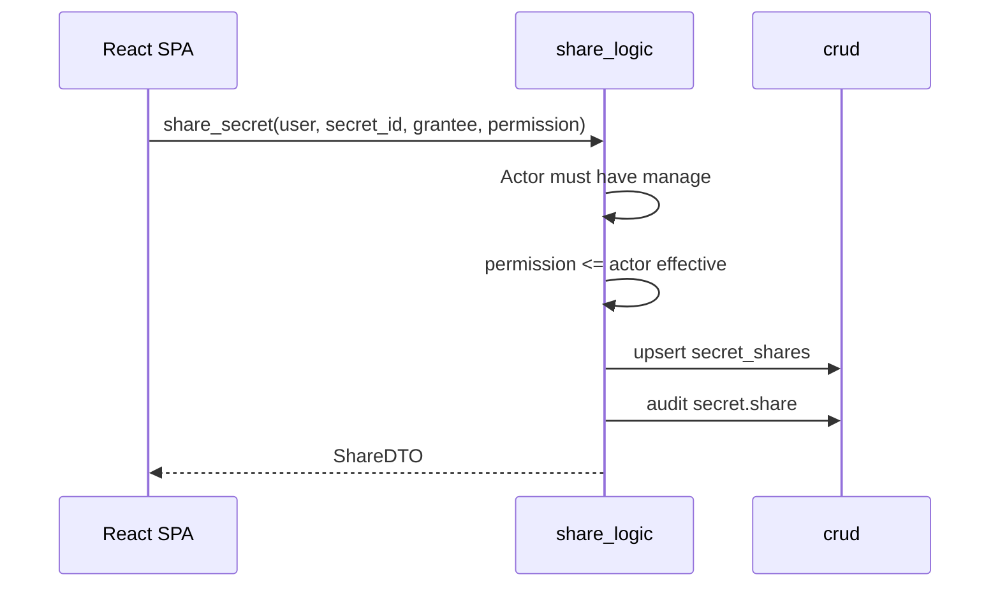

### 11.6 Launch Secret

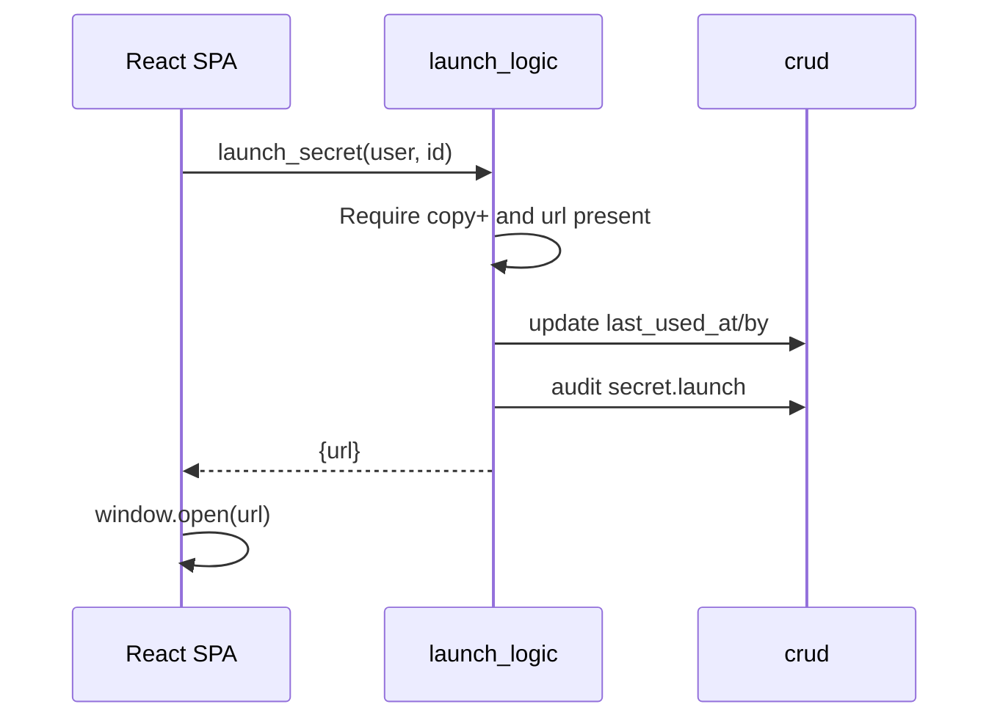

### 11.7 Search Secret

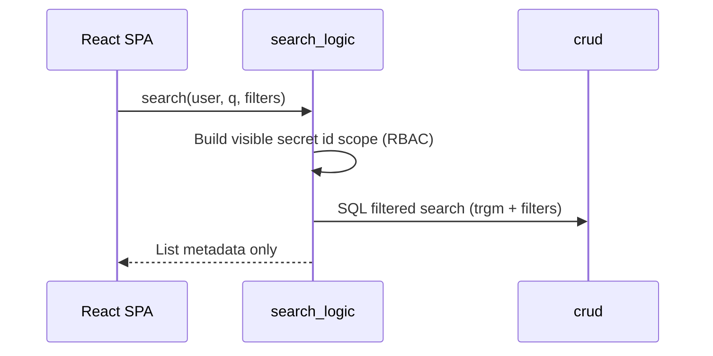

### 11.8 Browser Extension Autofill

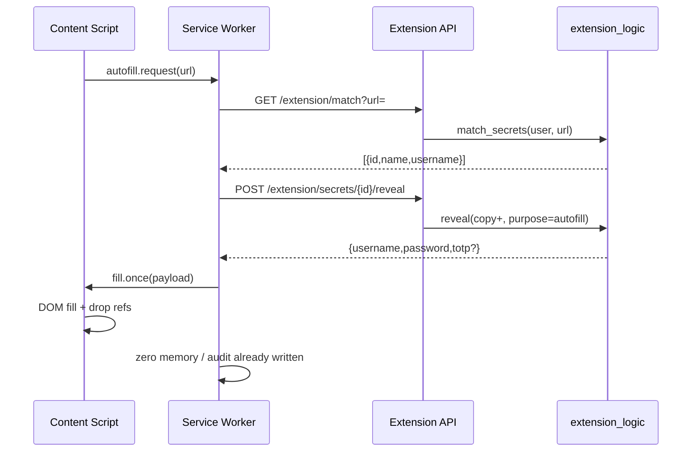

---

## 12. Flowcharts

### 12.1 Authentication

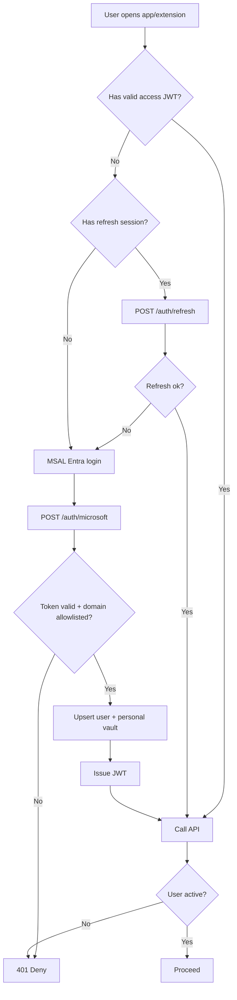

### 12.2 Secret Lifecycle

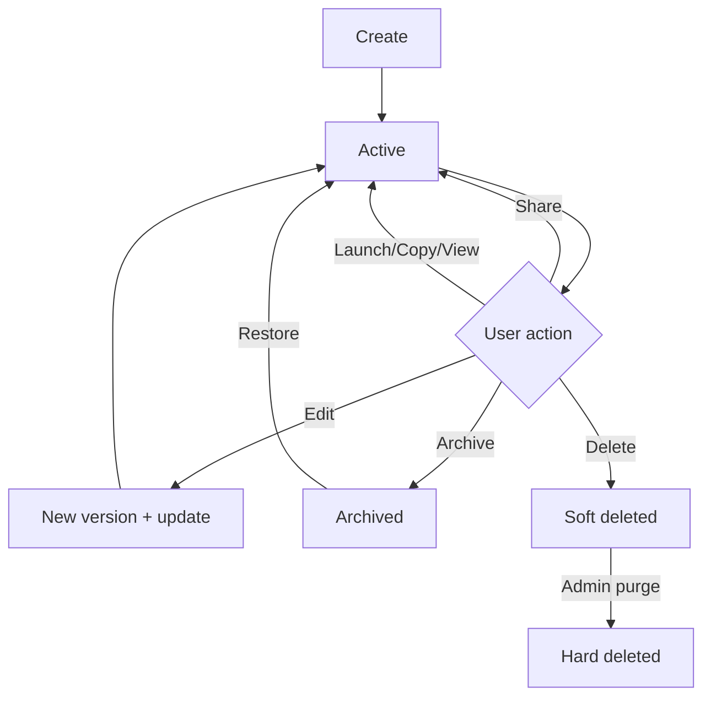

### 12.3 Workspace Management

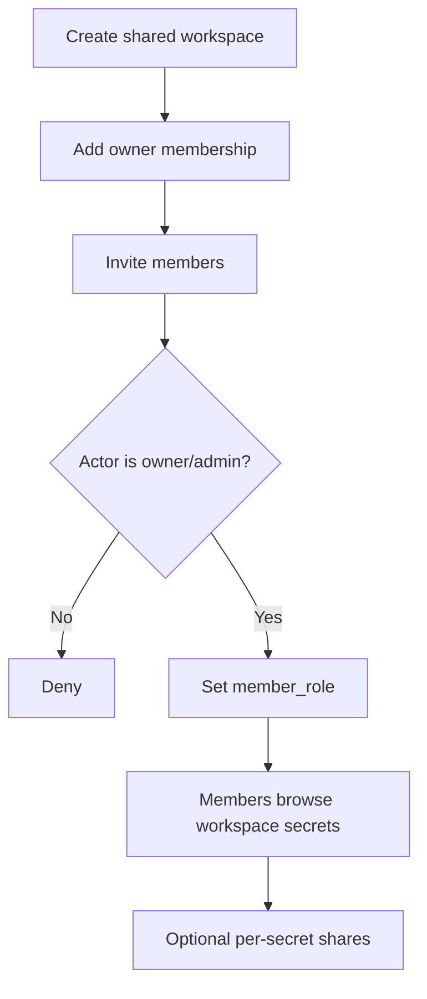

### 12.4 Secret Sharing

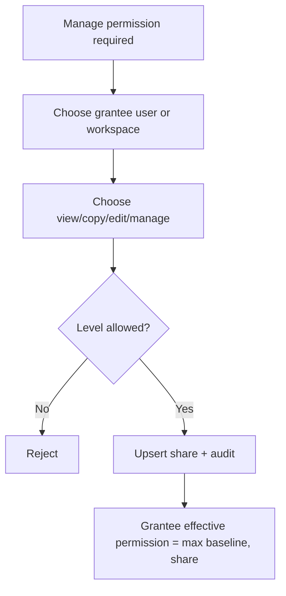

### 12.5 Browser Extension

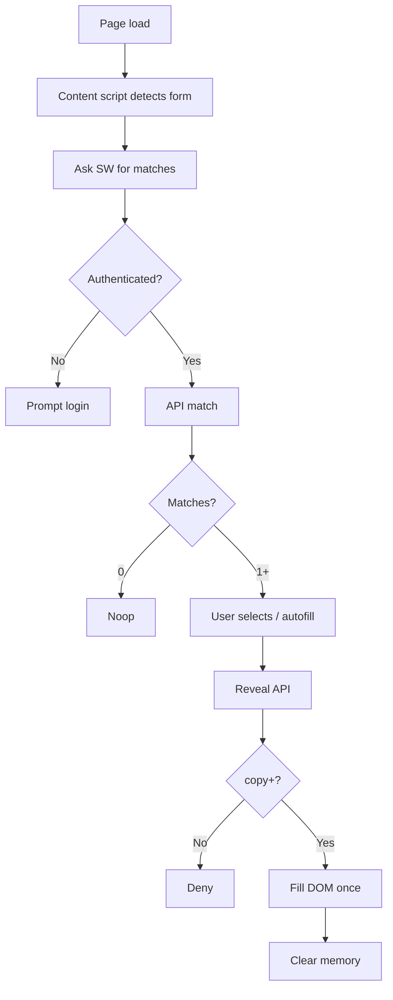

### 12.6 Audit Logging

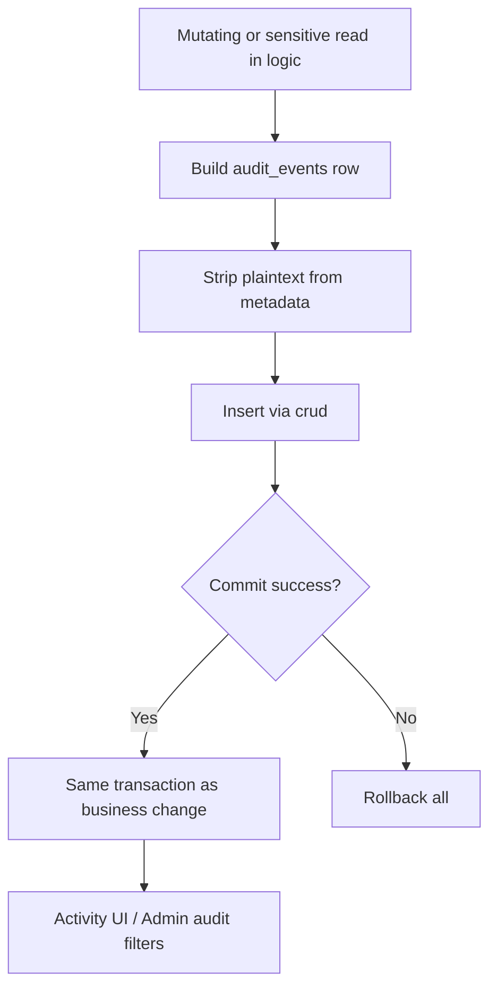

---

## 13. API Design (REST only)

Base: `/api/v1` · Auth: `Authorization: Bearer <jwt>` · JSON.

### Auth
| Method | Path | Purpose |
|--------|------|---------|
| POST | `/auth/microsoft` | Exchange Entra token → app JWT |
| POST | `/auth/refresh` | Rotate access token |
| POST | `/auth/logout` | Revoke refresh session |
| GET | `/auth/me` | Current user profile |

### Users / Admin
| Method | Path | Purpose |
|--------|------|---------|
| GET | `/users` | List directory (admin / team_admin) |
| PATCH | `/users/{id}` | Set `global_role`, `is_active` (admin) |
| GET/PUT | `/admin/settings` | App settings |
| GET/PUT | `/admin/password-policies` | Policies |
| GET | `/admin/audit` | Audit search |

### Workspaces
| Method | Path | Purpose |
|--------|------|---------|
| GET | `/workspaces` | List mine |
| POST | `/workspaces` | Create shared |
| GET | `/workspaces/{id}` | Detail |
| PATCH | `/workspaces/{id}` | Update |
| GET/POST | `/workspaces/{id}/members` | List / add |
| PATCH/DELETE | `/workspaces/{id}/members/{userId}` | Update / remove |

### Categories & Tags
| Method | Path | Purpose |
|--------|------|---------|
| GET/POST | `/categories` | List / create |
| PATCH/DELETE | `/categories/{id}` | Update / delete |
| GET/POST | `/tags` | List / create |

### Secrets
| Method | Path | Purpose |
|--------|------|---------|
| GET | `/secrets` | List (scoped filters) |
| POST | `/secrets` | Create |
| GET | `/secrets/{id}` | Metadata |
| GET | `/secrets/{id}/reveal` | Decrypt sensitive (audited) |
| PATCH | `/secrets/{id}` | Update |
| POST | `/secrets/{id}/archive` | Archive |
| POST | `/secrets/{id}/restore` | Restore |
| DELETE | `/secrets/{id}` | Soft/hard delete |
| POST | `/secrets/{id}/launch` | Launch + last used |
| GET | `/secrets/{id}/versions` | Version list |
| POST | `/secrets/{id}/versions/{n}/restore` | Restore version |
| GET | `/secrets/{id}/totp` | Current TOTP code (requires copy+) |

### Shares / Favorites / Attachments
| Method | Path | Purpose |
|--------|------|---------|
| GET/POST | `/secrets/{id}/shares` | List / create |
| PATCH/DELETE | `/secrets/{id}/shares/{shareId}` | Update / revoke |
| PUT/DELETE | `/secrets/{id}/favorite` | Favorite toggle |
| GET/POST | `/secrets/{id}/attachments` | List / upload |
| GET/DELETE | `/attachments/{id}` | Download / delete |

### Search
| Method | Path | Purpose |
|--------|------|---------|
| GET | `/search/secrets?q=&filter=` | Global search |

Filters: `mine`, `shared_with_me`, `expiring`, `favorites`, `archived`, `environment`, `type`, `workspace_id`, `category_id`, `tag`.

### Extension
| Method | Path | Purpose |
|--------|------|---------|
| GET | `/extension/match` | URL → candidates |
| POST | `/extension/secrets/{id}/reveal` | Autofill reveal |

### Activity
| Method | Path | Purpose |
|--------|------|---------|
| GET | `/activity` | Activity feed for current user scope |

**Error model:** RFC7807-style `{type,title,status,detail,code}` · 401 unauthenticated · 403 forbidden · 404 masked as 404 for unauthorized resources (existence hiding).

---

## 14. Security Design

### 14.1 Microsoft Entra ID

- Sole IdP; tenant-restricted app registration
- SPA + extension redirect URIs registered
- Backend validates issuer/audience/tid via JWKS
- Email domain allowlist (`@driftal.com`)
- Disable user in Entra → block on next refresh; short access TTL limits stale JWT window

### 14.2 JWT

- App-issued HS256/RS256 JWT after Entra proof
- Access TTL: **15 minutes**
- Refresh sessions hashed at rest, revocable
- `jti` tracked for critical revoke if needed
- JWT proves identity + global role only — **not** secret ACL

### 14.3 RBAC

**Global roles (MVP):**

| Role | Powers |
|------|--------|
| `admin` | All workspaces/secrets, admin console, audit, policies |
| `team_admin` | Create shared workspaces, manage members of owned/admin workspaces, broader directory read |
| `user` | Personal vault + member workspaces + explicit shares |

**Secret permissions:** view < copy < edit < manage  
Effective permission = max(global override, workspace baseline, direct shares).

### 14.4 Encryption

| Control | Spec |
|---------|------|
| Algorithm | **AES-256-GCM** only (no ECB/CBC) |
| Nonce | 96-bit random per encryption; stored with ciphertext |
| Envelope | Per-workspace DEK; DEK wrapped by Vault Master Key (VMK) from env/secret mount |
| Key version | `dek_key_version` / VMK version for rotation |
| What is encrypted | Passwords, keys, PEM, TOTP seeds, secure note bodies, sensitive custom fields, attachment bytes |
| What is not | name, url, username, tags, category, environment (needed for search) |
| Rotation | Generate new VMK version → rewrap DEKs → optional re-encrypt secrets in job |

**Trust statement:** Operators with VMK + DB access can decrypt. Acceptable for **internal** trusted-server vault under admin audit. Future hardening can plug external KMS without redesigning tables (replace unwrap implementation).

### 14.5 HTTPS

- TLS everywhere (web, API, extension)
- HSTS at reverse proxy
- Secure cookies only if cookie session used (prefer Authorization header for SPA/extension)

### 14.6 Audit Logging

- Every create/update/delete/share/permission change/view/copy/launch/autofill/login/logout
- Same DB transaction as the mutation when feasible
- No secret plaintext in logs
- Admin retention policy (e.g. 1–7 years) via partitioned table optional post-MVP

### 14.7 Additional controls

- Rate limit reveal/copy endpoints at reverse proxy
- Attachment size limits
- Mask unauthorized IDs as 404
- Extension memory hygiene (section 5)

---

## 15. Design Decisions

| Decision | Why |
|----------|-----|
| **Monolith FastAPI** | MVP team size and feature set do not justify service boundaries; one deployable reduces ops cost |
| **Strict Routes→Logic→CRUD→DB Wrapper** | Enforce testability and prevent SQL sprawl; matches Driftal engineering standards |
| **PostgreSQL only** | Sufficient for search (pg_trgm), JSON metadata, transactional audit; avoids Redis/Kafka complexity |
| **No Azure Key Vault in MVP** | Explicit constraint; envelope + env VMK keeps path to KMS later without schema break |
| **Trusted-server encryption** | Internal tool; Entra-only users; sharing/search/admin recoverability require server-side decrypt |
| **Workspaces = teams/collections** | One collaboration primitive instead of separate Team + Collection entities |
| **Personal workspace row** | Uniform ACL codepath for “my vault” vs shared |
| **Permission ladder view/copy/edit/manage** | Matches MVP; maps cleanly to autofill (copy+) and sharing UX |
| **Metadata plaintext / secrets ciphertext** | Engineers must search by URL/username; encrypting those destroys UX |
| **Version table snapshots** | Cheap rollback and forensic history without event-sourcing framework |
| **Single audit_events table** | Activity vs Audit are authorization views over one append-only log |
| **JIT user provisioning** | No signup UI; Entra remains source of identity |
| **Short JWT + refresh sessions** | Limits post-termination window without Continuous Access Evaluation dependency |
| **Extension reveals via API** | Backend remains source of truth for ACL and audit |
| **Attachments in DB for MVP** | Avoid object-store dependency; enforce size caps; can move to filesystem later behind same API |
| **TOTP seed encrypted server-side** | Consistency with other secrets; codes generated on demand with copy+ check |
| **Soft delete default** | Safer recovery; hard delete reserved for admin purge |

---

## Appendix A — MVP Traceability

| MVP / Required feature | Design coverage |
|------------------------|-----------------|
| Create/edit/delete/archive | secrets + versions + archive flags |
| Website / App / DB / API / SSH / Cert / SA / Generic / Notes | `secret_type` + ciphertext schema |
| Env vars | `env_var` type |
| Categories & teams | categories + shared workspaces |
| Share user/team View/Copy/Edit/Manage | secret_shares + workspace_members |
| Login launcher | `/secrets/{id}/launch` |
| Search + filters | `/search/secrets` + indexes |
| Audit logs | audit_events |
| Admin users/teams/categories/types/policies | admin module + settings |
| RBAC Admin / Team Admin / User | `global_role` + workspace roles |
| Personal vault | personal workspace |
| Favorites / Tags / Attachments | tables above |
| Version history | secret_versions |
| Browser extension / autofill / TOTP | extension module + totp in ciphertext |
| Activity logs | filtered audit_events |

---

## Appendix B — Out of Scope Reminder

Microservices · Redis · Kafka · RabbitMQ · Kubernetes · Azure Key Vault · local auth · public multi-tenant SaaS · zero-knowledge client encryption.

---

*End of architecture document — Driftal Vault v1.0*
`)
