# Entity Relationship Diagram

Source: `backend/database/models.py` (26 ORM models) + `backend/database/init_db.py` migration (`task_skills`).

Database access uses `db_wrapper.DatabaseWrapper` (`backend/database/database.py`). ORM models define schema metadata; all queries run through `crud/`.

---

## Visual diagram

```mermaid
erDiagram
    users {
        string id PK
        string name
        string email UK
        string password_hash
        string role
        string avatar
        string job_title
        int experience_months
        string joined_at
        boolean is_active
        string manager_id FK
    }

    app_settings {
        string key PK
        text value
    }

    clients {
        string id PK
        string name
        string created_at
    }

    projects {
        string id PK
        string name
        string description
        string client_id FK
        string created_by FK
        string created_at
        text background_image
        string accent_color
        text project_image
    }

    skills {
        string id PK
        string name
        string created_at
    }

    user_skills {
        string user_id PK,FK
        string skill_id PK,FK
    }

    task_skills {
        string task_id PK,FK
        string skill_id PK,FK
    }

    project_members {
        string project_id PK,FK
        string user_id PK,FK
    }

    sections {
        string id PK
        string name
        string project_id FK
    }

    tasks {
        string id PK
        string title
        string description
        string project_id FK
        string section_id FK
        string assigned_to FK
        string assigned_by FK
        string created_by FK
        string due_date
        string priority
        string status
        boolean is_started
        string started_at
        string completed_at
        boolean approved_by_manager
        int time_tracked
        int min_log_minutes
        text tags_json
        text custom_fields_json
        string created_at
    }

    task_assignees {
        string task_id PK,FK
        string user_id PK,FK
        int position
    }

    task_timer_runs {
        string user_id PK,FK
        string task_id PK,FK
        string started_at
    }

    task_time_logs {
        int id PK
        string task_id FK
        string user_id FK
        string log_date
        int seconds
    }

    kanban_columns {
        string id PK
        string label
        int position
    }

    timesheet_submissions {
        string id PK
        string user_id FK
        string week_start
        string status
        string submitted_at
        string reviewer_id FK
        string reviewed_at
        text rejection_note
        text submitted_dates
    }

    timesheet_entries {
        string id PK
        string user_id FK
        string work_date
        string project_id FK
        string section_id FK
        text description
        string time_from
        string time_to
        int seconds
        boolean billable
        string created_at
    }

    task_feedback {
        string id PK
        string task_id FK
        string user_id FK
        text message
        string created_at
        string updated_at
    }

    task_checklists {
        string id PK
        string task_id FK
        string title
        string priority
        boolean is_done
        int position
        string created_by FK
        string created_at
    }

    task_attachments {
        string id PK
        string task_id FK
        string filename
        string stored_name
        string content_type
        int size_bytes
        string uploaded_by FK
        string created_at
    }

    audit_logs {
        int id PK
        string user_id FK
        string action
        string entity_type
        string entity_id
        string entity_name
        text details
        string created_at
    }

    notifications {
        int id PK
        string user_id FK
        string type
        string title
        string message
        string entity_type
        string entity_id
        boolean is_read
        string triggered_by FK
        string created_at
    }

    oauth_clients {
        string client_id PK
        text data
        string created_at
    }

    oauth_grants {
        string key PK
        string kind
        string client_id
        string user_id
        text data
        float expires_at
    }

    personal_access_tokens {
        string id PK
        string user_id FK
        string name
        string token_hash UK
        string prefix
        string created_at
        string last_used_at
        boolean revoked
    }

    scrums {
        string id PK
        string work_date
        string title
        int position
        text raw_text
        text parsed_json
        string parse_status
        string updated_by FK
        string updated_at
        string created_at
    }

    teams_transcript_imports {
        string transcript_id PK
        string meeting_id
        string scrum_id FK
        string imported_by FK
        string imported_at
    }

    users ||--o{ users : "manager_id"
    users ||--o{ projects : "created_by"
    users ||--o{ project_members : ""
    users ||--o{ tasks : "assigned_to"
    users ||--o{ tasks : "assigned_by"
    users ||--o{ tasks : "created_by"
    users ||--o{ task_assignees : ""
    users ||--o{ task_timer_runs : ""
    users ||--o{ task_time_logs : ""
    users ||--o{ timesheet_submissions : "user_id"
    users ||--o{ timesheet_submissions : "reviewer_id"
    users ||--o{ timesheet_entries : ""
    users ||--o{ task_feedback : ""
    users ||--o{ task_checklists : "created_by"
    users ||--o{ task_attachments : "uploaded_by"
    users ||--o{ audit_logs : ""
    users ||--o{ notifications : "user_id"
    users ||--o{ notifications : "triggered_by"
    users ||--o{ personal_access_tokens : ""
    users ||--o{ user_skills : ""
    users ||--o{ scrums : "updated_by"
    users ||--o{ teams_transcript_imports : "imported_by"

    clients ||--o{ projects : "client_id"
    projects ||--o{ project_members : ""
    projects ||--o{ sections : ""
    projects ||--o{ tasks : ""
    projects ||--o{ timesheet_entries : ""
    sections ||--o{ tasks : ""
    sections ||--o{ timesheet_entries : ""
    tasks ||--o{ task_assignees : ""
    tasks ||--o{ task_timer_runs : ""
    tasks ||--o{ task_time_logs : ""
    tasks ||--o{ task_feedback : ""
    tasks ||--o{ task_checklists : ""
    tasks ||--o{ task_attachments : ""
    tasks ||--o{ task_skills : ""
    skills ||--o{ user_skills : ""
    skills ||--o{ task_skills : ""
    scrums ||--o{ teams_transcript_imports : ""
```



A standalone copy of this diagram is in [erd.mmd](./erd.mmd).

---

## Table inventory (27 tables)

| # | Table | Primary key | ORM class |
|---|-------|-------------|-----------|
| 1 | `users` | `id` | `User` |
| 2 | `app_settings` | `key` | `AppSetting` |
| 3 | `clients` | `id` | `Client` |
| 4 | `projects` | `id` | `Project` |
| 5 | `skills` | `id` | `Skill` |
| 6 | `user_skills` | `(user_id, skill_id)` | `UserSkill` |
| 7 | `task_skills` | `(task_id, skill_id)` | **None** (migration only) |
| 8 | `project_members` | `(project_id, user_id)` | `ProjectMember` |
| 9 | `sections` | `id` | `Section` |
| 10 | `tasks` | `id` | `Task` |
| 11 | `task_assignees` | `(task_id, user_id)` | `TaskAssignee` |
| 12 | `task_timer_runs` | `(user_id, task_id)` | `TaskTimerRun` |
| 13 | `task_time_logs` | `id` (autoincrement) | `TaskTimeLog` |
| 14 | `kanban_columns` | `id` | `KanbanColumn` |
| 15 | `timesheet_submissions` | `id` | `TimesheetSubmission` |
| 16 | `timesheet_entries` | `id` | `TimesheetEntry` |
| 17 | `task_feedback` | `id` | `TaskFeedback` |
| 18 | `task_checklists` | `id` | `TaskChecklist` |
| 19 | `task_attachments` | `id` | `TaskAttachment` |
| 20 | `audit_logs` | `id` (autoincrement) | `AuditLog` |
| 21 | `notifications` | `id` (autoincrement) | `Notification` |
| 22 | `oauth_clients` | `client_id` | `OAuthClient` |
| 23 | `oauth_grants` | `key` | `OAuthGrant` |
| 24 | `personal_access_tokens` | `id` | `PersonalAccessToken` |
| 25 | `scrums` | `id` | `Scrum` |
| 26 | `teams_transcript_imports` | `transcript_id` | `TeamsTranscriptImport` |

`kanban_columns` has no foreign keys — columns are global, not per-user or per-project.

---

## Foreign key reference

| From table | Column | → To table | ON DELETE |
|------------|--------|------------|-----------|
| `users` | `manager_id` | `users.id` | SET NULL |
| `projects` | `client_id` | `clients.id` | RESTRICT |
| `projects` | `created_by` | `users.id` | — |
| `user_skills` | `user_id` | `users.id` | CASCADE |
| `user_skills` | `skill_id` | `skills.id` | CASCADE |
| `task_skills` | `task_id` | `tasks.id` | CASCADE |
| `task_skills` | `skill_id` | `skills.id` | CASCADE |
| `project_members` | `project_id` | `projects.id` | — |
| `project_members` | `user_id` | `users.id` | — |
| `sections` | `project_id` | `projects.id` | — |
| `tasks` | `project_id` | `projects.id` | — |
| `tasks` | `section_id` | `sections.id` | — |
| `tasks` | `assigned_to` | `users.id` | — |
| `tasks` | `assigned_by` | `users.id` | — |
| `tasks` | `created_by` | `users.id` | — |
| `task_assignees` | `task_id` | `tasks.id` | CASCADE |
| `task_assignees` | `user_id` | `users.id` | CASCADE |
| `task_timer_runs` | `user_id` | `users.id` | CASCADE |
| `task_timer_runs` | `task_id` | `tasks.id` | CASCADE |
| `task_time_logs` | `task_id` | `tasks.id` | CASCADE |
| `task_time_logs` | `user_id` | `users.id` | — |
| `timesheet_submissions` | `user_id` | `users.id` | CASCADE |
| `timesheet_submissions` | `reviewer_id` | `users.id` | SET NULL |
| `timesheet_entries` | `user_id` | `users.id` | — |
| `timesheet_entries` | `project_id` | `projects.id` | — |
| `timesheet_entries` | `section_id` | `sections.id` | — |
| `task_feedback` | `task_id` | `tasks.id` | CASCADE |
| `task_feedback` | `user_id` | `users.id` | — |
| `task_checklists` | `task_id` | `tasks.id` | CASCADE |
| `task_checklists` | `created_by` | `users.id` | — |
| `task_attachments` | `task_id` | `tasks.id` | CASCADE |
| `task_attachments` | `uploaded_by` | `users.id` | — |
| `audit_logs` | `user_id` | `users.id` | — |
| `notifications` | `user_id` | `users.id` | — |
| `notifications` | `triggered_by` | `users.id` | — |
| `personal_access_tokens` | `user_id` | `users.id` | CASCADE |
| `scrums` | `updated_by` | `users.id` | — |
| `teams_transcript_imports` | `scrum_id` | `scrums.id` | SET NULL |
| `teams_transcript_imports` | `imported_by` | `users.id` | — |

`oauth_grants.client_id` and `oauth_grants.user_id` are string columns with **no declared FK** in the ORM.

---

## Unique constraints

| Table | Constraint | Columns |
|-------|------------|---------|
| `users` | unique index | `email` |
| `task_time_logs` | `uq_task_time_user_date` | `(task_id, log_date, user_id)` |
| `timesheet_submissions` | `uq_timesheet_submission_user_week` | `(user_id, week_start)` |
| `personal_access_tokens` | unique index | `token_hash` |

---

## ORM relationships (declared in models.py)

Only these tables have SQLAlchemy `relationship()` declarations:

```
Client ←──(client)── Project ──(sections)──→ Section
                      │
                      └──(members)──→ ProjectMember

Task ──(assignees)──→ TaskAssignee
```

All other foreign keys exist as `ForeignKey` columns only.

---

## Domain groupings

| Group | Tables |
|-------|--------|
| **Identity & auth** | `users`, `personal_access_tokens`, `oauth_clients`, `oauth_grants`, `app_settings` |
| **Organization** | `clients`, `projects`, `project_members`, `sections`, `skills`, `user_skills`, `task_skills` |
| **Work items** | `tasks`, `task_assignees`, `task_feedback`, `task_checklists`, `task_attachments`, `kanban_columns` |
| **Time tracking** | `task_time_logs`, `task_timer_runs`, `timesheet_entries`, `timesheet_submissions` |
| **Collaboration** | `notifications`, `audit_logs`, `scrums`, `teams_transcript_imports` |

---

## Notes

- **`task_skills`**: Created by `init_db.py` migration. Read via `crud/skills.py` (`skill_names_by_task_ids`). No write CRUD found in codebase.
- **Bootstrap indexes**: `bootstrap_sqlite.sql` / `bootstrap_aurora.sql` add extra indexes on `tasks`, `project_members`, `task_time_logs`, `task_assignees`, `sections`, `timesheet_entries` not declared in ORM `index=True`.
- **Storage**: SQLite file at `backend/data/taskmanager.db` in dev (`ZET_TEST_SQLITE=1`); production uses Aurora via `db_wrapper`.
